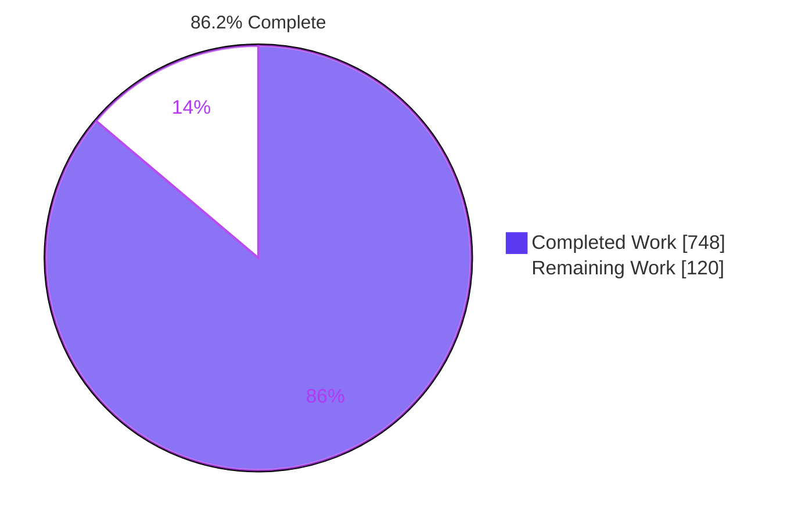
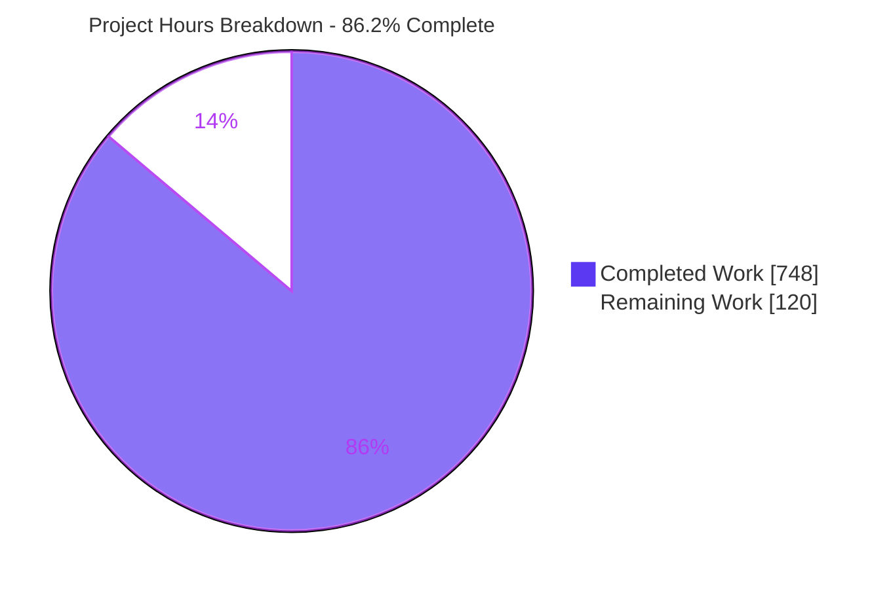
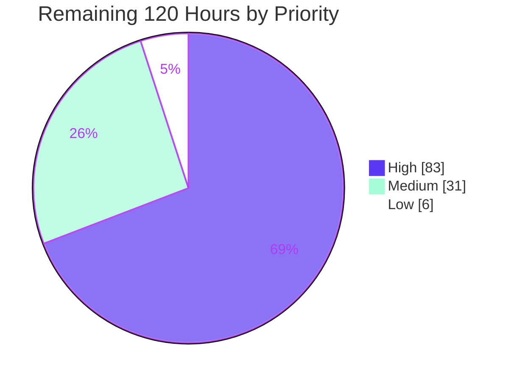
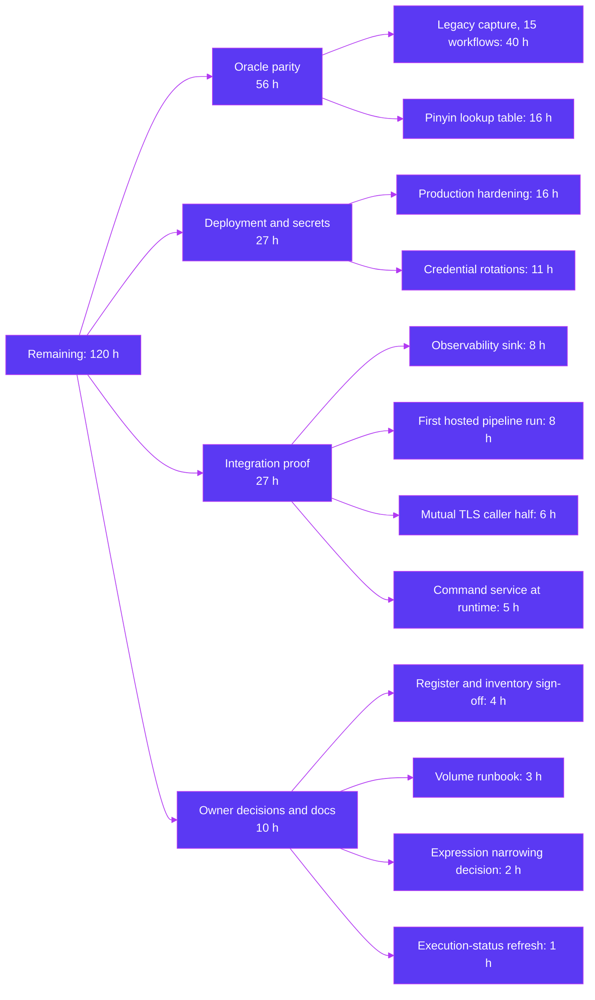

# 1. Executive Summary

## 1.1 Project Overview

PowerFramework — an Appeon PowerBuilder 2021 desktop framework of 39 library exports, 544 objects and
160,445 lines of PowerScript loaded into one process — is now four independently deployable .NET 10
services with authenticated network boundaries: Gateway (sole REST ingress and composition root),
DataServices (the DataWindow retrieval/validation/update triple and the column-expression engine),
Persistence (the only SQL generator and the only storage owner), and Security (the sole JWT issuer and the
cryptographic surface). Four further capability areas — DesignSystem, Documents, Integration and
ScriptBridge — are mapped in discovery and deliberately left unbuilt. The legacy tree is untouched and
remains the behavioural specification.

## 1.2 Completion Status



| Metric | Value |
| --- | --- |
| Total Hours | **868** |
| Completed Hours (AI + Manual) | **748** |
| Remaining Hours | **120** |
| Percent Complete | **86.2%** |

Measured over the planned scope plus the path-to-production activities it implies: 748 / 868 = 86.2%.

## 1.3 Key Accomplishments

- ✅ Four separate services, four container images, four independently buildable solutions; 22 projects compile with zero warnings under warnings-as-errors
- ✅ 22,958 tests pass with zero failures and zero skips; every service clears the 80% line-coverage floor (89.9% – 93.3%)
- ✅ Optimistic concurrency survives the network: a stale-original update is refused HTTP 409 with the current row state and overwrites nothing
- ✅ Static (`$name`) and dynamic (`$$name`) expansion survive serialization as three separate wire members
- ✅ Every boundary is authenticated — one issuer mints, the other three verify, and 401 without a credential on all four
- ✅ A signing-key rotation costs zero 401s while a forged key identifier is still refused
- ✅ The four deferred capabilities exist only as reserved 501 routes — no project, image, test or stub
- ✅ One manifest brings the estate up health-gated; the cross-service suite passes 29 of 29 against it

## 1.4 Critical Unresolved Issues

| Issue | Impact | Owner | ETA |
| --- | --- | --- | --- |
| No paired characterization recording exists for any of the fifteen declared workflows, so behavioural equivalence with the legacy framework is asserted from tests rather than measured against the oracle | Parity unestablished. The capture driver and the pair-state reporter are built and run; only the legacy half is missing, and it needs a host carrying the PowerBuilder runtime | Platform engineering | 1 week after an oracle host is available |
| Pinyin first-letter matching is unverified against the oracle: the lookup table lives only inside a closed binary, so the filter is reported blocked rather than approximated | The drop-down search pinyin filter may return a different result set from the legacy one, in a way no unit test can detect | Platform engineering | With the item above |
| The two credentials committed in the read-only legacy tree remain live until rotated at their source systems — a broker credential triple and a shared configuration-encryption key with no re-encryption path | Standing exposure outside this codebase. Neither value is replicated anywhere in the .NET tree, and the files holding them may not be edited | Security owner | 1 week |
| The documented end-to-end caller identity exists only in the development configuration overlay, so token issuance for it answers 401 under a production profile | A production deployment cannot obtain a token for that identity until the roster decision is made | Deployment owner | Before first deployment |
| `persistence.v1.CommandService` is implemented and unit-tested but reachable from no route and called by no service, so it has never been driven at runtime | Its behaviour rests on unit tests alone | Platform engineering | 1 sprint |
| The continuous-integration workflow has never executed on a hosted runner; every gate's commands and arithmetic were executed locally | Runner-specific behaviour — clone depth for the guards that derive figures from git, and image attestation publication — is unproven | Platform engineering | 1 sprint |

## 1.5 Access Issues

| System/Resource | Type of Access | Issue Description | Resolution Status | Owner |
| --- | --- | --- | --- | --- |
| Appeon PowerBuilder 2021 runtime host | Windows host with the runtime installed | The legacy half of every paired recording, and the pinyin lookup table, can only be produced by the PowerBuilder virtual machine. `pfw.dll` is a 32-bit PE that exports the PBNI entry points and consumes a session object the VM supplies, and no `pbvm` library exists in this repository | Open — blocks parity establishment | Platform engineering |
| Container registry | Publish credential | An image is built for each service on every run and published only on a push to the default branch, because a fork pull request receives a read-only token and declaring a registry credential would have meant inventing a secret | Open — publication to any other registry needs a real credential | Release engineering |
| Broker system holding the committed credential triple | Administrative access to the broker | The credential must be rotated at its owning system; this repository cannot do it and the file that carries it is read-only | Open | Security owner |
| Internal certificate authority | A CRL or OCSP distribution point | The authority publishes neither, so revocation checking stays at its documented permissive default with short certificate lifetimes as the compensating control | Open | Security owner |
| Signing keys, certificates and caller credentials | Locally generated | No environment variable or secret was supplied to this project. Every credential is produced by the documented bootstrap, which runs end to end and was executed successfully | Resolved | Deployment owner |

## 1.6 Recommended Next Steps

1. **[High]** Capture the legacy half of all fifteen workflows on a PowerBuilder runtime host against an unrecreated `persistence-db` volume, then land both halves together — this closes the parity gap and unblocks the pinyin work behind it.
2. **[High]** Rotate both legacy-tree credentials at their source systems, pairing the configuration-key rotation with a migration for values already encrypted under it.
3. **[High]** Settle the production profile: a token-roster identity outside the development overlay, a revocation distribution point, and a certificate re-key lifecycle.
4. **[Medium]** Run the pipeline on a hosted runner once, with a registry credential.
5. **[Medium]** Sign off the deviation register and the target-file inventory, or direct their reversal.

# 2. Project Hours Breakdown

## 2.1 Completed Work Detail

| Component | Hours | Description |
| --- | --- | --- |
| DataServices service | 110 | The 22-event DataWindow chain (13 raw plus 9 semantic), the four-value item-change protocol, correlated validation sessions, five column-type validators, the expression evaluator and the static/dynamic expansion engine, four headless capability models, two gRPC services and the Gateway-only REST projection |
| Persistence service | 105 | The six-clause statement model, the SQL Server and Oracle paging rewriters as byte-exact pure transforms, the SQLite seam and its migration, the SQL task layer with its thread-affinity proxies, the buffer and changeset codecs, optimistic concurrency and identity resolution, the reference-counted transaction pool, statement redaction and four gRPC services |
| Gateway service | 60 | Composition root with the mandatory initialize/finalize pairing and fail-fast startup, the eight-bit capability gate as configuration, 39 projected REST operations, four reserved 501 routes, upstream health aggregation, typed resilient clients and the assert-payload system-error handler |
| Verification and hardening across all four services | 60 | Outbound resilience placed at the gRPC call layer where a subchannel connect failure is visible, zero-401 signing-key rotation on every verifier, handle reclamation under an abandoned uncommitted write, identifier gating at both the boundary and the SQL sink, correlation identifiers in every problem body, published-status closure, and the per-service coverage floor raised to 89–93% |
| Published contracts C-01…C-10 | 56 | Three protocol definitions and two OpenAPI documents with their generated stubs — the whole cross-service boundary, every one of it net-new because the legacy has no process boundary to translate |
| Security service | 55 | Sole-issuer token minting, JWKS and OIDC discovery for stock bearer handlers, the full hash / keyed-hash / symmetric / RSA / random / encoding surface with its legacy defaults preserved and annotated, and file-backed key material with a production fail-fast |
| Shared kernel | 44 | The return-code algebra with its tri-state boundary preserved exactly, the predicate family, the 1,162-line constant catalogue, the exception type, bit and word primitives, ancestry tests and composite formatting |
| Documentation set | 34 | Seven authored documents covering the full-estate mapping, build, architecture, contracts, parity, secrets and deferred scope, plus the attribution notice and the repository readme section |
| Shared event broker | 30 | The broker itself, subscription-topic decomposition into sequence, name and lifetime, the tri-valued veto and the priority and ordering surface |
| Repository build plumbing | 26 | The solution set including one solution per service, central package management with both mandatory pins, the analyzer policy that keeps the preserved constant spellings legal, and the tool manifest |
| Characterization scaffolding | 24 | Fifteen workflow definitions with their JSON schema, the paired recording store and its integrity rule, and the capture driver with three capture modes, seven derivations and honest pair-state reporting |
| Cross-service end-to-end suite | 24 | Six specifications, eight fixtures, the token-issuance path and an identity provisioning script, added beside the untouched legacy browser assets |
| Continuous integration | 24 | Hygiene gates for whitespace, strict JSON, workflow roster and tracked-file scope; whole-solution and per-service legs; the per-service coverage floor; and image publication with SBOM and provenance attestations behind pinned base-image digests |
| Shared localization | 20 | The provider contract whose translation mutates a reference parameter, the silent-passthrough facade, three locale providers including both preserved mistranslations, and the XML resource reader |
| Local orchestration | 20 | The four-service manifest with its health-gated dependency chain, twelve projected secrets, the persistence volume, the reserved commented port slot, the environment template and the bring-up guide |
| Shared diagnostics | 16 | The assertion protocol with its seven-field payload, stack-trace provision and caller information |
| Containerisation | 16 | Four multi-stage images running as an unprivileged account, with pinned base-image digests and working health probes |
| Secrets inventory and configuration injection | 14 | The eleven-site inventory with severity and required action per site, options binding throughout, file-backed key resolution and the production refusal of inline material |
| Shared containers | 10 | The insertion-ordered map and the calculation and recursion vector behind the expression engine |
| **Total** | **748** | |

## 2.2 Remaining Work Detail

| Category | Hours | Priority |
| --- | --- | --- |
| Legacy-oracle characterization capture for the fifteen declared workflows, then landing both halves together | 40 | High |
| Pinyin first-letter parity: characterise the lookup table and fuzzy-sound groupings, then un-skip the four hooks | 16 | High |
| Production deployment hardening: a token-roster identity outside the development overlay, a revocation distribution point, and a certificate re-key lifecycle | 16 | High |
| Rotate the shared configuration-encryption key with a migration for values already encrypted under it | 8 | High |
| Deployed-estate observability: a trace and metric sink behind the correlation identifiers already emitted | 8 | Medium |
| First pipeline execution on a hosted runner, including the registry credential and shallow-clone behaviour | 8 | Medium |
| Mutual-TLS caller half exercised end to end, and the certificate path-name collision settled | 6 | Medium |
| `persistence.v1.CommandService` driven at runtime and covered by an integration probe | 5 | Medium |
| Deviation register and target-file inventory sign-off — the open owner decisions | 4 | Medium |
| Rotate the broker credential triple at its owning system | 3 | High |
| Storage operations runbook for the persistence volume, honouring the paired-capture rule | 3 | Low |
| Cross-session expression-variable position: accept the documented narrowing or require co-resident DataWindows | 2 | Low |
| Execution-status statement refreshed to the current bring-up | 1 | Low |
| **Total** | **120** | |

## 2.3 Estimation Basis

Completed hours are derived from the delivered surface rather than asserted: 506 C# files across 22
projects, three protocol definitions and two OpenAPI documents, four container definitions, one
orchestration manifest, seven authored documents and a six-specification end-to-end suite, all of it
covered by 22,958 passing tests. Testing effort is weighted inside each component row at the usual
30–40% of its development effort rather than shown as a separate line, and the four hardening rounds
visible in the branch history are carried in the single verification-and-hardening row so no work is
counted twice.

Remaining hours are bottom-up per item. Confidence is high on the nine items that are configuration,
operational or decision work — their scope is fully known. It is medium on the first pipeline run and the
mutual-TLS edge, where the unknown is the runner and the deployment rather than the code. It is lower on
the two oracle-dependent items, which together account for 56 of the 120 hours: their estimate assumes a
Windows host carrying the PowerBuilder runtime can be stood up, and the capture itself is fast only
because the driver, the plan model and the comparison pass already exist and run.

Completed 748 + Remaining 120 = 868 total hours. 748 / 868 × 100 = 86.2% complete.

# 3. Test Results

Every figure below was produced by running `dotnet test PowerFramework.slnx -c Release
--collect:"XPlat Code Coverage"` against the current tree, and every coverage figure was parsed from that
service's own Cobertura package. Coverage is measured per service, never repository-aggregate, because a
whole-report rate would be diluted by the generated protocol code.

| Area / Category | Framework | Tests | Passed | Failed | Coverage | What This Proves |
| --- | --- | --- | --- | --- | --- | --- |
| DataServices — event chain, item-change protocol, validators, expression engine, headless models | xUnit v3 | 5,932 | 5,932 | 0 | 93.3% | The 22-event ordering, the four-value item-change alphabet and static-versus-dynamic expansion behave as the legacy specifies, including its documented quirks |
| Persistence — statement model, paging rewriters, buffer codecs, concurrency, transaction pool | xUnit v3 | 4,792 | 4,792 | 0 | 91.9% | Generated SQL is byte-exact for both database dialects, optimistic concurrency refuses a stale original, and identity values round-trip through an inverted buffer correctly |
| Published contracts — protocol definitions, OpenAPI documents, coherence guards | xUnit v3 | 4,739 | 4,739 | 0 | n/a — boundary definition | Every published operation declares exactly the status surface it can produce, and the contract project carries no behaviour |
| Security — issuance, key publication, crypto surface, key handling | xUnit v3 | 2,300 | 2,300 | 0 | 92.2% | One issuer mints, the key set publishes no private member, and each legacy weak default is preserved and annotated rather than corrected |
| Shared kernel — return-code algebra, predicates, constants, primitives | xUnit v3 | 1,750 | 1,750 | 0 | included in kernel package | A prevention still reads as a success and a cancellation is neither succeeded nor failed — the tri-state boundary is intact |
| Gateway — routing, capability gate, reserved routes, authorization, health aggregation | xUnit v3 | 1,224 | 1,224 | 0 | 89.9% | The ingress publishes only what it can produce, gates capabilities from configuration, and reports healthy only behind its upstreams |
| Shared diagnostics, event broker, localization and containers | xUnit v3 | 2,142 | 2,142 | 0 | included in each package | The assertion payload, the tri-valued veto, silent-passthrough translation with both mistranslations, and ordered container semantics all hold |
| Characterization capture driver | xUnit v3 | 79 | 79 | 0 | included in driver package | The driver captures deterministically, refuses to land an unpaired half in the store, and reports the pair state honestly |
| **Total** | **xUnit v3, 11 projects** | **22,958** | **22,958** | **0** | **89.9 – 93.3% per service** | |

Build under the same configuration: 22 projects, **0 warnings and 0 errors** with warnings treated as
errors, so the clean build is also the analyzer result. Each of the four services additionally restores,
builds and tests from its own directory with no reference to another.

**Not covered.** These capabilities are delivered but are exercised by no test, or by unit tests only, and a
human should test them before release:

- **Paired characterization against the legacy oracle.** Zero of the fifteen declared workflows has a comparable pair. Behavioural equivalence with PowerFramework is asserted from these 22,958 tests and from the oracle locators cited in the code, not measured against the framework itself. The comparison pass reports `0/15 comparable, 15 not executed` rather than implying more.
- **Pinyin first-letter matching.** Four parity hooks skip by name. The lookup table and its fuzzy-sound groupings exist only inside a closed binary, so the filter is reported blocked rather than approximated — an approximation would return a subtly different result set that no unit test would catch.
- **The SQL Server and Oracle paging rewriters.** Byte-exact matrices cover them with no instance of either engine provisioned, deliberately, because neither has a schema or connection string anywhere in the repository. The expectations lock the current output against drift; they do not prove agreement with the legacy generator.
- **`persistence.v1.CommandService` (C-07).** Covered by unit tests, but reachable from no route and called by no service, so nothing drives it at runtime.
- **The mutual-TLS caller half.** Neither Gateway nor DataServices presents its own certificate pair on the documented bring-up, which authenticates all three callers with the shared-secret form instead.
- **The pipeline as a pipeline.** Every gate's commands and arithmetic were executed locally against the tree, but the workflow has never run on a hosted runner.
- **Per-row calculation over the wire.** No published operation admits rows into the DataServices host in this phase, so per-row calculation answers a defined out-of-range refusal over REST; calculation over a host that does hold rows is proven by unit test only.
- **The handle-reclamation window at values other than its shipped default.** The shipped value was driven end to end; other values are covered only under a fake clock.

# 4. Runtime Validation & UI Verification

The whole estate was brought up from the documented recipe — the signing identity, the local authority,
one certificate pair per service and three caller credentials generated locally, then
`docker compose … up --build -d` — and the flows below were driven against it and torn down afterwards
with `down -v`.

- ✅ **Orchestration and readiness** — Four images, four containers healthy in dependency order, each running as an unprivileged account. `/health` answers 200 anonymously on 5101, 5102, 5104 and 5105; the reserved port refuses connection. Gateway's body names all three upstreams healthy alongside its own self, framework and credential checks, so the aggregate is live rather than cosmetic.
- ✅ **Authentication on every edge** — `/v1/ping` answers 401 without a credential and 200 with a right-audience token on all four services. A token minted for one audience is refused 401 by another, and a caller requesting an audience its grant does not cover is refused at issuance.
- ✅ **Token issuance and key publication** — Issuance mints RS256 tokens for three caller identities against the roster grant matrix. The key set publishes one RSA key with no private member, and discovery answers 200 anonymously, so a stock bearer handler self-configures with no bespoke code.
- ✅ **DataWindow retrieve, insert and update across containers** — Retrieval answers as an ordered chunk sequence carrying both current and original values for all six marked columns; an insert round-trips its engine-assigned identity; an update carrying all six originals applies.
- ✅ **Optimistic concurrency** — A stale-original update is refused **HTTP 409** with the conflict detail, the stored row is unchanged, and refresh-and-retry then applies. No silent overwrite occurs on any path.
- ✅ **Structured storage refusal** — A NOT NULL violation surfaces as a structured error naming the column as schema metadata, with the statement field empty; nothing is persisted.
- ✅ **Reserved deferred capabilities** — All four route families answer **501** with a machine-readable body naming DesignSystem, Documents, Integration or ScriptBridge and the reserved-for-next-phase marker. Nothing exists behind them.
- ✅ **Capability projection** — The capability endpoint reports the eight legacy bits spelled verbatim, each with its destination, and an aggregate of 3847 with the alternative browser-engine bit deliberately clear, matching the legacy declaration exactly.
- ✅ **Cross-service workflow suite** — The Playwright suite ran in strict mode against the live stack and passed **29 of 29 with zero skips**, having first confirmed the full topology reachable on all four ports.
- ✅ **Fault and disclosure posture** — Across 5,643 container log lines: zero unhandled exceptions, zero 500 responses, zero generic internal-error codes, and zero credential-shaped strings, key blocks or bearer tokens. Generated statement literals appear only as redaction placeholders. Key material appears zero times in the rendered manifest and in container inspection, against a control that finds it in its own host file. Omitting a required query parameter answers 400 naming the parameter, never a server fault.

**Not exercised at runtime.** `persistence.v1.CommandService` has no route and no caller, so nothing drives
it. The mutual-TLS caller half is unexercised because the documented bring-up projects no caller
certificate. The pipeline has never run on a hosted runner. No characterization recording exists on either
side, and the comparison pass reports that plainly rather than working around it.

**No user interface exists, and none was created.** This phase is API and service level only: the
capability area that would own any presentation surface is one of the four deliberately left unbuilt. The
three UI capabilities that in-scope logic genuinely touches — drop-down search, context menu and column
sort — ship their headless half (filter and sort expression construction, the search state machine, the
menu item model with its computed logical widths) while window positioning, DPI conversion, font
measurement and rendering are deferred behind the reserved design route. Browser automation is therefore
not applicable; the evidence above is HTTP, gRPC, database, container and log output.

# 5. Compliance & Quality Review

## 5.1 Compliance Matrix

Each row states where the deliverable stands now.

| # | Deliverable / Requirement | Benchmark | Status | Evidence |
| --- | --- | --- | --- | --- |
| 1 | Decompose into four independently deployable services, not one collapsed solution | Each service restores, builds and tests from a clean checkout without reference to another | ✅ PASS | Four service directories each with their own solution, project pair and image; per-service build and test re-run for all four |
| 2 | Preserve behaviour exactly, replicating documented defects | Every legacy quirk reachable from an in-scope path is reproduced and annotated | ✅ PASS | Tri-state return boundary, the four-value item-change alphabet with its non-fall-through empty arm, both localization mistranslations, the inverted filter-buffer traversal, four cross-thread transfer defects, four schema type mismatches and the weak cryptographic defaults — all present and covered |
| 3 | Transport chosen per service from the shape of its current interface | Documented decision plus rationale per service | ✅ PASS | REST with OpenAPI at the ingress and on Security; gRPC for the two internal services, with a thin Gateway-only REST projection |
| 4 | Optimistic concurrency preserved across a network boundary | A mismatch returns a versioned conflict carrying current row state; no silent overwrite | ✅ PASS | Current and original values per marked column on the wire; gRPC abort projected to HTTP 409 with the detail payload; driven live |
| 5 | Static versus dynamic expansion survives serialization | Unexpanded text, bind-time snapshot and live environment all transmitted, with a per-reference mode | ✅ PASS | Five expansion modes representable; the three members verified separately on the wire |
| 6 | Event ordering preserved across the new boundaries | A pattern assigned per capability area with evidence | ⚠ PASS with narrowing | Synchronous chains where cross-event state exists; a sequencing token elsewhere that detects and refuses an out-of-order arrival rather than reordering it (see 5.2) |
| 7 | Remediate every hardcoded secret, the three named sites a floor | Inventory, never replicate, rotate | ⚠ PASS in code | Eleven sites inventoried with severity and action; no value replicated; two rotations remain at their source systems |
| 8 | Authenticate every new boundary, one issuer only | Bearer validation on every internal edge; a single signing authority | ✅ PASS | 401 anonymous and 200 authenticated on all four; audience isolation and scope enforcement refused correctly; a forged key identifier refused by all four |
| 9 | Deliver the full-estate mapping and the complete contract inventory | All 544 objects assigned; every cross-service contract enumerated | ✅ PASS | The mapping, contract and deferred-scope documents carry the assignment, the ten contracts and the four reserved extension points |
| 10 | Do not implement the four deferred capabilities, even as stubs | No project, image, test or placeholder; routing metadata only | ✅ PASS | Four service directories only; zero deferred-named paths; zero throwing placeholders; four routes answering 501 with a named body; the reserved port comment-only |
| 11 | 80% line coverage per in-scope service | Measured per service from its own report, never aggregate | ✅ PASS | 89.9%, 93.3%, 91.9% and 92.2% against the 80% floor |
| 12 | Legacy tree read-only, and it is the behavioural specification | Never edited, moved, deleted or reformatted | ✅ PASS | The diff over every read-only path — the library exports, packaged libraries, resources, samples, legacy browser assets, native binaries and the five pre-existing documents — is empty |

## 5.2 AAP & Rule Divergences and Gaps

No user-specified rules exist for this project, so no user rule could be diverged from; the plan's own
twelve binding constraints and its enterprise baseline were the checkable standard. Eight divergences from
the plan are recorded below, each with what a human must decide.

| # | What the AAP/Rule Required | What Was Delivered Instead | Why It Diverged | Impact | Remediation |
| --- | --- | --- | --- | --- | --- |
| 1 | Root `README.md` is "the single UPDATE in the entire refactor", and "no `.gitignore` change is required" | `.gitignore` amended additively — a second update to a pre-existing file | The claim was tested and refuted: build output was excluded only by a local, uncloned exclude file | Positive. Independent per-service builds now hold on a fresh clone | Accept the second update, or reverse it and accept a dirty tree on every clone |
| 2 | An exhaustive inventory of 15 direct packages, .NET SDK 10.0.302 with 10.0.10 runtimes, the OpenAPI object model pinned at 2.11.0, and one development dependency for the end-to-end suite | 16 packages, SDK 10.0.303 with 10.0.11 runtimes, the object model at 2.12.0, and three development dependencies | Each moved for a stated reason: a regression guard on the mandatory pin, a security release fixing ten advisories, an upstream deprecation of the pinned version, and a type-check gate that cannot run without a compiler | Positive and verified — the dependency audit reports every project clean on both vulnerable and deprecated packages | Approve the register entries, or direct reversal knowing what each buys |
| 3 | A target-file manifest enumerating 338 files | 616 created and 2 updated files, measured, with zero unclassified and zero deletions | The manifest enumerates files while the plan enumerates trees, and the plan itself requires a test project per shippable project and independent per-service builds | None to any shipped artifact; the manifest and the tree disagree | **Open owner decision.** Extend the manifest to the plan's tree-level scope, or reduce the tree and forfeit those two constraints |
| 4 | Behaviour preserved verbatim, and a live in-process pointer resolved for foreign expression variables | Six inputs the legacy would have accepted are refused with a defined error, and cross-session foreign references are blocked | The plan's own rule governs: narrow with a defined error, never widen with a guess | A caller sending one of these now gets a defined refusal instead of an invalid statement or a wrong value | Accept the narrowings, or co-locate the DataWindows in one session where foreign references are needed |
| 5 | One listener per internal service, carrying both gRPC and REST | Two single-protocol TLS endpoints per internal service | A cleartext combined endpoint disables HTTP/2 outright, and splitting the versions makes a misaddressed call fail at negotiation | A caller configures the gRPC address rather than the REST one; the documented ports keep their documented meaning | Nothing. Collapsing to one endpoint is a single configuration change per service if ever preferred |
| 6 | The environment's `openssl rand` signing key and its plaintext health probes | An RSA signing key and HTTPS-only listeners and probes | Neither instruction is satisfiable against the delivered system: the issuer signs RS256 and publishes an RSA-only key set, and a plaintext probe fails below the handler | Positive. Probes need the local trust anchor, which the guide states | Accept the two register entries, or change the transport and algorithm posture they record |
| 7 | A crypto surface of 17 operations, a DataWindow contract of "exactly eight methods", and file-hash operations not projected | 18 operations, 16 methods, and file hashing published behind an opaque server-resolved reference | A wire type no method mentions is not an API — four headless models were otherwise unreachable — and explicit key release closes a lifecycle gap | Additive; nothing was removed or renamed | Note the additions when the contract inventory is next revised |
| 8 | Parity established against the behavioural oracle with paired recordings per workflow, and bit-exact pinyin matching | No recording on either side, and pinyin reported blocked rather than approximated | The oracle needs a PowerBuilder virtual machine that does not exist in this repository, and the plan's own risk instruction is to report blocked rather than approximate | Parity unestablished; the pinyin filter unverified | Capture the legacy half on a runtime host, then land both halves and characterise the table |

**1 — The second updated file.** The plan asserts that no ignore-rule change is required and that the
readme is the only pre-existing file touched. Testing the assertion refuted it: `git check-ignore -v`
reported the build-output exclusion resolving from a local exclude file that is never cloned, so a fresh
clone followed by a build left a dirty tree — which breaks the premise of independent per-service builds.
The edit is purely additive; every pre-existing pattern is preserved byte for byte, including the
packaged-library rule the plan describes as an inconsistency to leave alone. The owner is choosing between
a second update to a tracked file and a dirty tree after every clone, and the register states both
directions.

**2 — Dependency inventory and toolchain versions.** Four numbers in the plan's dependency section are not
the delivered ones, and each moved for a reason the plan itself would endorse. The sixteenth package is the
only regression guard on the mandatory OpenAPI pin, because the pinned version ships no YAML reader and the
two authored contract documents would otherwise be parsed by no test. The SDK and runtime moved to a
security release fixing ten advisories. The object model moved to 2.12.0 because 2.11.0 was deprecated
upstream and the recommended alternative is the major line the plan itself records as a build break.
`Directory.Packages.props` holds all of it centrally, so no service can drift.

**3 — Target-file inventory.** A manifest declares 338 target files; the tree measures 616 created and 2
updated, with 1,548 tracked in total. The gap is structural rather than scope creep: the manifest enumerates
individual files while the plan enumerates trees, and the plan's own constraints demand a test project per
shippable project and a solution per service so each builds independently. The difference was measured
rather than argued — every delivered path classifies into a group the plan declares, none is unclassified,
none is a deletion, and none is inside the read-only region. A guard test now derives the figures from git
rather than restating them. This is the one divergence that needs a decision rather than engineering.

**4 — Contract narrowings.** Six inputs the legacy accepted are now refused with a defined error:
structural SQL inside a clause, multi-statement text in the statement model, a page product that overflows,
an empty or whitespace update-table name, the transaction descriptor's auto-commit member, and a cipher
mode whose feedback width cannot be measured from a closed binary. Cross-session foreign expression
variables are likewise blocked, because the legacy holds a live in-process pointer that cannot be
serialised. Each is licensed by the plan's own instruction to narrow with a defined error rather than widen
with a guess, and nothing escapes, quotes or strips a character — for every input the legacy could actually
have been given, the generated statement is byte-identical.

**5 — Listener topology.** The plan's port map gives each internal service one listener carrying gRPC
alongside REST. Each binds two TLS endpoints instead, one protocol version apiece, with the documented port
keeping its documented meaning and the second address being one the environment never named. The reason is
mechanical: a cleartext combined endpoint disables HTTP/2 outright, and separating the versions makes a call
sent to the wrong address fail at negotiation instead of surfacing later as an unexplained upstream fault.
The only consequence for a caller is that the gRPC address must be configured rather than assumed, and
every document that names an address now says so consistently.

**6 — Transport and probe posture.** The attached environment's instructions generate the signing key with
`openssl rand` and probe health over plain HTTP. Neither is satisfiable here. The issuer signs RS256 over a
closed algorithm allow-list and publishes an RSA-only key set, so random bytes cannot be imported or
published as a key at all and the host refuses to start on them. Every listener terminates TLS, so a
plaintext probe fails at the transport layer before any handler runs, and a health-conditioned dependency
chain built on such a probe would never satisfy. Both departures are registered with the instruction, the
requirement, and the reason both cannot hold.

**7 — Published surface larger than planned.** Three contract counts exceed the plan's. The crypto surface
publishes an eighteenth operation — explicit key release — because a generated key otherwise has no
lifecycle end; it takes the reference in the body, as its nine sibling operations do, rather than on a
logged path. The DataWindow contract publishes sixteen methods against "exactly these eight" because four
headless capability models were declared as wire types no method could reach, and a type no method mentions
is not an API. File hashing is published where a brief marked it unprojected, honouring that brief's own
escape clause by taking an opaque server-resolved reference and never a raw path. Nothing was removed or
renamed.

**8 — Parity establishment.** Fifteen workflows are defined, schema-validated and stored in a paired
recording store whose integrity rule requires both halves; a capture driver produces the target half
deterministically across repeated runs. Neither half is landed, deliberately: the legacy half needs the
Appeon PowerBuilder virtual machine, and the binary that would supply the behaviour is a 32-bit library
consuming a session object only that machine provides, with no such runtime anywhere in the repository.
Landing an unpaired half would have broken the store's own rule and silently un-skipped the pinyin matrix.
The comparison pass reports `0/15 comparable` plainly, and pinyin remains blocked rather than approximated
— its flag semantics are known, so only the lookup table is outstanding.

# 6. Risk Assessment

These are forward-looking: what could still go wrong between here and production.

| Risk | Category | Severity | Probability | Mitigation | Status |
| --- | --- | --- | --- | --- | --- |
| Behavioural equivalence with the legacy framework is unmeasured. Zero of the fifteen declared workflows has a comparable recording, so parity rests on 22,958 tests and on the oracle locators cited in the code rather than on a comparison against the framework itself | Technical | High | Medium | The capture driver, the plan model, the store schema and the comparison pass are built and run; only the legacy half is missing. Deterministic capture is proven across repeated runs, so the moment a runtime host exists the target half is a command away | Open — 40h, remaining item 1 |
| Pinyin first-letter matching may return a different result set from the legacy filter. The lookup table and its fuzzy-sound groupings exist only inside a closed binary; a wrong table is invisible to a unit test. The paging rewriters carry the same shape of risk at lower severity — their byte-exact expectations lock the delivered output against drift but do not prove agreement with the legacy generator | Technical | Medium | Medium | Reported blocked rather than approximated, per the plan's own instruction. Four hooks skip with a named reason, and the flag semantics are now established so only the table is outstanding | Open — 16h, remaining item 2 |
| Two credentials committed in the read-only legacy tree stay live until rotated at their source systems: a broker credential triple, and a shared configuration-encryption key with no re-encryption path, so rotating it without a migration orphans every value already encrypted under it | Security | High | High | Every site is inventoried with severity, owner and required action; no value is replicated anywhere in the .NET tree, and all key material reaches the services through configuration | Open — 11h, remaining items 4 and 10 |
| A compromised internal certificate cannot be revoked mid-life. The internal authority publishes neither a revocation list nor a responder, so revocation checking stays at its documented permissive default | Security | Medium | Low | Short certificate lifetimes are the compensating control, and the revocation mode is a configuration setting ready to switch the moment a distribution point exists | Open — folded into remaining item 3 |
| The legacy cryptographic weak defaults are preserved deliberately — electronic-codebook mode as the default, no key-derivation function, no authenticated encryption, and 1024-bit keys legal on the crypto surface. A caller who reads the contract sees the risk; one who does not may adopt it | Security | Medium | Medium | Each weakness is annotated at its own published operation rather than in a footnote, and the token-signing path is separately floored at 2048 bits so the new surface is not bound by the old one | Accepted by design — behaviour preservation forbids correcting it |
| Correlation stops at the log line. Every service emits a trace identifier and tracks trace, span and parent scopes, but there is no exporter, sink, span hierarchy or sampling, so an operator greps four containers' logs | Operational | Medium | High | The identifiers are already on every problem body and every log record, so a sink is an addition rather than a retrofit | Open — 8h, remaining item 5 |
| The documented end-to-end caller identity exists only in the development configuration overlay, so under a production profile token issuance for it answers 401 and the suite cannot obtain a token. No backup or restore runbook exists for the persistence volume either, and the paired-capture rule forbids recreating it mid-capture | Operational | Medium | High | Both are configuration and documentation work with fully known scope; the difference between the two profiles has been measured rather than assumed | Open — 19h, remaining items 3 and 11 |
| The pipeline has never executed on a hosted runner, and the mutual-TLS caller half has never been exercised. Clone depth for the guards that derive figures from git, attestation publication, and a server/client certificate path-name collision are all unproven in place | Integration | Medium | Medium | Every gate's commands and arithmetic were executed locally against the tree; the bring-up authenticates all three callers with the shared-secret form, so the boundary is authenticated either way | Open — 14h, remaining items 6 and 7 |

# 7. Visual Project Status

Completed work is shown in Blitzy dark blue (`#5B39F3`); remaining work in white (`#FFFFFF`) with a
violet-black outline (`#B23AF2`).



Remaining work by priority — 83 hours High, 31 hours Medium, 6 hours Low:



Where the remaining hours sit:



Delivered scope at a glance: 22 projects, 506 C# source files, three protocol definitions and two OpenAPI
documents, four container images, one orchestration manifest, seven authored documents, 22,958 passing
tests and per-service line coverage between 89.9% and 93.3%.

# 8. Summary & Recommendations

The decomposition is delivered and it is **86.2% complete** against its planned scope — 748 hours of 868.
What was a single PowerBuilder process loading 39 libraries into one flat namespace is now four .NET 10
services with explicit versioned contracts between them: Gateway as the sole ingress and composition root,
DataServices owning the DataWindow triple and the column-expression engine, Persistence as the only
generator and executor of SQL and the only holder of a storage provider, and Security as the sole token
issuer. All four build independently from a clean checkout, all four ship as unprivileged container images
behind pinned base-image digests, and one manifest brings the estate up behind a health-gated dependency
chain. The four capability areas the plan defers hold to their boundary exactly: four reserved routes
answering 501 with a machine-readable body, and no project, image, test or placeholder behind any of them.

The two contracts the plan named as hardest both hold, and both were driven end to end rather than
inferred. Optimistic concurrency survives the network: current and original values for all six marked
columns travel on the wire, a stale original is refused with HTTP 409 carrying the current row state, the
refused attempt changes nothing, and refresh-and-retry then applies — there is no silent overwrite on any
path. The column-expression contract keeps static and dynamic expansion distinguishable by transmitting the
unexpanded text, the bind-time snapshot and the live environment as three separate members with a mode per
reference, which is precisely what a naively serialised, already-expanded string would have destroyed.
Behaviour preservation extends to the defects: a prevention still reads as a success, a cancellation is
neither succeeded nor failed, the four-value item-change alphabet keeps its empty arm rather than falling
through, both localization mistranslations survive with the correct wording left commented out beside them,
and the filter buffer is still walked backwards because its order is inverted.

The verification behind that is substantial and was re-run for this assessment. 22,958 tests pass with zero
failures and zero skips across 11 projects, the whole solution builds with zero warnings under
warnings-as-errors, and every service clears the 80% line-coverage floor with room — 89.9% at the ingress
rising to 93.3% in DataServices. The estate was brought up from the documented recipe and driven:
anonymous health on four ports with the reserved port refusing, 401 without a credential and 200 with one on
every service, audience isolation and scope enforcement both refusing correctly, a key rotation absorbed by
every verifier without a single 401 while a forged key identifier is still refused, and the cross-service
suite passing 29 of 29 in strict mode. Across 5,643 log lines there were no unhandled exceptions, no 500
responses and no credential-shaped strings, with generated statement literals appearing only as redaction
placeholders.

The critical path to production runs through one thing the repository cannot supply: a host carrying the
Appeon PowerBuilder 2021 runtime. Parity is the largest single gap at 56 of the 120 remaining hours — no
paired characterization recording exists on either side, and the pinyin lookup table lives only inside a
closed binary — and both are reported as blocked rather than approximated, which is the correct answer but
not a finished one. The scaffolding around them is complete: fifteen schema-validated workflow definitions,
a paired store with an integrity rule, a capture driver that produces the target half deterministically, and
a comparison pass that reports `0/15 comparable` plainly. After that come the two credential rotations at
their source systems, the production profile decisions — a token-roster identity outside the development
overlay, a revocation distribution point, a certificate re-key lifecycle — and then the integration proofs:
the first hosted pipeline run, the mutual-TLS caller half, and driving the command contract that no route
currently reaches.

**Production readiness: conditionally ready for a controlled deployment, not for a parity-critical
cutover.** The system is operationally sound — it builds clean, tests clean, comes up healthy, authenticates
every edge, refuses conflicts correctly and discloses nothing in its logs — and for a greenfield consumer of
these four services that is a defensible starting point today. It is not ready as a drop-in replacement for
the legacy framework, because equivalence with that framework has not been measured against it, and one
capability is explicitly unverified. Recommended success metrics for the next increment: fifteen of fifteen
comparable recordings with a documented reconciliation of every difference; the pinyin matrix un-skipped and
passing; both credentials rotated with the encryption migration applied; one green pipeline run on a hosted
runner with images published and attested; and the deviation register signed off so the manifest and the
tree agree.

# 9. Development Guide

Every command below was executed against the current tree on a Linux host and works as written. Run them
from the repository root unless a step says otherwise.

## 9.1 System Prerequisites

| Component | Version | Notes |
| --- | --- | --- |
| .NET SDK | 10.0.303 | Pinned by root `global.json` with `rollForward: latestFeature`. Runtimes present: `Microsoft.NETCore.App` and `Microsoft.AspNetCore.App` 10.0.11 |
| Node.js / npm | 22.23.2 / 11.18.0 | Node 22.12.0 or newer is required by the end-to-end suite |
| Docker Engine / Compose | 29.7.0 / v5.3.1 | Compose v2 syntax (`docker compose`, not `docker-compose`). `overlay2` storage driver |
| OpenSSL | 3.5.3 | Generates the signing identity and the certificate set |
| git / git-lfs | 2.51.0 / 3.7.1 | The repository's only hooks are the four stock LFS hooks |
| `dotnet-ef` | 10.0.11 | Not part of the SDK. Restored from the committed tool manifest, and equal to the single EF package pin |
| Operating system | Linux | The four images are `mcr.microsoft.com/dotnet/aspnet:10.0`, running as an unprivileged account |

## 9.2 Environment Setup

`dotnet ef` is not a command until the pinned tool is restored. Do this once per clone:

```bash
dotnet tool restore
dotnet ef --version        # expect 10.0.11, equal to the EF package pin
```

Generate the credentials the orchestration manifest requires. Keep them **outside** the working tree — a
populated environment file names the absolute path of every file holding key material:

```bash
set -euo pipefail
SEC="$HOME/.config/powerframework/secrets"
install -d -m 700 "$SEC"; cd "$SEC"

# The signing identity. It must be an RSA private key: the issuer signs RS256 and publishes an
# RSA-only key set, so random bytes cannot be imported and the host refuses to start on them.
openssl genpkey -algorithm RSA -pkeyopt rsa_keygen_bits:2048 -out security-signing.key

# A local authority. Its public half is what every service trusts.
openssl req -x509 -newkey rsa:2048 -nodes -days 30 -subj "/CN=powerframework-local-ca" \
        -keyout mtls-ca.key -out mtls-ca.crt

# One server pair per service, each carrying ITS OWN subject alternative names. A certificate with a
# common name and no SAN matches nothing at all - current TLS stacks ignore the common name.
for svc in persistence dataservices security gateway; do
  cat > "$svc-san.cnf" <<SAN
[req]
distinguished_name = dn
[dn]
[ext]
basicConstraints = critical, CA:FALSE
keyUsage         = critical, digitalSignature, keyEncipherment
extendedKeyUsage = serverAuth
subjectAltName   = DNS:$svc-service, DNS:localhost, IP:127.0.0.1, IP:::1
SAN
  openssl req -newkey rsa:2048 -nodes -subj "/CN=$svc-service" \
          -keyout "$svc-server.key" -out "$svc-server.csr"
  openssl x509 -req -in "$svc-server.csr" -CA mtls-ca.crt -CAkey mtls-ca.key -days 30 \
          -extfile "$svc-san.cnf" -extensions ext -out "$svc-server.crt"
done

# One shared credential per caller of the issuance endpoint. There are three: two services and the
# operator / end-to-end identity.
for caller in gateway dataservices e2e-suite; do
  openssl rand -base64 32 > "caller-${caller}.secret"
done

# PERMISSIONS: the rule is "projected or not", and nothing else decides it. Compose ignores mode, uid
# and gid on a secret outside Swarm, so a 0600 host file arrives root-owned and the unprivileged
# account cannot read it - the service then refuses to start. The enclosing 0700 directory is the
# real host control, which is why 0644 here is not the weakening it looks like.
chmod 644 persistence-server.key dataservices-server.key security-server.key gateway-server.key \
          security-signing.key caller-gateway.secret caller-dataservices.secret
chmod 600 mtls-ca.key caller-e2e-suite.secret

# Verify before deploying: a name mismatch is silent until the first connection.
for svc in persistence dataservices security gateway; do
  openssl verify -CAfile mtls-ca.crt -verify_hostname "$svc-service" "$svc-server.crt"
  openssl verify -CAfile mtls-ca.crt -verify_hostname localhost      "$svc-server.crt"
done
```

Then name the twelve host paths in an environment file kept outside the tree. Every one is a **path**, never
material — the manifest projects each file as a secret and each service reads the projected path, so a value
pasted here configures nothing:

```bash
set -euo pipefail
SEC="$HOME/.config/powerframework/secrets"
PFW_ENV="$HOME/.config/powerframework/pfw.env"
install -d -m 700 "$(dirname "$PFW_ENV")"
cp orchestration/.env.example "$PFW_ENV" && chmod 600 "$PFW_ENV"
{
  for svc in persistence dataservices security gateway; do
    u=$(printf '%s' "$svc" | tr '[:lower:]' '[:upper:]')
    echo "${u}_TLS_CERTIFICATE_PATH=$SEC/$svc-server.crt"
    echo "${u}_TLS_CERTIFICATE_KEY_PATH=$SEC/$svc-server.key"
  done
  echo "INTERNAL_TLS_CA_PATH=$SEC/mtls-ca.crt"
  echo "SECURITY_JWT_SIGNING_KEY_PATH=$SEC/security-signing.key"
  echo "SECURITY_CLIENT_SECRET_GATEWAY_PATH=$SEC/caller-gateway.secret"
  echo "SECURITY_CLIENT_SECRET_DATASERVICES_PATH=$SEC/caller-dataservices.secret"
  echo "SECURITY_CLIENT_SECRET=$(cat "$SEC/caller-e2e-suite.secret")"
} >> "$PFW_ENV"
```

## 9.3 Dependency Installation and Build

Package references are versionless throughout: central package management owns every version in
`Directory.Packages.props`, which is what forces both mandatory pins onto all four services from one place.
Never add a `Version` attribute to a `PackageReference`.

```bash
# Whole solution
dotnet build PowerFramework.slnx -c Release
# expect: Build succeeded. 0 Warning(s) 0 Error(s) - 22 projects

dotnet test PowerFramework.slnx -c Release --collect:"XPlat Code Coverage"
# expect: 22,958 passed, 0 failed, 0 skipped across 11 test projects
```

Each service also builds and tests on its own, which is what makes it independently deployable. Each service
directory holds exactly one solution file, so the bare verbs resolve it:

```bash
cd services/gateway-service      # or dataservices-service, persistence-service, security-service
dotnet restore && dotnet build -c Release && dotnet test -c Release --collect:"XPlat Code Coverage"
```

Pass `-c Release` to `dotnet test`: bare `dotnet test` builds Debug even immediately after a Release build.
Scope any coverage gate to the service's own package in the Cobertura report — a whole-report line rate is
meaningless because it counts the generated protocol code.

## 9.4 Application Startup

A fresh stack needs no provisioning step: the persistence service applies its own migration additively and
idempotently inside its startup path, before it can answer its health probe.

```bash
docker compose -f orchestration/docker-compose.yml \
  --env-file "$HOME/.config/powerframework/pfw.env" up --build -d
```

The manifest renders four services, one volume, one network and twelve projected secrets, on host ports
5101, 5102, 5104 and 5105. The reserved slot at 5103 appears only as a comment. Dependency order is
security → persistence → dataservices → gateway, expressed with health conditions, so the composition root
never comes up ahead of what it composes.

To provision the schema on the host instead — for a capture that must not touch it between the two halves of
a paired recording:

```bash
PROVISION="$HOME/.config/powerframework/provision"; install -d -m 700 "$PROVISION"
cd services/persistence-service/PowerFramework.Persistence
dotnet build -c Release
dotnet ef database update --no-build --configuration Release \
  -c PowerFrameworkDbContext --connection "Data Source=$PROVISION/test.db"
```

Use `--configuration Release`, not `-c Release`: on this verb `-c` means `--context` and `-c Release` fails
with *No DbContext named 'Release' was found*. Re-running answers *No migrations were applied. The database
is already up to date.*

## 9.5 Verification Steps

Every listener terminates TLS, so probes are `https` and need the local anchor. A plaintext probe fails at
the transport layer before any handler runs.

```bash
CA="$HOME/.config/powerframework/secrets/mtls-ca.crt"

# Gate 1 - anonymous health on all four, and nothing on the reserved port
for p in 5101 5102 5104 5105; do
  printf '%s ' "$p"; curl -s --cacert "$CA" -o /dev/null -w '%{http_code}\n' "https://localhost:$p/health"
done                                                    # expect 200 four times
curl -s --max-time 4 -o /dev/null "https://localhost:5103/health"; echo "5103 exit=$?"   # expect 7

# Gate 2 - the authenticated probe refuses without a credential
for p in 5101 5102 5104 5105; do
  printf '%s ' "$p"; curl -s --cacert "$CA" -o /dev/null -w '%{http_code}\n' "https://localhost:$p/v1/ping"
done                                                    # expect 401 four times

# Gate 3 - mint a token, then pass it. Feed the credential through --config, never as an argv
# element: an argv element is readable from the process table.
SECRET=$(cat "$HOME/.config/powerframework/secrets/caller-e2e-suite.secret")
TOKEN=$(curl -s --cacert "$CA" -u "pfw-e2e-suite:$SECRET" -H 'content-type: application/json' \
  -d '{"subject":"pfw-e2e-suite","audience":"powerframework-gateway","scopes":["ping","capabilities","datawindow"]}' \
  "https://localhost:5104/v1/tokens" | python3 -c 'import sys,json;print(json.load(sys.stdin)["access_token"])')
curl -s --cacert "$CA" --config <(printf 'header = "authorization: Bearer %s"\n' "$TOKEN") \
  -o /dev/null -w 'ping=%{http_code}\n' "https://localhost:5105/v1/ping"        # expect 200

# Gate 4 - key publication is anonymous, and publishes no private member
curl -s --cacert "$CA" -o /dev/null -w 'discovery=%{http_code}\n' \
  "https://localhost:5104/.well-known/openid-configuration"                     # expect 200
curl -s --cacert "$CA" "https://localhost:5104/.well-known/jwks.json"

# Gate 5 - the four reserved capabilities answer 501 and name themselves
for area in design documents integration scripting; do
  curl -s --cacert "$CA" --config <(printf 'header = "authorization: Bearer %s"\n' "$TOKEN") \
    -w " <- /v1/$area (%{http_code})\n" "https://localhost:5105/v1/$area/anything"
done
```

Then the cross-service suite, from `tests/e2e`:

```bash
cd tests/e2e
npm ci
export SECURITY_CLIENT_ID='pfw-e2e-suite'
export SECURITY_CLIENT_SECRET="$(cat "$HOME/.config/powerframework/secrets/caller-e2e-suite.secret")"
export NODE_EXTRA_CA_CERTS="$HOME/.config/powerframework/secrets/mtls-ca.crt"
npm test        # expect: STRICT mode, 29 passed, 0 skipped, 0 failed
```

Useful variants: `npm run test:list` and `npm run typecheck` need no stack; `npm run test:partial` allows an
absent one. To see the parity position at any time:

```bash
dotnet run --project characterization/tools/PowerFramework.Characterization.Capture -c Release -- --pair-state
# expect: comparable 0/15, blocked 0, not executed 15, exit 0
```

Tear down completely — this removes the volume, so do not run it between the two halves of a paired capture:

```bash
docker compose -f orchestration/docker-compose.yml \
  --env-file "$HOME/.config/powerframework/pfw.env" down -v
```

## 9.6 Example Usage

Retrieve, then update with a stale original to see the concurrency contract refuse:

```bash
CA="$HOME/.config/powerframework/secrets/mtls-ca.crt"
AUTH=$(mktemp); printf 'header = "authorization: Bearer %s"\n' "$TOKEN" > "$AUTH"

# The retrieval answers as an ordered chunk sequence carrying both current and original values for
# every marked column - which is what the update contract compares against.
curl -s --cacert "$CA" --config "$AUTH" -H 'content-type: application/json' \
  -d '{"datawindowHandle":"dw_sqlite"}' "https://localhost:5105/v1/datawindow/retrieve"

# An update whose original values no longer match storage is refused 409 with the current row state,
# changes nothing, and is recoverable by retrieving again and retrying.
rm -f "$AUTH"
```

The published contracts are the authority for every request shape: `shared/PowerFramework.Contracts/OpenApi/`
for the two REST surfaces and `shared/PowerFramework.Contracts/Proto/` for the three protocol definitions. A
running service also serves its own document at `/openapi/v1.json`.

## 9.7 Troubleshooting

| Symptom | Cause | Resolution |
| --- | --- | --- |
| `docker build` fails restoring packages with `NU1301` | Host MTU below the container's blackholes TLS | Re-apply the MSS clamp: `iptables -t mangle -A POSTROUTING -p tcp --tcp-flags SYN,RST SYN -j TCPMSS --clamp-mss-to-pmtu`. The daemon configuration and the compose network already set the MTU |
| Bring-up aborts naming a variable before any container is created | The manifest declares twelve host paths with the abort-on-unset form and refuses by name on any unset one, and on a path naming an absent file | Populate all twelve. Every one is a path, never material |
| A container crash-loops on its certificate key, or bring-up stops outright | A projected file is `0600`, so it arrives root-owned and unreadable to the unprivileged account | Make the seven projected files `0644` inside the `0700` directory, or `sudo chown 1654` them and leave the mode |
| A service starts but every internal channel is unusable | The certificate carries a common name and no subject alternative name, so it matches nothing — including the name it appears to carry | Re-issue with the SAN block in §9.2 and re-run the `-verify_hostname` checks |
| The host refuses to start on the signing key | `openssl rand` was used. The issuer signs RS256 and publishes an RSA-only key set, and a 2048-bit floor is enforced in both the validator and the provider | Generate an RSA private key of at least 2048 bits |
| `depends_on: condition: service_healthy` never satisfies | The runtime base image ships no `curl`, so a probe that uses it needs it installed in the runtime stage | All four images already install it; if you author a fifth, do the same |
| Build fails on `xUnit1051` | Warnings are errors here, and every awaited call that accepts one must take the test cancellation token | Thread `TestContext.Current.CancellationToken` through. Test projects are hand-authored with `<OutputType>Exe</OutputType>` |
| A package version conflict, or a version that will not move | Central package management is mandatory | Add or change the version only in `Directory.Packages.props`; keep every `PackageReference` versionless |
| Coverage looks like a Debug run, or reports an implausibly low rate | Bare `dotnet test` builds Debug, and a whole-report rate counts the generated protocol code | Pass `-c Release`, and scope the gate to the service's own package |
| `dotnet ef` reports *No DbContext named 'Release' was found* | On that verb `-c` means `--context` | Use `--configuration Release` |
| Restore fails with *Invalid framework identifier ''* | A literal `--` inside an XML comment in a `.props` or `.csproj` makes the file non-well-formed, so MSBuild evaluates no properties | Reword the comment; never put `--` inside one |
| A token request answers 403 with the right credential | The caller is asking for an audience or scope its roster grant does not cover | Check the grant matrix in the security service's settings; the message names the demanded policy and echoes no credential |

# 10. Appendices

## A. Command Reference

| Purpose | Command |
| --- | --- |
| Restore the pinned migration tool (once per clone) | `dotnet tool restore` |
| Build everything | `dotnet build PowerFramework.slnx -c Release` |
| Test everything with coverage | `dotnet test PowerFramework.slnx -c Release --collect:"XPlat Code Coverage"` |
| Build and test one service independently | `cd services/<name> && dotnet restore && dotnet build -c Release && dotnet test -c Release --collect:"XPlat Code Coverage"` |
| Render the orchestration manifest without starting anything | `docker compose -f orchestration/docker-compose.yml --env-file "$PFW_ENV" config -q` |
| Bring the estate up | `docker compose -f orchestration/docker-compose.yml --env-file "$PFW_ENV" up --build -d` |
| Container status | `docker compose -f orchestration/docker-compose.yml --env-file "$PFW_ENV" ps` |
| Tear down, including the volume | `docker compose -f orchestration/docker-compose.yml --env-file "$PFW_ENV" down -v` |
| Apply the schema on the host | `dotnet ef database update --no-build --configuration Release -c PowerFrameworkDbContext --connection "Data Source=<path>/test.db"` |
| Run the cross-service suite | `cd tests/e2e && npm ci && npm test` |
| List the suite without a stack | `cd tests/e2e && npm run test:list` |
| Type-check the suite | `cd tests/e2e && npm run typecheck` |
| Report the parity position | `dotnet run --project characterization/tools/PowerFramework.Characterization.Capture -c Release -- --pair-state` |
| Audit the resolved dependency graph | `dotnet list package --vulnerable --include-transitive` and `--deprecated --include-transitive` |

## B. Port Reference

| Port | Service | Transport | Token role | Anonymous surface |
| --- | --- | --- | --- | --- |
| 5101 | Persistence | gRPC, plus REST health and the authenticated probe | Verification only | `/health` |
| 5102 | DataServices | gRPC primary, plus a Gateway-only REST projection | Verification only | `/health` |
| 5103 | *(reserved)* | — | — | Deliberately unallocated. Present in the manifest as a comment and nothing else |
| 5104 | Security | REST, plus the key set and discovery documents | **Sole issuer** | `/health`, `/.well-known/jwks.json`, `/.well-known/openid-configuration` |
| 5105 | Gateway | REST with OpenAPI — the composition root and sole ingress | Verification only | `/health` |

`/health` is anonymous on all four; Gateway reports healthy only after its three upstreams do. `/v1/ping`
requires a token on all four and answers 401 without one. A gRPC abort projects to HTTP 409 at the ingress.

## C. Key File Locations

| Path | What it holds |
| --- | --- |
| `PowerFramework.slnx` | The repository solution across all 22 projects |
| `Directory.Build.props` / `Directory.Packages.props` | Target framework, nullable, warnings-as-errors, and every package version including both mandatory pins |
| `global.json` / `.config/dotnet-tools.json` | The SDK pin, and the migration tool pin equal to the EF package version |
| `services/<name>-service/` | One service: its solution, its image definition, its application project and its test project |
| `shared/PowerFramework.Contracts/Proto/` | `common.v1`, `dataservices.v1` and `persistence.v1` — the three protocol definitions |
| `shared/PowerFramework.Contracts/OpenApi/` | `gateway.v1.yaml` and `security.v1.yaml` — the two REST contracts |
| `shared/PowerFramework.Shared.*/` | Kernel, Diagnostics, Eventful, Localization and Containers, each with a sibling test project |
| `orchestration/` | The manifest, the environment template and the bring-up guide |
| `docs/` | The full-estate mapping, build, architecture, contracts, parity, secrets and deferred-scope documents |
| `characterization/workflows/` | Fifteen workflow definitions and their JSON schema |
| `characterization/tools/` | The capture driver, its plans and its tests |
| `characterization/recordings/{legacy,dotnet}/` | The paired recording store — currently holding only its own guidance |
| `tests/e2e/` | The cross-service suite: configuration, six specifications, eight fixtures and a provisioning script |
| `.github/workflows/ci.yml` | Hygiene gates, whole-solution and per-service legs, the coverage floor, and image publication |
| `ws_objects/` and the packaged libraries | The read-only legacy tree — the behavioural specification, never an edit target |

## D. Technology Versions

| Component | Version |
| --- | --- |
| Target framework / language | `net10.0` / C# 14 |
| .NET SDK | 10.0.303 |
| `Microsoft.NETCore.App` / `Microsoft.AspNetCore.App` | 10.0.11 |
| Build-stage image / runtime-stage image | `mcr.microsoft.com/dotnet/sdk:10.0` / `mcr.microsoft.com/dotnet/aspnet:10.0`, both digest-pinned |
| `Grpc.AspNetCore` | 2.83.0 |
| `Microsoft.AspNetCore.OpenApi` | 10.0.x, aligned to the platform |
| `Microsoft.OpenApi` / `Microsoft.OpenApi.YamlReader` | 2.12.0 — a mandatory pin pair, lock-stepped |
| `Microsoft.AspNetCore.Authentication.JwtBearer` | 10.0.x, aligned to the platform |
| `Microsoft.EntityFrameworkCore.Sqlite` / `Microsoft.Data.Sqlite` | 10.0.x, aligned to the platform |
| `SQLitePCLRaw.bundle_e_sqlite3` | 3.0.5 — a mandatory pin |
| `Microsoft.Extensions.Http.Resilience` | 10.8.x |
| `xunit.v3` / `Microsoft.NET.Test.Sdk` / `coverlet.collector` | Hand-authored test projects with `OutputType` `Exe` |
| `dotnet-ef` | 10.0.11 |
| Node.js / npm / `@playwright/test` | 22.23.2 / 11.18.0 / 1.62.1 |
| Docker Engine / Compose | 29.7.0 / v5.3.1 |

Every version lives in `Directory.Packages.props` and every `PackageReference` is versionless, so no service
can drift from another.

## E. Environment Variable Reference

Twelve host paths are required for the bring-up. Every one is a **path**, never material: the manifest
projects each file as a secret and each service reads a fixed projected path, so a value written here
configures nothing. The manifest aborts by name on any unset variable and on a path naming an absent file.

| Variable | Kind | What it receives |
| --- | --- | --- |
| `{PERSISTENCE,DATASERVICES,SECURITY,GATEWAY}_TLS_CERTIFICATE_PATH` | Path ×4 | That service's own server certificate |
| `{PERSISTENCE,DATASERVICES,SECURITY,GATEWAY}_TLS_CERTIFICATE_KEY_PATH` | Path ×4 | That service's own private key. Must be readable by the unprivileged container account |
| `INTERNAL_TLS_CA_PATH` | Path | The shared public anchor — the one file correctly shared by all four |
| `SECURITY_JWT_SIGNING_KEY_PATH` | Path | The RSA signing key. The only signing secret in the whole system |
| `SECURITY_CLIENT_SECRET_GATEWAY_PATH`, `SECURITY_CLIENT_SECRET_DATASERVICES_PATH` | Path ×2 | One shared credential per service caller of the issuance endpoint |
| `SECURITY_CLIENT_SECRET` | **Value** | The third roster credential — the operator and end-to-end identity. Optional: the suite needs it, the stack does not |
| `ASPNETCORE_ENVIRONMENT` | Value | Selects the configuration overlay. The end-to-end caller identity is registered only in the development overlay |
| `INTERNAL_TLS_REVOCATION_MODE` | Value | Certificate revocation checking. Defaults to permissive because the internal authority publishes no distribution point |
| `PERSISTENCE_APPLY_MIGRATIONS_ON_STARTUP` | Value | Leave on for an ordinary bring-up; switch it off for a paired capture that must not touch the schema |
| `GATEWAY_CAPABILITY_FLAGS`, `GATEWAY_LOCALE` | Value ×2 | The eight-bit capability gate, and the locale whose legacy hardcoded value is preserved as the default |
| `{SERVICE}_HOST_PORT`, `{SERVICE}_HOST_BIND`, `{SERVICE}_CPU_LIMIT`, `{SERVICE}_MEMORY_LIMIT` | Value | Host publication and resource ceilings, four each |
| `{GATEWAY,DATASERVICES,SECURITY,PERSISTENCE}_MTLS_CERT_PATH` / `_KEY_PATH` | Path | **Optional.** The client-certificate alternative on the issuance edge. Empty on the documented bring-up |

## F. Developer Tools Guide

- **Contracts are the authority.** The two OpenAPI documents and three protocol definitions under `shared/PowerFramework.Contracts/` define every request and response shape. A running service also serves its own document at `/openapi/v1.json`. Coherence guards in the contracts test project fail the build if a document and an implementation disagree.
- **The clean build is the lint result.** Warnings are errors on every project including the test projects, so there is no separate analyzer step. The only suppression is scoped to the files carrying the deliberately preserved upper-case legacy constant spellings — those names appear in serialized payloads and stored comparisons, so renaming them would silently invalidate stored evidence.
- **Preserved defects are annotated at their point of reproduction.** Where the delivered code looks wrong, read the comment: it cites the legacy locator and says why the behaviour is faithful. The filter buffer walked backwards and the empty item-change arm that does not fall through are the two most likely to be "corrected" by mistake.
- **Coverage is measured per service.** Point any gate at that service's own package in the Cobertura report. A whole-report rate is diluted by the generated protocol code and no service could ever pass against it.
- **The legacy tree is the specification and is read-only.** Never edit, move, delete or reformat anything under it — including the files that carry hardcoded credentials. Those are inventoried and rotated at their source systems instead.
- **Paired captures share one volume state.** For a given workflow, the legacy-side and target-side recordings must be taken against the same unrecreated persistence volume. `down -v` between the two halves invalidates the pair.

## G. Glossary

| Term | Meaning |
| --- | --- |
| DataWindow | The legacy framework's data-bound control and its buffer model. Its retrieval, validation and update triple is the capability DataServices owns |
| Buffer | One of the three row collections a DataWindow carries — primary, deleted and filtered. The filtered buffer's row order is inverted relative to the source, which is why it is traversed backwards |
| Original value | The value a column held when a row was retrieved. Optimistic concurrency compares against these, which is why both current and original values travel on the wire |
| `updatewhereclause` | The legacy concurrency mode that puts the key column plus every updateable column's original value into the generated update's where clause. All six columns of the evidenced schema are marked |
| Static / dynamic expansion | `$name` substitutes a variable's value at bind time, so later mutation does not change the result; `$$name` keeps a reference resolved at calculation time, so it does. The distinction is why the wire payload carries three separate members |
| Event chain | The 22 events a DataWindow service observes — 13 raw and 9 semantic — whose ordering and cross-event state the validation session preserves |
| Item-change protocol | The four-value alphabet an item-change handler answers, distinct from the return-code algebra and carried verbatim, including the empty arm that does not fall through |
| Tri-state return algebra | The legacy return convention in which a prevention reads as a success and a cancellation is neither succeeded nor failed. Preserved exactly |
| Veto | The tri-valued broker answer: prevent once, prevent deeply, or continue. Never flattened to a boolean |
| Capability gate | The legacy eight-bit initialization mask, re-expressed as configuration. Only the storage bit has a consumer in this phase |
| Deferred capability | One of the four areas mapped in discovery and deliberately not built: DesignSystem, Documents, Integration, ScriptBridge. Each has a reserved route answering 501 and nothing behind it |
| Reserved extension point | A route family declared in the ingress's routing and contract metadata so the shape of the eventual system is legible. Metadata, not a stub |
| Characterization / paired recording | Capturing what code actually does rather than what it should, then comparing a legacy-side and a target-side recording of the same workflow taken against the same volume state |
| Behavioural oracle | The legacy tree itself. Every behavioural claim in the delivered code cites a locator in it |
| Pair state | The honest report of how many workflows have both halves captured. Currently zero of fifteen |
