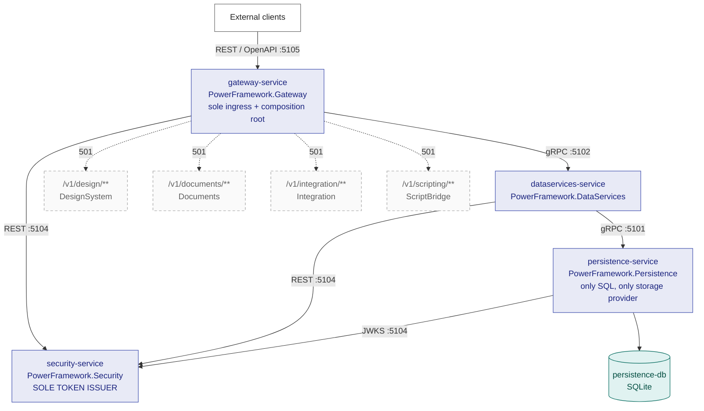

<!-- Markdown lint policy for this file. Rationale and the verifying command are in docs/BUILD.md
     section 14. MD013 is 120 rather than the 80-character default, and is disabled for tables and
     code blocks: an evidence row carrying a legacy locator and a quoted finding cannot be wrapped
     without splitting the locator from what it proves, and a wrapped command is a command that does
     not run. Prose IS wrapped, and is held to the 120 limit. Verify with:
       npx markdownlint-cli2 docs/SERVICE_MAPPING.md docs/ARCHITECTURE.md docs/CONTRACTS.md \
                             docs/DEFERRED.md docs/SECRETS.md docs/BUILD.md
     The command names the six authored files EXPLICITLY and does not glob `docs/*.md`, because that
     glob also sweeps the five read-only legacy Chinese documents, which carry their own pre-existing
     violations (hard tabs, unlabelled code fences and others). Those files are the behavioural oracle
     and are never edited, so a command that reports them would fail for reasons this refactor must not
     "fix".

     Declared inline, per file, so the policy travels with the document and applies to the six files
     this refactor authored WITHOUT changing how the read-only legacy documents in this folder are
     linted, and without adding a repository-root configuration artifact the plan does not provide for. -->
<!-- markdownlint-configure-file { "MD013": { "line_length": 120, "tables": false, "code_blocks": false } } -->

# PowerFramework → .NET 10 — Target Architecture

This document is the authoritative reference for the **service topology**, the **transport chosen for
each service**, the **port map**, and **capability gating** of the four-service .NET 10 decomposition
of PowerFramework. Several sibling documents are written against it.

It describes **Phase 1**, which implements exactly four of an eight-service target roster. The other
four are mapped to a destination but receive no code, no test and no container; see
[`DEFERRED.md`](DEFERRED.md).

**Audience.** Anyone who needs to know *why* a boundary is where it is, not merely where it is. Every
architectural claim below carries a locator into the read-only legacy tree so a reader can check it
without taking this document's word for anything.

**What this document deliberately does not duplicate.** Cross-reference rather than restatement is the
rule here, because a figure repeated in two places is a figure that will eventually disagree with
itself:

| For | See |
| --- | --- |
| The full-estate mapping — all 39 libraries and all 544 objects assigned to a destination | [`SERVICE_MAPPING.md`](SERVICE_MAPPING.md) |
| The cross-service contract inventory and the four reserved Gateway extension points | [`CONTRACTS.md`](CONTRACTS.md) |
| Build and test commands, the solution layout, and per-service build independence | [`BUILD.md`](BUILD.md) |
| The characterization model, the fixture corpus and the determinism seams | [`docs/PARITY.md`](PARITY.md) |
| Secret locators, severities, required actions and the token-topology register | [`SECRETS.md`](SECRETS.md) |
| The four deferred destinations in detail and their assigned objects | [`DEFERRED.md`](DEFERRED.md) |

## Current state of the artifacts this document references

Some artifacts referenced below are **planned and not yet present in this repository**. They are named
because they are where the corresponding work belongs, not because a reader can open them today:

| Artifact | What it will carry | State |
| --- | --- | --- |
| `orchestration/docker-compose.yml`, `orchestration/README.md` | Local orchestration and the readiness-gate bring-up. `orchestration/.env.example` is already present; the manifest and its readme are not | **Planned — not yet present** |
| `characterization/` | The paired legacy and target recordings | **Planned — not yet present** |
| The four per-service `Dockerfile`s | Container images for the four services | **Planned — not yet present** |

Everything else this document references — the solution and project files, the shared libraries, the
protocol and OpenAPI definitions under `shared/PowerFramework.Contracts/`, the per-service settings,
[`PARITY.md`](PARITY.md), `orchestration/.env.example` and
the read-only legacy tree — **is present in the tree today**.

**The topology described below is therefore a design, not a running system.** Every service boundary,
port assignment and readiness dependency is specified and internally consistent, but no container has
been built from this document and no bring-up has been observed.

---

## Table of contents

1. [Position, method and evidence discipline](#1-position-method-and-evidence-discipline)
2. [The starting point: a library, not a server](#2-the-starting-point-a-library-not-a-server)
3. [Target topology](#3-target-topology)
4. [Port, transport and endpoint map](#4-port-transport-and-endpoint-map)
5. [Transport chosen per service](#5-transport-chosen-per-service)
6. [Capability gating: the legacy's own decomposition intent](#6-capability-gating-the-legacys-own-decomposition-intent)
7. [The composition root](#7-the-composition-root)
8. [Storage](#8-storage)
9. [Security and token topology](#9-security-and-token-topology)
10. [Orchestration](#10-orchestration)
11. [Design patterns and the legacy-to-target mapping](#11-design-patterns-and-the-legacy-to-target-mapping)
12. [Deliberately absent](#12-deliberately-absent)
13. [Known limitations and anomalies](#13-known-limitations-and-anomalies)
14. [Closing note: what this architecture does and does not claim](#14-closing-note-what-this-architecture-does-and-does-not-claim)

---

## 1. Position, method and evidence discipline

### 1.1 No user-specified rules exist

The project's rules document was retrieved and contains exactly one statement: **no user rules were
provided.** That is a finding, not an omission, and three consequences follow:

- **No rule is invented, inferred, or back-filled from convention.** Nothing in this document is
  presented as a requirement because it is a common practice.
- **Enterprise-standard best practice applies in the rules' place.** For an architecture document
  that means every claim is traceable to evidence, every decision records the alternative that was
  rejected and the reason it was rejected, and nothing is asserted that the repository cannot
  support.
- **Zero files enter scope because of a rule.** This document exists because the migration plan
  requires it.

The binding constraints therefore come from elsewhere — the migration brief's own clauses and the
attached environment's setup instructions. They are referred to below by their identifiers (C-A
through C-L) rather than reproduced.

### 1.2 The legacy tree is read-only, and it is the only specification

`ws_objects/**`, the compiled libraries and target files, `oldversion/125/**`, `pack/**`, the native
binaries, `res/**` and the legacy browser assets under `tests/blink`, `tests/sciter` and
`tests/webview` are the **behavioural oracle**. They are never edited, moved, renamed or reformatted
(C-C).

That read-only status extends explicitly to the five pre-existing Chinese documents in this very
folder — [`README.md`](README.md), [`Blink交互.md`](Blink交互.md), [`Sciter交互.md`](Sciter交互.md),
[`PB多线程绕坑提示.md`](PB多线程绕坑提示.md) and
[`n_cst_dwsvc_columnexp.md`](n_cst_dwsvc_columnexp.md). This document **cites** them; it does not
touch them, translate them, re-encode them or rewrite their links. Where one of them is inaccurate —
and §7.3 records two places where one is — the correction is stated *here*, never applied *there*.

### 1.3 Locator convention and why nothing else can adjudicate behaviour

Every behavioural claim carries a `path:Lnn` locator. That discipline is not ceremony; it is forced
by the fact that no other artifact in the repository can settle a question of behaviour:

- **The changelog is stale.** `logfile.md` opens at `## 3.0.7.2062(2022-04-14)` while the commit
  history runs years later, and there are **zero Git tags** across the repository's history, so no
  release is marked.
- **Neither PowerBuilder build definition would build as written.** `ws_objects/pfw.pbl.src/project.srj`
  declares 29 `PBD:` lines and `ws_objects/pfw.pbl.src/p_pfw.srj` declares 28; they disagree on the
  vendor string; and **both reference `pfw.utility.imgcodec.pbl`**
  [`project.srj:L41`, `p_pfw.srj:L40`] — a library that exists nowhere in the repository. They are
  read for build *intent* only.

Consequently the .NET build, CI and orchestration are authored as clean creations rather than
translated from an existing definition, and every behavioural assertion in the generated code traces
to a `ws_objects/**` locator.

---

## 2. The starting point: a library, not a server

The target topology only makes sense against what it replaces, so this section establishes the
starting point first.

### 2.1 What one PowerBuilder process actually is

The estate is **39 exported library folders** under `ws_objects/` against **40 compiled root `*.pbl`
files** — reconciled by the one library that appears on a target's library list with no corresponding
source export, `pfwx.utility.codec.pbl` [`pfwx.pbt`, `LibList`].

An application composes its world by *listing* libraries in its target file, and the primary target
does so explicitly: `pfw.pbt`'s `LibList` names **32** libraries in a single ordered string; the
secondary target `pfwx.pbt` names **9**, of which exactly two — `pfw.common.pbl` and `pfw.shared.pbl`
— are shared with the primary target, which is what makes those two the cross-target foundation.

The consequences of that mechanism are the architectural facts that matter:

- **One flat global namespace.** PowerBuilder has no namespaces and no import statements. Every
  global object lives in one namespace, and **symbol resolution is determined by the order of the
  library list** [`pfw.pbt`, `LibList`]. There are therefore no import statements to rewrite in this
  refactor — the work is namespace *creation* plus resolving the collisions a flat namespace
  tolerated.
- **Every call is in-process and synchronous** unless explicitly posted to the Win32 message queue.
- **Object identity is a pointer.** Structures hold live object references, and §13 records the one
  place where that genuinely cannot cross a process boundary.
- **Events are dispatched by the PowerBuilder runtime**, not by application code.
- **Cross-thread work uses a hand-built proxy-pair pattern** in which every concurrency class exists
  twice — a caller-side `n_cst_threading*` and a worker-side `n_cst_thread*` — so that no object is
  ever touched from two threads.

### 2.2 The two consequences that shape every boundary

Now the fact that makes this refactor unusual, stated plainly:

> **PowerFramework is a library, not a server.** It has no process of its own, no listener, no route
> table, no serialization layer, and no authentication of any kind — because there is nothing to
> authenticate against.

Two consequences follow, and both are load-bearing for everything below:

1. **Every cross-service contract in this refactor is net-new.** None of them translates an existing
   wire format, because no wire format exists to translate. This is why the contract inventory is
   published for review as its own artifact rather than emitted silently as a by-product of code
   generation — see [`CONTRACTS.md`](CONTRACTS.md).
2. **Decomposition creates the system's first-ever ingress.** The legacy opens no listening socket,
   registers no route and receives no unsolicited request. That is precisely why Security exists as a
   Phase-1 service, and why a JSON Web Token is required on **every internal edge** rather than only
   at the outer edge. §9.1 works through why the "no new attack surface" requirement cannot be read
   literally.

### 2.3 The threading hazards that constrain the Persistence design

The legacy carries its own threading note, [`PB多线程绕坑提示.md`](PB多线程绕坑提示.md) (read-only),
and it documents two hazards that directly constrain how the SQL layer may be re-expressed:

- **A worker thread synchronously calling a main-thread object function or event whose return type is
  `string` or `blob` may raise a memory exception** [`docs/PB多线程绕坑提示.md:L1-L4`]. The stated
  trigger is a main-thread object having an unexecuted `Post` message while the object itself has
  been destroyed. The stated remedies are to avoid such calls, or to return the value through a `ref`
  parameter instead.
- **A worker thread that receives a main-thread object must release it explicitly** — the note
  requires the worker to set the referenced main-thread object to null (`SetNull`) in its `OnUninit`
  event [`docs/PB多线程绕坑提示.md:L5`].

These two hazards are *why* the proxy pair of §2.1 exists. They are the reason the port reproduces an
**explicit marshalling boundary** between the caller side and the worker side rather than flattening
the pair into a single async method: the thread-affinity split is a contract that the legacy encodes
in its own object comments, not an implementation detail that a modern async idiom subsumes. The same
reasoning is why the buffer carrier is an anti-corruption layer rather than a rowset (§11.1).

---

## 3. Target topology

### 3.1 The four services

Four ASP.NET Core services on `net10.0`, **each in its own container image and each with its own
per-service solution file**, so that every one restores, builds and tests from a clean checkout
without reference to any other service's project (C-A). A single collapsed solution containing four
folders is a failure mode, not a cautious choice, and is not what is built here.

| Service | Directory | Project | Capability it owns | Legacy anchor |
| --- | --- | --- | --- | --- |
| **Gateway** | `services/gateway-service` | `PowerFramework.Gateway` | Sole ingress and composition root; request routing; capability gating; the reserved extension points | The application objects and the framework lifecycle contract [`ws_objects/pfw.pbl.src/pfw.sra:L88-L108`], [`docs/README.md` §初始化] |
| **DataServices** | `services/dataservices-service` | `PowerFramework.DataServices` | The DataWindow retrieval / validation / update triple, the 22-event DataWindow chain, and the column-expression engine | `ws_objects/pfw.datawindow.services.pbl.src/` (13 objects) |
| **Persistence** | `services/persistence-service` | `PowerFramework.Persistence` | **The only service that generates or executes SQL, and the only one holding a storage provider** | `ws_objects/pfw.utility.sqlite.pbl.src/` (3), `ws_objects/pfw.thread.pbl.src/` (6), `ws_objects/pfw.thread.ext.pbl.src/` (15) |
| **Security** | `services/security-service` | `PowerFramework.Security` | The keyed cryptographic surface; **sole JSON Web Token issuer** for all four services | `ws_objects/pfw.crypto.pbl.src/n_crypto.sru:L9-L73` |

These directory and project names are canonical, and they are used identically in
[`BUILD.md`](BUILD.md) and [`SERVICE_MAPPING.md`](SERVICE_MAPPING.md).

**The root `README.md` does not yet carry them.** It still holds only its original legacy content, and
appending a .NET section that names these services and their ports is **planned work that has not been
done** — so a reader should not expect the root README to corroborate this table today. That update is
the one and only modification this refactor makes to a pre-existing file, and it is deliberately
scoped so the existing licence text and its Chinese restatement are preserved verbatim.

Two boundary justifications are worth drawing out, because they are the ones a reader is most likely
to question:

- **Why Persistence owns SQL exclusively.** `ws_objects/pfw.thread.ext.pbl.src/` is entirely
  SQL-shaped: its two structures are literally `dberrordata.srs` and `transactiondata.srs`, and 13 of
  its 15 objects are SQL query, command, update and transaction tasks. Asynchronous SQL is the whole
  reason that library exists, so it cannot be separated from SQL without dissolving it.
- **Why Security is a Phase-1 service rather than a library.** The legacy already contains the
  signing primitives a token issuer needs — `RSASign` and `VerifyRSASign`
  [`ws_objects/pfw.crypto.pbl.src/n_crypto.sru:L70-L73`] — inside a surface of 65 declared functions
  at `:L9-L73`, of which 63 are cryptographic operations and two are version and copyright
  accessors. Concentrating that surface behind one boundary is what makes a single signing authority
  possible at all (§9.2).

The full-estate capability assignment — which of the 544 objects goes where, including the deferred
majority — is [`SERVICE_MAPPING.md`](SERVICE_MAPPING.md)'s subject and is not restated here.

### 3.2 The call graph — layered and acyclic

The graph is strictly layered, and it is acyclic:

- **Gateway** calls DataServices and Security.
- **DataServices** calls Persistence and Security.
- **Persistence** reads Security's published verification keys only.
- **Nothing calls Gateway except external clients; nothing but Gateway calls DataServices; nothing
  but DataServices calls Persistence.**

This is what satisfies the constraint that no service reaches into another service's internals. The
**only** cross-service coupling anywhere in the system is the published contracts project: it is the
boundary *definition*, not a shared-code back door. No behavioural code crosses a service boundary.

Because there is no cycle, each service can be deployed and scaled independently of the others — an
architectural property of the topology, and the whole point of C-J.

### 3.3 Diagram

Solid boxes are built services; the four dashed boxes reached by dotted edges are reserved routes.



**The dotted edges are routing metadata only.** No project, no container, no test and no
placeholder class exists behind any of them — which is why those four nodes are drawn dashed and
unfilled rather than as services. §4.4 states that distinction in full, because it is the one an
auditor should be able to check without ambiguity.

---

## 4. Port, transport and endpoint map

### 4.1 The map

The attached environment fixes a 5101–5105 band and publishes the composition root at port 5105. That
band and that port are preserved (C-L) so the documented access URL still resolves; the band is
re-mapped onto the four real services.

| Directory | Project | Port | Transport | Token role |
| --- | --- | --- | --- | --- |
| `services/persistence-service` | `PowerFramework.Persistence` | **5101** | gRPC, plus REST `/health` and `/v1/ping` | verification only |
| `services/dataservices-service` | `PowerFramework.DataServices` | **5102** | gRPC primary + a thin REST projection for Gateway | verification only |
| *(reserved)* | — | **5103** | — | **commented-out DesignSystem Phase-2 slot** |
| `services/security-service` | `PowerFramework.Security` | **5104** | REST + `/.well-known/jwks.json`, **over HTTPS** | **SOLE ISSUER** |
| `services/gateway-service` | `PowerFramework.Gateway` | **5105** | REST + OpenAPI | verification only |

The composition root is reachable at `http://localhost:5105`.

**Security's listener is the one that must be TLS, and for a functional reason rather than a
hardening one.** Its published server is `https://localhost:5104`. Token issuance authenticates the
caller with a **client certificate**, and a client certificate cannot be presented on a plaintext
listener at all — published over `http` the token endpoint would be uncallable and no service could
obtain its first token. The JWKS and discovery documents are additionally the verification material
the other three services trust, so a channel an attacker can rewrite would let that attacker choose
the keys every token in the system is validated against. Consumers configure their bearer handler's
authority as `https://localhost:5104` with metadata retrieval over HTTPS required; inside the
orchestration network they use the service name on the same port.

### 4.2 The endpoint contract common to all four

- **`/health` is anonymous on all four services.** **Gateway reports healthy only after Persistence,
  DataServices and Security report healthy** — expressed in the Compose manifest with `depends_on`
  using a `service_healthy` condition. This is the most important readiness property in the
  orchestration, and §10.4 records the alternative that was rejected precisely because it could not
  express it.
- **`/v1/ping` requires a token on all four services** and returns **`401`** without one. It is the
  standing proof that the authenticated-boundary requirement holds on every service, not just at the
  ingress.
- **Conflict mapping.** On an optimistic-concurrency mismatch, Persistence and DataServices return
  gRPC `StatusCode.Aborted` — the canonical gRPC-to-HTTP mapping — and Gateway's REST projection
  surfaces it as **HTTP `409`** carrying a structured conflict detail with the current row state.
  Callers implement an explicit retry-or-surface policy. **There is no silent overwrite anywhere in
  the system.**

### 4.3 Why 5103 is reserved rather than reassigned

The attached environment assigned 5103 to a design service. DesignSystem is precisely one of the four
deferred services, so the slot is left in the Compose manifest as a **commented-out placeholder**
rather than reassigned to one of the four services that do exist.

That is a deliberate choice with a reason: leaving it commented is literally the obvious Phase-2 slot
the manifest should provide, and it keeps the shape of the eventual system legible. Reassigning the
port would erase that signal, and a future reader would have no way to tell that a service had been
planned there.

### 4.4 The four reserved deferred routes are metadata, not stubs

Gateway's routing metadata declares four reserved routes. Each returns **`501 Not Implemented`** with
a machine-readable body naming the deferred service it will eventually reach and the marker
*reserved for Phase 2*:

| Route | Deferred service |
| --- | --- |
| `/v1/design/**` | DesignSystem |
| `/v1/documents/**` | Documents |
| `/v1/integration/**` | Integration |
| `/v1/scripting/**` | ScriptBridge |

**Stated explicitly so it is auditable: a routing declaration is not a stub of the deferred service.**
For DesignSystem, Documents, Integration and ScriptBridge there is:

- no service directory and no project file,
- no container definition,
- no test project,
- no partial implementation, and
- no exception-throwing placeholder class.

The route exists so that the shape of the eventual system is legible from Gateway's contract, which
is what the brief asks for. The prohibition in C-D is on *implementing* the deferred services — not
even partially, not even to stub them out — and a declaration in a route table implements nothing.
The capabilities each route will eventually reach are enumerated in [`DEFERRED.md`](DEFERRED.md).

---

## 5. Transport chosen per service

Transport is decided **per service, from the shape of that service's current interface** — not by
blanket policy. Each of the four decisions is recorded below with the interface evidence that drove
it, and each rejected alternative is recorded with its reason (C-K).

No transport decision here rests on a speed argument, and none is available to rest on: the repository
publishes no service-level objective of any kind (§12 and C-B).

### 5.1 Gateway → REST (Minimal APIs + OpenAPI)

**Interface shape.** Gateway's legacy analogue is the coarse, human-facing application lifecycle —
`open`, `close` and `systemerror` [`ws_objects/pfw.pbl.src/pfw.sra:L88-L108`, `:L111-L144`] — plus a
navigation surface. That is a request/response shape, not a streamed or ordered one.

**Additionally required because Gateway is the sole ingress.** REST gives browser and third-party
reach, alignment with HTTP-standard caching and proxying, and mature OpenAPI tooling for a surface that
external clients must be able to discover. Note carefully what "REST" names here and what it does not:
it names **HTTP semantics** — request/response, resource paths, status codes, an OpenAPI description a
stock client consumes — and says nothing about the scheme. **Every service in this system speaks those
semantics over HTTPS in a deployed topology**; the plain-HTTP loopback addresses in §4.1 and in the
documented bring-up are a local-development convenience, and §9.4 states the transport-security model
in full.

**Rejected alternative — gRPC at the edge.** gRPC-Web requires a translating proxy in front of it and
supports server streaming only. Choosing it for the ingress would forfeit exactly the properties an
ingress needs, and would add an intermediary component to the one boundary that external clients must
reach directly.

### 5.2 DataServices → gRPC primary, with a thin REST projection consumed only by Gateway

**Interface shape.** `ws_objects/pfw.datawindow.services.pbl.src/se_cst_dw.sru` declares exactly 22
events at `:L11-L32` — 9 semantic and 13 raw `pbm_dwn*` — forming an ordered chain with veto
semantics. Three features of that declaration decide the transport between them:

- an **ordered event chain** whose sequence is itself contract, including nested and deferred
  dispatch;
- a **`ref string` out-parameter** — `onddsgetfilter` produces its result by mutating a reference
  rather than returning a value [`se_cst_dw.sru:L13`];
- an **`any` return over a `string[]` argument** — `oncolumnexpinvokemethod` [`se_cst_dw.sru:L14`].

That shape demands compile-time contract enforcement, bidirectional streaming to carry the ordered
chain, and a status model rich enough for a four-value item-change alphabet and a tri-valued veto.
Protobuf over gRPC carries all three. JSON over REST would lose both the ordering and the typed veto,
and would leave the `any` return untyped at both ends.

**Why a REST projection exists as well.** Gateway is REST at the edge (§5.1), so a thin projection of
the DataWindow surface is exposed for Gateway alone to consume. It is a projection, not a second
implementation, and it is the layer where gRPC `Aborted` becomes HTTP `409` (§4.2).

### 5.3 Persistence → gRPC

**Interface shape.** The legacy surface is `Query`, `Update`, `Exec`, `Commit`, `Rollback` and
`SQLErrText`. That vocabulary is **action-oriented, and therefore RPC-shaped rather than
resource-oriented** — there is no resource whose representation these methods manipulate; they are
operations. Four further properties confirm the choice:

- the 13 SQL task classes carry **mandatory thread affinity** encoded in their own source comments,
  which the contract must express as an explicit marshalling boundary (§2.3);
- `dberrordata.srs` requires a **structured error payload**, not a string;
- the mandated conflict response requires **rich status detail** — the current row state travels with
  the status (§4.2);
- **server streaming** reproduces the progressive result delivery of the legacy recordset object.

### 5.4 Security → REST (minimal, OpenAPI-described)

**Interface shape.** The cryptographic surface at
`ws_objects/pfw.crypto.pbl.src/n_crypto.sru:L9-L73` is stateless request/response throughout, with no
ordering requirement and nothing to stream.

**Additionally required by how tokens are consumed.** Token issuance and key publication must speak
**ordinary HTTP** — not a bespoke protocol — so that consumers' stock JSON Web Token bearer handlers
fetch `/.well-known/jwks.json` and OpenID Connect discovery metadata with **zero bespoke code**. HTTP
*semantics*, over HTTPS: the scheme is not what makes a stock handler work, and §9.4 records both the
transport-security model and the one edge on which it is load-bearing. That keeps the security-critical
retrieval path
inside framework code rather than hand-written code.

**Rejected alternative — gRPC for Security.** Choosing gRPC here would force custom key-set retrieval
into three separate services. That is a net *increase* in hand-written security code, which is the
opposite of what the requirement is trying to achieve. It is the wrong direction, not merely a less
convenient one.

### 5.5 Summary

| Service | Transport | Decided by | Rejected alternative |
| --- | --- | --- | --- |
| Gateway | REST + OpenAPI | Coarse lifecycle shape; sole-ingress reach and tooling | gRPC-Web at the edge — needs a translating proxy, server streaming only |
| DataServices | gRPC + thin REST projection | 22-event ordered chain, `ref string` out-parameter, `any` return | JSON over REST — loses ordering and the typed veto |
| Persistence | gRPC | Action-oriented verbs, thread affinity, structured errors, rich status, server streaming | — |
| Security | REST + JWKS over HTTPS | Stateless surface; stock bearer handlers self-configure from the discovery document. TLS is not the reason REST was chosen, but it is a hard requirement of the chosen shape — see §4.1 | gRPC — would force bespoke key retrieval into three services |

---

## 6. Capability gating: the legacy's own decomposition intent

This section carries a genuinely interesting finding, so it is given room.

The framework's own module-gating bitmask **is the legacy's own decomposition intent**. It was written
years before this refactor, for its own reasons, and mapping it onto the Phase-1 service roster
independently corroborates that the four-service slice is drawn along the same seams the framework's
authors already recognised.

### 6.1 The eight capability bits

`ws_objects/pfw.shared.pbl.src/enums.sru:L41-L49` declares eight capability bits, each as a
`Constant Long`, under the comment `//Initialize flags (pfwInitialize:[flags])` at `:L40`. Verified
verbatim:

| Constant | Value | Locator | Maps to |
| --- | --- | --- | --- |
| `INIT_FLAG_ENABLE_UI` | 1 | `enums.sru:L41` | DesignSystem (deferred) |
| `INIT_FLAG_ENABLE_SCITER` | 2 | `enums.sru:L42` | ScriptBridge (deferred) |
| `INIT_FLAG_ENABLE_BLINK` | 4 | `enums.sru:L43` | ScriptBridge (deferred) |
| `INIT_FLAG_ENABLE_BLINKFAST` | 8 | `enums.sru:L44` | ScriptBridge (deferred) |
| `INIT_FLAG_ENABLE_ORCA` | 256 | `enums.sru:L45` | packaging tooling |
| `INIT_FLAG_ENABLE_SQLITE` | 512 | `enums.sru:L46` | **Persistence — the only bit with an in-scope consumer** |
| `INIT_FLAG_ENABLE_DPIAWARE` | 1024 | `enums.sru:L47` | DesignSystem (deferred) |
| `INIT_FLAG_ENABLE_WEBVIEW` | 2048 | `enums.sru:L48` | ScriptBridge (deferred) |

These identifier spellings are preserved exactly, in SCREAMING_SNAKE, contrary to C# naming
convention — because these strings appear in serialized payloads, in log records and in
characterization recordings, where a rename would silently invalidate every stored comparison. An
analyzer suppression scoped to the files that carry them accompanies the decision; see
[`BUILD.md`](BUILD.md).

### 6.2 `INIT_FLAG_ENABLE_ALL` omits `BLINKFAST`, deliberately

`INIT_FLAG_ENABLE_ALL` is declared at `enums.sru:L49` as the sum of

```powerscript
INIT_FLAG_ENABLE_UI + INIT_FLAG_ENABLE_SCITER + INIT_FLAG_ENABLE_BLINK + INIT_FLAG_ENABLE_ORCA
  + INIT_FLAG_ENABLE_SQLITE + INIT_FLAG_ENABLE_DPIAWARE + INIT_FLAG_ENABLE_WEBVIEW
```

— seven of the eight bits. **`INIT_FLAG_ENABLE_BLINKFAST` is omitted**, so the constant evaluates to
`3847` rather than `3855`.

This is stated explicitly **because it looks like an oversight and is not**: `blink.dll` and
`blinkfast.dll` are alternative builds of one engine rather than two independent capabilities, so
enabling both in an "everything on" constant would be incoherent. The omission is verified in the
source and is reproduced exactly in the ported constant. A future maintainer who "fixes" it by adding
the eighth bit would be changing behaviour, not correcting a typo.

### 6.3 The operational consequence

The read-only legacy specification is explicit about what a capability bit actually controls
[`docs/README.md` §高级初始化, `:L26`]: a module that is **not** explicitly initialized has its
related functionality **unusable**, and its DLL **need not be shipped** at all. The same section shows
the pattern

```powerscript
pfwInitialize(Enums.INIT_FLAG_ENABLE_SCITER)
```

at `docs/README.md:L28`, and warns at `:L30` that the corresponding DLL must accompany the application
at runtime **or initialization fails**. That is a hard failure, not a degradation — and it is the same
posture §7.4 requires the .NET composition root to preserve.

That evidence is why the equivalent gate is exposed as **configuration on Gateway's composition
root** rather than hard-wired: the legacy already treated its capability set as a deployment-time
decision that determines which artifacts even need to be present.

### 6.4 What the mapping corroborates

Read down the right-hand column of the table in §6.1 and the Phase-1 slice falls out of it:

- **`INIT_FLAG_ENABLE_SQLITE` is the only bit with an in-scope consumer.** Persistence consumes it;
  nothing else in Phase 1 does.
- `INIT_FLAG_ENABLE_UI` and `INIT_FLAG_ENABLE_DPIAWARE` are DesignSystem — deferred.
- `INIT_FLAG_ENABLE_SCITER`, `INIT_FLAG_ENABLE_BLINK`, `INIT_FLAG_ENABLE_BLINKFAST` and
  `INIT_FLAG_ENABLE_WEBVIEW` are ScriptBridge — deferred.
- `INIT_FLAG_ENABLE_ORCA` is packaging tooling, which is not a service at all.

The framework's own gating vocabulary therefore already separates storage from presentation from
scripting from tooling. The Phase-1 boundary agrees with a distinction the legacy drew itself, which
is a stronger argument for the boundary than any amount of design preference.

---

## 7. The composition root

Gateway is the composition root, and its contract is inherited directly from the legacy application
lifecycle.

### 7.1 The mandatory initialize/finalize pairing

The read-only legacy specification [`docs/README.md` §初始化] states that from version 2.0 onward the
framework **must** be initialized before use; that `pfwInitialize([flags])` belongs at the very
**start** of the Application `open` event and `pfwFinalize` at the very **end** of `close`
[`docs/README.md:L11-L12`]; and it carries an explicit warning at `:L15` that the two **must be
paired**.

In the .NET target this becomes ASP.NET Core **host startup and shutdown**, with the pairing enforced
by the host lifetime rather than by convention, and with **fail-fast validation** at startup (§7.4).

The legacy honours its own rule in the primary application — `pfwInitialize(Enums.INIT_FLAG_ENABLE_ALL)`
is the first statement of the `open` event [`ws_objects/pfw.pbl.src/pfw.sra:L91`] and the `close` event
is exactly `pfwFinalize()` [`:L108`]. It does **not** honour it in the secondary application:
`ws_objects/pfwx.pbl.src/pfwx.sra`'s `open` event contains no initialize call at all [`:L48-L50`] while
its `close` event still calls `pfwxFinalize()` [`:L52`]. That asymmetry is recorded as an observed
anomaly (§13); the .NET host cannot reproduce an unpaired lifecycle because the pairing is structural
there, and the secondary application is reference-only in any case.

### 7.2 Verified native signatures

Both lifecycle functions are PowerBuilder Native Interface entry points over the closed
`pfw.dll`, and both return `long` — so the initialization result flows through the framework's
return-code algebra rather than through an exception:

| Locator | Declaration |
| --- | --- |
| `ws_objects/pfw.base.pbl.src/pfwinitialize.srf:L3` | `global type pfwinitialize from function_object native "pfw.dll"` |
| `…/pfwinitialize.srf:L7` | `global function long pfwInitialize ()` |
| `…/pfwinitialize.srf:L8` | `global function long pfwInitialize (readonly unsignedlong flags)` |
| `ws_objects/pfw.base.pbl.src/pfwfinalize.srf:L3` | `global type pfwfinalize from function_object native "pfw.dll"` |
| `…/pfwfinalize.srf:L7` | `global function long pfwFinalize ()` |

Initialize has two overloads — a no-argument form and a flags form taking `readonly unsignedlong` —
which is exactly the shape the capability gate of §6 needs. Finalize has one.

### 7.3 Two discrepancies in the legacy documentation

The second initialization mechanism the legacy offers is to inherit an initializer object and let
automatic instantiation drive the lifecycle [`docs/README.md:L17-L21`]. Two statements in that
paragraph do not survive verification. Both are recorded here and **neither is corrected in the legacy
document**, which is read-only (C-C).

- **The library attribution is wrong.** `docs/README.md:L19` attributes `n_initializer` to
  `pfw.common.pbl`. The only `n_initializer.sru` anywhere in the tree is at
  **`ws_objects/pfw.base.pbl.src/n_initializer.sru`**, and `ws_objects/pfw.common.pbl.src/` contains
  no initialization object at all — its 25 objects are bit and word operations, assertion, stack
  trace, `sprintf`, ancestry predicates and string helpers. **Cite the real location.** The
  attribution `pfw.common.pbl::n_initializer` is not repeated as fact anywhere in this
  documentation set.
- **The equivalence claim is not exact.** `docs/README.md:L20` states that the initializer's property
  switches are equivalent to the `Enums.INIT_FLAG_XXX` values. The object declares **seven**
  switches — `#UI` (defaulting to `true`), `#Sciter`, `#Blink`, `#BlinkFast`, `#ORCA`, `#SQLite` and
  `#DPIAware`, the last six defaulting to `false` [`ws_objects/pfw.base.pbl.src/n_initializer.sru:L14-L20`]
  — against the **eight** bits of §6.1. There is no `#WebView` switch, so the two mechanisms are not
  interchangeable for a WebView-enabled application. The .NET capability gate is modelled on the
  eight-bit enum, which is the authoritative set.

The same object is also one of the flat-namespace collisions §2.1 refers to: it declares
`global n_initializer n_initializer` at `:L10`, an auto-instance shadowing its own type name. In the
target the type keeps a descriptive name and the instance becomes an injected dependency rather than a
global.

### 7.4 Fail-fast, preserved as fail-fast

`ws_objects/pfw.pbl.src/pfw.sra:L111-L144` implements a `systemerror` event that, when the error
originates from an assertion [`:L114`], splits the error text on a CRLF separator into an array
[`:L115`], and — when the split yields exactly **seven** fields [`:L119`] — repopulates the error
number, text, window, object, event, line and stack trace from them [`:L117-L124`]. It then formats a
report [`:L129-L139`], displays it [`:L141`], and executes **`HALT CLOSE`** [`:L143`].

The .NET equivalent is **fail-fast startup validation and process termination on structural faults**.
Worker-session creation failure is likewise fatal.

**Softening this into warn-and-continue would be a behavioural change dressed as robustness**, and it
is worth naming that temptation directly, because graceful degradation is normally the better instinct
in a service and here it is not. The legacy's contract is that a structural fault stops the process;
preserving that is preserving behaviour, and replacing it would silently convert a loud failure into a
quiet one. The seven-field payload protocol itself is carried across as a structured type rather than a
CRLF-delimited string.

### 7.5 One preserved defect: the hardcoded locale

`ws_objects/pfw.pbl.src/pfw.sra:L94` sets `lang = "en"` as a literal, inside an `open` event that
initializes with the all-capabilities flag [`:L91`], sets the locale literally [`:L94`], selects one of
three provider classes from it [`:L95-L102`], installs the provider [`:L103`], and opens the demo
selector [`:L105`].

**The defect is the hardcoding, not the value.** It is therefore preserved as the **default** value and
made **overridable through configuration** — which reproduces the observable default without
re-creating the un-configurability. That distinction matters and is applied consistently: the
observable default is a *behaviour* and is preserved; being impossible to configure is a *structural
property* of a compiled literal, not a behaviour, and is not something a reader could observe from
outside.

### 7.6 Theming is disabled by the legacy itself

For completeness, and because it bears on §12: `ws_objects/pfw.pbl.src/pfw.sra:L25` sets
`themename = "Do Not Use Themes"`. The legacy application disables its own theming outright. This is
one of the three independent reasons no design system is introduced in this phase.

The same object records the legacy runtime it was built against — `appruntimeversion = "21.0.0.1311"`
[`:L34`] — which constrains nothing on the .NET side but is the version any characterization capture
must be taken against.

---

## 8. Storage

This section carries constraint C-E — **no fabricated database** — so it is stated with more precision
than brevity would prefer. The single most important sentence in it is §8.2's first line.

### 8.1 Two mutually independent storage paths

The repository contains two storage paths that have nothing to do with each other. Conflating them
would fabricate a database that does not exist.

**Path 1 — the SQLite binding. The only path with a real, evidenced connection.**

`ws_objects/pfw.tests.pbl.src/w_test_sqlite.srw` opens a SQLite file through a URI:

- a file delete precedes the open [`:L450`];
- the surrounding comments [`:L452-L455`] cite the SQLite URI specification and document two
  framework-specific URI extensions — a `check` option with a `quick` variant, selecting between an
  ordinary and a quick integrity check, and a `journal` option across six values (`DELETE`,
  `TRUNCATE`, `PERSIST`, `MEMORY`, `WAL`, `OFF`) **defaulting to `DELETE`**;
- the open itself is `test.db?mode=rwc` with an optional password parameter shown inline [`:L456`],
  guarded by the framework's failure predicate;
- auto-commit is toggled on and off around the statement [`:L461`, `:L473`].

The same file carries **the only DDL in the entire repository** [`:L463-L469`], creating a `COMPANY`
table with an `INTEGER PRIMARY KEY` identifier, a required text name, a required integer age, an
address column **declared** `CHAR(50)`, a real salary and a text birth field.

Two properties of that DDL are stated precisely here rather than loosely, because both are easy to
overstate and the entity model depends on getting them right:

- **The declared `CHAR(50)` length is not enforced.** SQLite assigns a declared type containing
  `CHAR` **TEXT affinity** and ignores the parenthesised length entirely, so the engine neither
  truncates at 50 nor pads to 50. The address column is therefore *declared* `CHAR(50)` with TEXT
  affinity, and a longer value round-trips intact — a fact the seeded literal `'Rich-Mond '`
  [`:L388`], with its trailing space preserved, demonstrates directly. Calling it a fixed-width
  50-character field would describe a constraint the engine does not apply.
- **`INTEGER PRIMARY KEY` is a rowid alias, and the `AUTOINCREMENT` keyword is absent.** The column
  is declared `ID INTEGER PRIMARY KEY NOT NULL` [`:L464`], which makes it an alias for the table's
  rowid, so SQLite assigns a value automatically on an insert that omits it. That automatic
  assignment is **not** the SQLite `AUTOINCREMENT` keyword, which the DDL never uses: `AUTOINCREMENT`
  would additionally guarantee monotonically increasing values and create a `sqlite_sequence` entry,
  and neither applies here. The legacy's own inline comment on that line marks it the auto-increment
  column, and that annotation is what the DataWindow's `key=yes identity=yes` corresponds to — but
  the mechanism is rowid assignment, not the keyword.

**Path 2 — the transaction-object path.**

`ws_objects/pfw.thread.ext.pbl.src/n_cst_thread_trans.sru` declares **exactly two** engine-type
constants — `DBT_MSSQL` as `0` [`:L60`] and `DBT_ORACLE` as `1` [`:L61`] — resolved by a type accessor
that inspects the connection's DBMS string [`:L356-L360`]. **SQLite is not in this enumeration at
all.** The paging rewriter dispatches on that accessor
[`ws_objects/pfw.thread.ext.pbl.src/n_cst_thread_task_sqlquery.sru:L320-L399`], with the SQL Server arm
at `:L321`, the Oracle arm at `:L386`, and a **not-implemented arm for anything else** at
`:L396-L398` returning `RetCode.E_NO_IMPLEMENTATION`.

**Neither SQL Server nor Oracle has any schema, any connection string or any DDL anywhere in the
repository** — only those two constants and the two statement generators that branch on them.

### 8.2 The resolution, stated unambiguously

> **Persistence provisions SQLite and only SQLite.** No SQL Server instance and no Oracle instance is
> provisioned, configured, containerized, connected to, or required — not in development, not in CI,
> not in the Compose manifest, and not by any test.

Persistence targets the single evidenced schema of §8.1 through EF Core and the SQLite provider,
reproducing the legacy URI grammar including both documented extensions.

The SQL Server and Oracle behaviours are preserved as **paging-rewriter strategies that are pure string
transforms**: an input statement plus a page size and a page index yields an output statement, with no
connection involved at any point. They are therefore fully unit-testable **with no instance of either
engine in existence**, which is exactly how both behaviours are preserved without fabricating a schema
for either. Parity is byte-exact generated SQL, down to every sentinel identifier the legacy emits.
Those sentinels differ per arm, so the attribution matters:

| Sentinel | Emitted by | Locators in `n_cst_thread_task_sqlquery.sru` |
| --- | --- | --- |
| `pfwPagedSQL_OutterTbl` | SQL Server arm only | `:L333`, `:L350`, `:L362` |
| `pfwPagedSQL_RN` | both arms | `:L355`, `:L356`, `:L381-L383` and `:L394-L395` |
| `pfwPagedSQL_Tbl` | SQL Server arm, and the count wrapper | `:L356`, `:L382`, `:L834` |
| `pfwPagedSQL_TblInnerInner` | Oracle arm only | `:L394` |
| `pfwPagedSQL_TblInner` | Oracle arm only | `:L394` |
| `pfwPagedSQL_TblOuter` | Oracle arm only | `:L394` |

**The SQL Server arm has FOUR generated forms, not three, and each must be reproduced separately.**
It is a two-by-two: the outer test is whether unique-index columns were supplied [`:L323`] and the
inner test is the native-paging flag [`:L343`, `:L366`].

| # | Unique-index columns | Native paging | Locators | Generated form |
| --- | --- | --- | --- | --- |
| 1 | supplied | yes | `:L343-L350`, result at `:L364` | Unique columns appended to `ORDER BY`, column list swapped for the unique columns, `OFFSET … ROWS FETCH NEXT … ROWS ONLY` on the inner query, column list restored, inner query appended as `INNER JOIN (…) pfwPagedSQL_OutterTbl ON …` |
| 2 | supplied | no | `:L351-L362`, result at `:L364` | `ORDER BY` stripped, column list swapped for `TOP … <unique columns>,ROW_NUMBER() OVER (…) AS pfwPagedSQL_RN`, wrapped in `SELECT TOP … FROM (…) pfwPagedSQL_Tbl WHERE pfwPagedSQL_RN BETWEEN …`, column list and `ORDER BY` restored, wrapper appended as the same `INNER JOIN`. **No trailing `ORDER BY pfwPagedSQL_RN`** |
| 3 | none | yes | `:L366-L373` | `ORDER BY` kept or `(SELECT 0)` substituted, then replaced by `<order> OFFSET … ROWS FETCH NEXT … ROWS ONLY`. No join, no row-number column |
| 4 | none | no | `:L374-L383` | `ORDER BY` captured and stripped or `(SELECT 0)` substituted, column list swapped for `TOP … ,ROW_NUMBER() OVER (…) AS pfwPagedSQL_RN`, wrapped as in branch 2, and — **uniquely** — a trailing `ORDER BY pfwPagedSQL_RN` appended [`:L383`] |

Branches 1 and 2 return the re-parsed original statement [`:L364`], so the outer column list survives;
branches 3 and 4 return the constructed string. Together with the branch-4-only trailing `ORDER BY`,
those are the two properties by which a collapsed branch betrays itself.

Parity also covers the empty-order-by substitutions, which are **not interchangeable between arms** —
SQL Server substitutes `(SELECT 0)` [`:L370`, `:L379`] while Oracle substitutes `''` [`:L392`] — and
the count wrapper, whose column list is replaced by the alias `1 AS _` [`:L830`] before the statement
is wrapped as `SELECT COUNT(1) AS CNT FROM (…) pfwPagedSQL_Tbl` [`:L834`].

Oracle contributes a fifth generated form and the `case else` arm a sixth outcome, so one dispatch has
**six** observable results and a parity matrix needs a case for each.
[`CONTRACTS.md`](CONTRACTS.md) §8.4 carries the per-form detail; it is not duplicated here.

So: two engine *dialects* are reproduced as text generators; one storage engine is provisioned. Those
are different claims, and only the second one involves a running database.

### 8.3 Encrypted SQLite is out of Phase-1 scope

The plain SQLite library and the cipher-enabled one shipped in this repository are at materially
different versions, the cipher build being the older of the two. More decisively, the cipher library's
key-derivation and per-page integrity options are **not configurable through any framework API** —
nothing in the framework exposes the relevant pragmas, so there is no evidence of what settings a
legacy encrypted file was created with.

Since the target provider tracks a current SQLite, encrypted-file parity cannot reproduce the older
page format without an explicit compatible provider. The encrypted path is therefore **recorded as a
known limitation rather than silently attempted** (§13). The URI grammar's optional password parameter
is preserved in the connection-string model; what is not claimed is byte-format parity for an encrypted
file.

### 8.4 Schema-versus-DataWindow type mismatches are preserved as defects

The one updatable DataWindow in the repository, `ws_objects/pfw.tests.pbl.src/dw_sqlite.srd`
(`release 12.5` at `:L2`), declares column types that do not agree with the DDL of §8.1. All six
columns carry `update=yes updatewhereclause=yes` and the identifier column is additionally
`key=yes identity=yes` [`:L8-L13`], with table settings
`update="COMPANY" updatewhere=1 updatekeyinplace=no` [`:L14`]:

| Column | DataWindow declares | DDL declares | Nature of the disagreement | Locators |
| --- | --- | --- | --- | --- |
| `name` | `char(100)` | `TEXT NOT NULL` — **unbounded** | The DataWindow imposes a 100-character bound on a column the DDL leaves unbounded, so the DataWindow is **stricter** than the schema | `dw_sqlite.srd:L9`, `w_test_sqlite.srw:L465` |
| `address` | `char(200)` | `CHAR(50)` — **declared, with TEXT affinity; the length is not enforced** | The DataWindow bounds the column at 200 characters where the DDL *declares* 50 but constrains nothing, so the two declarations disagree while only the DataWindow's bound has any effect — the opposite direction to `name`, and the only row where both oracles name a finite width | `dw_sqlite.srd:L11`, `w_test_sqlite.srw:L467` |
| `salary` | `decimal(2)` | `REAL` | A fixed two-place decimal declared over a floating-point column | `dw_sqlite.srd:L12`, `w_test_sqlite.srw:L468` |
| `birth` | `date` | `TEXT` | A date type declared over a text column, so the date format is a convention rather than a constraint | `dw_sqlite.srd:L13`, `w_test_sqlite.srw:L469` |

**There are four, not three.** `name` is the one most easily missed, because a bound over an unbounded
column looks benign next to the other three — but it is a disagreement in the *opposite direction* to
`address`, and the two together are why the entity cannot simply adopt either side's types wholesale.

These are **preserved, not corrected** (C-B). They are reproduced in the entity and DataWindow models
and annotated at the point of reproduction so a future reader cannot mistake them for a porting error.
The entity records all four against the same locators, and explicitly declines to impose the
DataWindow's `char(100)` and `char(200)` bounds on the entity because doing so would correct the
defect rather than preserve it
[`services/persistence-service/PowerFramework.Persistence/Data/CompanyEntity.cs`].

Two further facts about the same DDL belong with the table, because they are part of the same
comparison. The DDL marks only `ID`, `NAME` and `AGE` as `NOT NULL` [`w_test_sqlite.srw:L464-L466`],
leaving `ADDRESS`, `SALARY` and `BIRTH` nullable [`:L467-L469`]; and the identifier column is declared
`INTEGER PRIMARY KEY NOT NULL` [`:L464`], which makes it a **rowid alias** whose value SQLite assigns
automatically on an insert that omits it — the mechanism behind the legacy's own inline "auto-increment
column" annotation on that line, and what the DataWindow's `key=yes identity=yes` corresponds to.
**The SQLite `AUTOINCREMENT` keyword is not used**, so the stronger guarantees it would add — strictly
monotonic values and a `sqlite_sequence` row — are absent, as §8.1 sets out.

One consequence for the `address` row above is worth stating separately, because it is the difference
between a divergence and a bug: since the declared `CHAR(50)` constrains nothing, **the disagreement is
between two descriptions of one column and never a runtime truncation.** A value longer than 50
characters is stored and returned intact by the legacy and must be by this port too. `CompanyEntity.cs`
records the same ruling at its `Address` property, and cites the trailing space in the seeded literal
`'Rich-Mond '` [`w_test_sqlite.srw:L388`] as the characterization evidence that the column is never
padded or trimmed.

### 8.5 The SQL-injection exposure, mechanically explained

This exposure is documented rather than silently repaired, and the mechanism matters because it
explains why the .NET implementation can be safer internally while remaining observably identical.

**The root mechanism is a connection setting.**
`ws_objects/pfw.thread.ext.pbl.src/n_cst_thread_task_sqlbase.sru:L128-L129` parses the connection
parameter string for a bind-disabling flag and a national-character-binding flag, by regular
expression. **A disabled-bind setting means the runtime does not use bind variables — values are
interpolated as literals into the statement text — and that is the mechanical root of the exposure.**
It is not an incidental coding slip; it is a configured mode of the data layer.

Two call paths then carry untrusted text into generated statements:

- **The where-clause setter takes a raw clause string.** `of_setwhereclause`
  [`n_cst_thread_task_sqlquery.sru:L269-L284`] validates only that the select index is positive and the
  clause is non-empty, returning `RetCode.E_INVALID_ARGUMENT` otherwise [`:L271`], then stores the
  clause verbatim [`:L281`]. It is spliced into the statement through the parser's modify path at
  `:L691`.
- **The drop-down search service interpolates user data unescaped into a filter expression.**
  `ws_objects/pfw.datawindow.services.pbl.src/n_cst_dwsvc_dropdownsearch.sru:L319` concatenates the
  search text into a `LIKE` clause, and `:L323` concatenates it into a pinyin matching call with a
  literal flag value of `7`.

**The .NET implementation uses parameterized commands internally while preserving observable
behaviour**, and documents each site as a known legacy defect rather than silently changing the
generated SQL. The implementation may be safer than the legacy exactly where the change is
unobservable; where the generated statement is observable, it matches. The complete security register —
locators, severities and required actions, with no value ever reproduced — is
[`SECRETS.md`](SECRETS.md).

---

## 9. Security and token topology

### 9.1 Why "no new attack surface" cannot mean "no new surface" literally

The requirement that decomposition introduce no new attack surface cannot be read literally, and it is
worth working through why, because the literal reading would forbid the refactor outright.

As §2.2 establishes, the legacy **opens no listening socket, registers no route, and receives no
unsolicited request**. It is a library loaded into a desktop process. There is no surface to preserve
the size of, and no authentication anywhere in it — because there is nothing to authenticate against.
Decomposition therefore creates the system's **first-ever ingress**, and any four-service topology
creates several internal edges that likewise never existed.

The requirement must therefore be read as: **every newly created surface is authenticated from the
outset** (C-G). That reading is what makes Security a Phase-1 service rather than a later addition, and
it is why a token is required on every internal edge rather than only at the boundary an external
client touches. An internal edge that trusted its caller because "it is internal" would be a new
unauthenticated surface, which is what the requirement exists to prevent.

### 9.2 Sole-issuer topology

| Role | Held by | What it means |
| --- | --- | --- |
| **Issuer** | Security only | The **only** component in the system that mints a token |
| **Verifier** | Gateway, DataServices, Persistence | Hold **verification material only**; no independent signing authority |

Concretely:

- **Security is the sole issuer.** It mints short-lived service tokens on request and publishes
  verification material at the standard key-set path together with discovery metadata (§4.1, §5.4).
- **The other three services hold verification material only** and validate inbound tokens with the
  framework's stock bearer handler. None of them can mint a token, and none of them holds a signing
  key. Where per-service key names are retained at all they are verification-side names and are **not
  independent signing authorities**.
- **Exactly one signing secret exists in the whole system**, held by Security and injected through the
  options pattern from the orchestration secret layer. No key material appears in source, in
  application settings, or in any container definition. The name of that secret and the full token
  register are in [`SECRETS.md`](SECRETS.md); no value appears in any document.
- **`/v1/ping` is the standing proof.** It requires a token on all four services and returns `401`
  without one (§4.2), so the property is testable rather than merely asserted.

This topology is also the reason Security speaks REST: the stock bearer handler consumes a published
key set with zero bespoke code, which keeps the security-critical path inside framework code (§5.4).

### 9.3 Mutual TLS is the per-pair fallback, and the token-issuance edge is that pair

Mutual TLS is the documented fallback for a pair where a token issuer is inappropriate, it applies
**for that pair only**, and JSON Web Tokens remain the default on every other edge. That is the general
rule. What matters operationally is that the rule already has exactly one instance, and naming it is
the difference between a policy and a design:

> **`POST /v1/tokens` is the single mutual-TLS edge in the system, and mutual TLS is mandatory on it.**

The reason is structural rather than a hardening preference: **a caller cannot present a bearer token in
order to obtain its first bearer token**, so caller identity on the issuance operation must come from
somewhere other than a token, and it comes from the client certificate the transport presents. The
contract says so in a machine-readable way rather than in prose —
`shared/PowerFramework.Contracts/OpenApi/security.v1.yaml` declares a `mutualTLS` security scheme,
applies it to `POST /v1/tokens` as an **override** of the document-level bearer requirement, and
defines the two failure modes as part of the contract:

| Status | Meaning on `POST /v1/tokens` |
| --- | --- |
| `401` | No client certificate was presented, or the certificate presented is not trusted. There is no bearer-token alternative on this operation to fall back to |
| `403` | The certificate is trusted, but the caller is not permitted the requested subject or audience — in particular the claimed `subject` does not match the identity the certificate establishes. The response names neither the expected identity nor any stored configuration |

Adopting it for that pair adds a certificate path setting and a key path setting **for those two
participants only**, and any such path points at material mounted from the orchestration secret layer:
no certificate and no key is committed to this repository or embedded in an image.

**No signing, verification or mutual-TLS material is scaffolded for any deferred service.** The
attached environment named five per-service signing secrets against a placeholder roster; the two that
correspond to services which do not exist in this phase are deliberately **not provisioned**, because
provisioning a credential for a service that does not exist creates an unowned secret.

### 9.4 Transport security: HTTPS is the deployed scheme, and plain HTTP is a development exception

This subsection exists because two facts elsewhere in this document read as a contradiction if the
distinction underneath them is left implicit, and they are not one.

**"REST" names an interface shape, not a scheme.** §5.1 and §5.4 choose REST for Gateway and Security
because their interfaces are request/response and because stock tooling consumes an HTTP surface with
no bespoke code. Neither statement is a claim about `http` versus `https`. **In a deployed topology
every service in this system speaks its HTTP semantics over HTTPS.**

**The loopback addresses are a development convenience, and they are confined to where they belong.**
The `http://localhost:510x` addresses in §4.1, in the documented bring-up and in the end-to-end suite's
defaults are what the local bring-up publishes on the loopback interface. In the .NET configuration
they are expressed as **`appsettings.Development.json` overrides**, while the base `appsettings.json`
carries https authorities, https upstreams and `RequireHttpsMetadata` set to true. That split is the
mechanism, not a nicety: a relaxation that lives in a base file is inherited by every environment that
forgets to override it, whereas one that lives in the Development file applies only when
`ASPNETCORE_ENVIRONMENT` is `Development`. `Configuration/GatewayOptions.cs` additionally rejects
`RequireHttpsMetadata` true against a non-https authority at startup, so an incoherent pair fails fast
rather than surfacing on a first metadata fetch.

**The one path that constrains deployment.** Bearer-protected and anonymous operations may sit behind a
TLS-terminating proxy in the ordinary way. **`POST /v1/tokens` may not.** Mutual TLS authenticates the
client to Security itself, so an intermediary that terminates TLS on that path either discards the
client certificate or leaves Security trusting a forwarded assertion of an identity it cannot verify —
and either outcome defeats the sole-issuer topology of §9.2. If a proxy fronts the issuance path at
all, it passes the connection through rather than terminating it.

**What plain HTTP costs, stated rather than glossed.** On `http`, `POST /v1/tokens` has no client
certificate to present and therefore no caller authentication available at all. That is acceptable on a
developer's own loopback interface and acceptable nowhere else, which is precisely why the scheme is an
explicit, named exception here instead of an unremarked default.

---

## 10. Orchestration

### 10.1 The built path

A hand-authored `orchestration/docker-compose.yml` plus `orchestration/.env.example` is the **primary
and only** orchestration path (C-J). **Neither file has been authored yet** — this subsection specifies
what the manifest must declare, and is the specification that work will be built against rather than a
description of a file in the tree. It declares:

- the four services of §3.1, **one container per service**;
- a `persistence-db` volume, attached to Persistence alone — it is the only service with a storage
  provider (§3.1);
- the **commented-out 5103 slot** of §4.3;
- a `depends_on` chain using **health conditions**, so that Gateway is gated behind Persistence,
  DataServices and Security (§4.2).

One manifest will bring all four services up together, which is the local-orchestration requirement; and
because the four are separate images with no in-process dependency on one another, instance counts can
vary per service independently. **Independent scalability is a structural property of one-container-per-service
and holds by construction; it is not a measured result, and no throughput figure is claimed for it.**

### 10.2 Container build context

Each service's container definition **will live** at `services/<service-name>/Dockerfile` — none of the
four exists yet — and the Compose manifest sets the build **context to the repository root**:
`context: ..` with `dockerfile: services/<service-name>/Dockerfile`.

This is not stylistic. Every service project references the shared libraries and the generated contract
stubs under `shared/`, and a Docker build cannot reach outside its own context, so **a
per-service-directory context would not work**: restore would fail on the missing shared projects. A
repository-root `.dockerignore` keeps the legacy tree, the native binaries and all build output out of
every image layer, so the root context does not drag the read-only oracle into the images.

### 10.3 Images

Each image is **multi-stage** — an SDK image for restore and build, an ASP.NET runtime image for the
final stage — and the final stage runs as a **non-root** user. Note that the runtime image ships without
`curl` or `wget`, so any container health probe expressed as a shell command must install its own probe
tool in the runtime stage; otherwise the `service_healthy` condition of §10.1 can never be satisfied and
the readiness gate silently never opens. [`BUILD.md`](BUILD.md) carries the toolchain detail.

### 10.4 Rejected alternative — .NET Aspire's Docker Compose publishing

Recorded with its precise reason, because C-K requires the rejected alternative and not only the
conclusion.

Aspire's Compose publishing does generate a manifest and an environment file from an AppHost model, so
it was a genuine candidate. It was rejected on two findings:

1. The **Dockerfile-builder APIs remain experimental** and require suppressing an experimental-API
   diagnostic to use at all.
2. **`depends_on` with a `service_healthy` condition was not expressible through the generated
   model.**

The second is decisive. That condition is what makes Gateway report healthy only once its three
upstreams do — the single most important readiness property in the orchestration (§4.2) and an explicit
requirement of the attached environment. An orchestration path that cannot express it would break the
gate it exists to enforce.

Hand-authored Compose is therefore the one built path, and Aspire is documented here as a considered
and rejected alternative rather than quietly omitted.

### 10.5 One deliberate deviation — the volume name

The attached environment names the persistence volume after a *data service*. Since that placeholder
service becomes `persistence-service` in the reviewed roster (§3.1), the volume becomes
**`persistence-db`**.

The environment's paired-capture persistence rule survives the rename intact: it is restated verbatim
against the new name in [`docs/PARITY.md`](PARITY.md), and it is restated again in
`characterization/README.md` once that directory is created (it is not yet present). The rule itself
is not restated here — it belongs with the characterization model, and duplicating it is exactly how a
rule drifts.

### 10.6 What was not verified — stated plainly

**No verified container bring-up is claimed anywhere in this document.** Docker was unavailable in the
environment where this migration was planned, so the Compose bring-up and its ordered health probes
could not be exercised, and the container definitions and Compose manifest are authored in the same
change set that this document describes.

Container correctness is therefore asserted by **container-definition and Compose review plus CI**, and
this document says so rather than implying an end-to-end run that did not happen. What *was* exercised
is the per-service restore, release build and coverage-collecting test path; see
[`BUILD.md`](BUILD.md) for exactly what that command was and what it produced.

---

## 11. Design patterns and the legacy-to-target mapping

### 11.1 Patterns applied, each tied to its evidence

No pattern below is applied for its own sake; each is required by something in the legacy source. Wire
detail lives in [`CONTRACTS.md`](CONTRACTS.md).

- **Retrieval / validation / update as three explicit contracts.** Mirrors the legacy query task, the
  five type validators and the update task. They are three separate contracts so they can version
  independently — which matters because the update contract is the one carrying optimistic-concurrency
  semantics, and it will change on a different cadence from retrieval.
- **Anti-corruption layer for the DataWindow buffer model.** Required, not stylistic: the legacy result
  carrier derives from a datastore, so it **is** a DataWindow — complete with the primary, delete and
  filter buffers and per-item modification statuses. A naive rowset would silently discard exactly the
  state the update contract depends on, and the loss would not be visible until a concurrency check
  produced the wrong answer.
- **Strategy plus provider dispatch for paging.** Replaces the legacy `choose case` on engine type
  [`n_cst_thread_task_sqlquery.sru:L320`], preserving both type constants and the not-implemented arm
  [`:L396-L398`]. Pure string transforms, fully testable with no storage instance of any kind (§8.2).
- **Repository plus unit of work over EF Core and SQLite**, for the only evidenced schema, reproducing
  the documented URI grammar including both extensions (§8.1).
- **API gateway plus composition root.** Reproduces the mandatory initialize/finalize pairing as host
  startup and shutdown with fail-fast validation (§7.1, §7.4), and the eight-bit capability gate as
  configuration (§6.3).
- **Sole-issuer token authority.** Security mints; the other three validate against the published key
  set. This is *why* Security is REST: the stock bearer handler consumes that endpoint with zero
  bespoke code, so the security-critical path is framework code rather than hand-written code (§5.4,
  §9.2).
- **Event broker with decomposed topic identity.** The legacy topic string fuses several independent
  encodings into one opaque value — a lexical ordering prefix, the logical name, a
  persistence-namespace suffix, a capture mode, an explicit priority, a prepend flag, and two negation
  flags belonging to the *filter* grammar. The contract carries each as its own field and reconstitutes
  the fused legacy form only at the compatibility edge, because transmitting the fused string makes the
  ordering invisible while parsing it at the far end gives the contract an undocumented grammar. The
  negation flags matter most: a negated-namespace filter removes the subscriptions that are **not** in
  the named namespace, so a model that recorded only "the persistent namespace" would invert the
  behaviour while looking correct — see [`CONTRACTS.md`](CONTRACTS.md) §6.7.
- **Explicit validation-session context.** Four pieces of cross-event mutable state
  [`ws_objects/pfw.datawindow.services.pbl.src/se_cst_dw.sru:L89-L96`] — the disabled-event mask, two
  re-entrancy flags, and the item-change return value stashed for the validation-error event to
  consume — have nowhere to live on a stateless boundary, so they become fields of a server-held
  session correlated by identifier and opened and closed by dedicated calls.
- **Options pattern for all secret and configuration injection.** No literal appears in source, in
  application settings, or in any container definition. This discharges the secrets mandate
  *structurally* rather than by review, which is the only way it stays discharged.
- **Structured-error results replacing dialogs.** Every legacy message box becomes a typed error
  carrying the original text, the localization category, the substitution arguments, the severity, and
  for expression parse failures the caret position. **Only the delivery channel changes**; no message
  text is reworded and no severity is reclassified.

### 11.2 Architecture mapping, current to target

The right-hand column is the point of this table: in every row the translation is *not* mechanical, and
the reason it is not is what a downstream implementer needs.

| Legacy mechanism | Target mechanism | Why the translation is not mechanical |
| --- | --- | --- |
| One flat global namespace resolved by library-list order [`pfw.pbt`, `LibList`] | Explicit C# namespaces under `PowerFramework.*` | There are no import statements to rewrite. The work is namespace *creation* plus resolving the collisions a flat namespace tolerated — including auto-instances that shadow their own type names (§7.3) and two distinct files both named `pfw.sra` (§13) |
| In-process synchronous call | gRPC or REST call across a process boundary | A call that **could not fail in transit** now can. Handling that failure mode is required **by** the transition; it is not an improvement layered on top of it |
| PowerBuilder event dispatch, 22 events on one control [`se_cst_dw.sru:L11-L32`] | Bidirectional gRPC stream plus an explicit validation session | Four fields of cross-event mutable state have nowhere to live on a stateless boundary [`se_cst_dw.sru:L89-L96`] |
| `Post` to the Win32 message queue | An explicitly queued continuation on the validation session | **A headless Linux container has no message pump.** The deferred behaviour must be modelled explicitly because the mechanism it relied on does not exist |
| Proxy pair `n_cst_threading*` / `n_cst_thread*` | Async request/response across an explicit marshalling boundary, with cancellation | The thread-affinity split is a contract the legacy documents in its own comments and threading note (§2.3), not an implementation detail to flatten into one async method |
| Native class over a closed DLL | Base-class-library substitution, in-repo reimplementation, or a documented non-port | Three capabilities have no portable equivalent and are deliberately not ported; one has no substitute whose fidelity can be proven without the behavioural oracle (§13) |
| Modal dialog | Structured, machine-readable error result | Only the channel changes: text, category, severity and caret position are all preserved (§11.1) |
| Hardcoded literal | Options-pattern binding from the orchestration secret layer | The mandate is repository-wide, while the read-only rule forbids editing the offending legacy files — so the remediation posture is never-replicate rather than remove-from-source (§9.2) |
| Return codes through a tri-state algebra | The same algebra, preserved including its boundary hole | A prevention reads as a success and a cancellation is neither succeeded nor failed. Collapsing null to zero would convert "neither" into "succeeded" |

---

## 12. Deliberately absent

### 12.1 No presentation surface is created in this phase

This refactor is **API and service-level only**. Three mutually reinforcing pieces of evidence support
that, and they are recorded so that no future reader assumes an omission:

1. **The attached environment states it directly** — the environment is API and service-level only
   until a presentation surface is discovered or migrated in a later phase, and no UI exists yet.
2. **DesignSystem is deferred.** The service that would own any presentation surface is precisely one
   of the four the brief forbids implementing, even partially, even to stub out (C-D, §4.4).
3. **The legacy application disables its own theming** — `themename = "Do Not Use Themes"`
   [`ws_objects/pfw.pbl.src/pfw.sra:L25`].

### 12.2 No component library or design system is introduced

This is a determination with evidence, not an omission:

- **No component library or design system is named anywhere in the requirements** for the in-scope
  work.
- **No design attachment was provided**, so there is no design-to-implementation mapping to perform.
- **The repository contains no design-system artifacts** — no package manifest predating this refactor,
  no utility-CSS configuration, and no theme, token or variables file.
- The capability area that would own one is the deferred one (§12.1).

Accordingly, no design-system alignment exercise is performed in Phase 1; doing so would be work on a
forbidden target.

### 12.3 The three UI capabilities that in-scope logic genuinely touches are split

Three DataWindow services are irreducibly part-presentational. Rather than approximate the rendering
half or drop the capability, each is **split**: the headless half ships in DataServices and is returned
over the contract as data; the rendering half is deferred and named as a reserved Gateway extension
point under `/v1/design/**` (§4.4).

| Capability | Headless half — ships in DataServices | Rendering half — deferred |
| --- | --- | --- |
| Drop-down search | Filter-expression construction including the pinyin clause; the search state machine; row and filtered counts | Window positioning and input-method text entry |
| Context menu | The complete menu item model — labels, identifiers, enabled and split flags, computed logical text widths | DPI-to-pixel conversion, font measurement, and actual menu rendering |
| Column sort | Sort-expression construction and sort state | Sort-indicator geometry |

**Nothing is silently dropped.** The gap is explicit and enumerable, which is the whole point: a
documented gap is better than a half-built capability. [`DEFERRED.md`](DEFERRED.md) carries the detail
and the object-level assignment.

---

## 13. Known limitations and anomalies

Carried into implementation openly rather than discovered during it. Where the honest answer is "report
blocked rather than approximate", that is what it says.

| # | Limitation or anomaly | Position taken |
| --- | --- | --- |
| L1 | **Pinyin first-letter matching cannot be proven exact from the repository alone**, and the risk is narrower than it first appears. The **flags are documented**: [`ws_objects/pfw.shared.pbl.src/enums.sru:L1146-L1149`] declares them under the comment `//PinyinFirstLetterLike:[flags]` as `PY_LIKE_IGNORE_CASE` = 1 (ignore case), `PY_LIKE_IGNORE_WIDTH` = 2 (ignore full-width versus half-width) and `PY_LIKE_FUZZY_SOUND` = 4 (fuzzy sound matching, `l`/`n`, `f`/`h`, `r`/`l`), so the literal `7` the call site passes [`n_cst_dwsvc_dropdownsearch.sru:L323`] enables **all three**. What remains unavailable is the **lookup table and the matching algorithm**, which exist only inside the closed native binary with no C++ source anywhere in the tree — and in particular the exact fuzzy-sound equivalence set, whose three documented pairs are illustrative rather than provably exhaustive | Characterize the table and the matching behaviour from the behavioural oracle; the flag decoding needs no characterization. **If the oracle cannot be exercised, report the pinyin filter as blocked rather than approximating it** — an approximation returns subtly different result sets, which is a regression that looks like correct behaviour |
| L2 | **Cross-session foreign column-expression variables are narrowed by design.** The legacy holds a live object pointer to another DataWindow's expression service, which cannot be serialized | Co-resident references are supported through a session-scoped handle; references spanning sessions or service instances are **blocked with a defined error**, never given a silently wrong value. A deliberate, documented narrowing — see [`CONTRACTS.md`](CONTRACTS.md) |
| L3 | **Encrypted-SQLite page-format parity is out of Phase-1 scope** (§8.3) | Provision the unencrypted path only and record the limitation, rather than attempting a format the target provider cannot produce |
| L4 | **Container bring-up was not exercised** (§10.6) | Assert container correctness by definition and Compose review plus CI. **No verified bring-up is claimed** |
| L5 | **There is no authoritative legacy build definition to translate.** The two project objects disagree on library count and vendor, and both reference a library that exists nowhere [`project.srj:L41`, `p_pfw.srj:L40`]; there are zero Git tags, so no release is marked (§1.3) | Author the .NET build and CI as clean creations, using the project objects as reference for *intent* only |
| L6 | **One compiled library has no source export.** `pfwx.utility.codec.pbl` appears on the secondary target's library list [`pfwx.pbt`, `LibList`] with no corresponding source directory | Recorded as an anomaly. It contributes no objects to the estate reconciliation and no capability to any service — see [`SERVICE_MAPPING.md`](SERVICE_MAPPING.md) |
| L7 | **Two distinct files share the name `pfw.sra`.** `ws_objects/pfw.pbl.src/pfw.sra` is the framework application and is authoritative for the composition root; `ws_objects/pfw.pack.pbl.src/pfw.sra` is the packager | Every reference cites the full path. A relative reference to either would be ambiguous, so none is used |
| L8 | **The secondary application's lifecycle is unpaired.** `pfwx.sra`'s `open` event contains no initialize call [`:L48-L50`] while `close` still finalizes [`:L52`], asymmetric with the primary application (§7.1) | Recorded as an observed anomaly. The .NET host cannot reproduce it because the pairing is structural there, and the secondary application is reference-only |
| L9 | **The legacy documentation is inaccurate in two places** about the initializer object (§7.3) | Cite the verified locations; note the discrepancies here; never edit the legacy document (C-C) |
| L10 | **One-based to zero-based array translation is a silent-defect hazard.** PowerBuilder arrays are one-based and its upper-bound function returns the last valid index | Route every ported loop through a centralized one-based indexing helper or audit it individually. The reverse-iteration cases are the most dangerous: one buffer is traversed backwards *because* its row order is inverted, so "correcting" the direction produces wrong data that still passes a row-count assertion |
| L11 | **The changelog is not a specification and is stale** (§1.3) | Derive behaviour from source only. Every behavioural claim in this document set carries a source locator |

---

## 14. Closing note: what this architecture does and does not claim

Two facts anchor everything above, and both are checkable:

- **The legacy is a library with no process** (§2.2), so every boundary and every contract in this
  design is genuinely new rather than a translation of something that already existed. That is why the
  contract inventory and the full-estate mapping were published for review *before* code generation
  rather than emitted as by-products of it.
- **The legacy's own eight-bit capability bitmask already expresses a decomposition intent** (§6), and
  the Phase-1 slice agrees with it. Storage, presentation, scripting and packaging were separated by
  the framework's own authors; this refactor draws its first four boundaries along those same seams.

And one thing this document deliberately does not claim: **no performance objective is asserted
anywhere in it**, because the repository publishes no service-level agreement, no latency budget, no
throughput target and no availability commitment of any kind (C-B). Each service is **independently
deployable and independently scalable** — architectural properties of the topology in §3.2 — and no
statement is made about what any instance achieves, because no baseline exists to compare one against
and inventing one would be a fabricated requirement. The only quantitative gate in the whole refactor
is the per-service line-coverage threshold enforced in CI; see [`BUILD.md`](BUILD.md).
