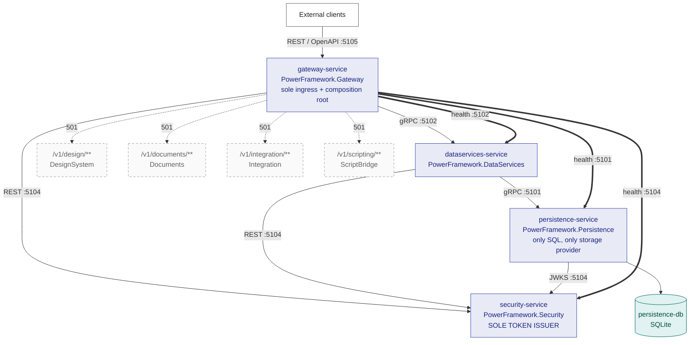

<!-- Markdown lint policy for this file. Rationale is in docs/BUILD.md section 14. MD013 is 120 rather
     than the 80-character default, and is disabled for tables and code blocks: an evidence row carrying
     a legacy locator and a quoted finding cannot be wrapped without splitting the locator from what it
     proves, and a wrapped command is a command that does not run. Prose IS wrapped, and is held to the
     120 limit.

     THE POLICY IS SELF-DECLARED, SO IT NEEDS NO COMMAND, NO FILE LIST AND NO GLOB. The directive on the
     next line travels with the document: any markdownlint-compatible tool already provisioned on a
     reader's machine honours it, with no flags to remember and no external configuration file to locate.
     It applies to the seven documents this refactor authored and CANNOT reach the five read-only legacy
     Chinese documents in this folder, which are the behavioural oracle, are never edited, and carry
     pre-existing violations of their own (hard tabs, unlabelled code fences and others) that this
     refactor must not "fix". That unreachability is precisely why a per-file directive was chosen over a
     repository-root configuration artifact the plan does not provide for.

     NO LINT COMMAND IS PUBLISHED, AND THAT IS A SUPPLY-CHAIN CONTROL RATHER THAN AN OMISSION. The entire
     approved npm dependency set for this repository is the exact, locked one declared under tests/e2e,
     and no Markdown linter appears in it. A documented on-demand package-runner invocation would
     therefore instruct an unpinned version to be resolved and executed from the network outside that
     lockfile every time somebody followed the documentation, which the deterministic-automation baseline
     forbids. Lint with tooling that is already installed; the directive below is what it reads. -->
<!-- markdownlint-configure-file { "MD013": { "line_length": 120, "tables": false, "code_blocks": false } } -->

# PowerFramework → .NET 10 — Target Architecture

This document is the authoritative reference for the **service topology**, the **transport chosen for
each service**, the **port map**, and **capability gating** of the four-service .NET 10 decomposition
of PowerFramework. Several sibling documents are written against it.

It describes **Phase 1**, which implements exactly four of an eight-service target roster. The other
four are mapped to a destination but receive no code, no test and no container; see
[`DEFERRED.md`](DEFERRED.md).

**Audience.** Anyone who needs to know *why* a boundary is where it is, not merely where it is. Every
architectural claim below carries a locator into the read-only legacy tree so a reader can check it
without taking this document's word for anything.

**What this document deliberately does not duplicate.** Cross-reference rather than restatement is the
rule here, because a figure repeated in two places is a figure that will eventually disagree with
itself:

| For | See |
| --- | --- |
| The full-estate mapping — all 39 libraries and all 544 objects assigned to a destination | [`SERVICE_MAPPING.md`](SERVICE_MAPPING.md) |
| The cross-service contract inventory and the four reserved Gateway extension points | [`CONTRACTS.md`](CONTRACTS.md) |
| Build and test commands, the solution layout, and per-service build independence | [`BUILD.md`](BUILD.md) |
| The characterization model, the fixture corpus and the determinism seams | [`docs/PARITY.md`](PARITY.md) |
| Secret locators, severities, required actions and the token-topology register | [`SECRETS.md`](SECRETS.md) |
| The four deferred destinations in detail and their assigned objects | [`DEFERRED.md`](DEFERRED.md) |

## Current state of the artifacts this document references

**Every artifact referenced below is present in the tree.** One is present as structure without content,
and the distinction is the point of this section:

| Artifact | State |
| --- | --- |
| `orchestration/docker-compose.yml`, `orchestration/README.md`, `orchestration/.env.example` | **Present.** Local orchestration, the readiness-gate bring-up, and the variable roster |
| `characterization/workflows/` | **Present.** Fifteen workflow definitions with their determinism masks, and the schema they validate against |
| `characterization/recordings/` | **Present as two empty roots.** No legacy recording and no target recording exists, so **no paired capture and no parity comparison exists** |

Everything else this document references — the solution and project files, the shared libraries, the
protocol and OpenAPI definitions under `shared/PowerFramework.Contracts/`, **all four service
applications with their handler trees and test projects**, **all four container definitions**,
`.github/workflows/ci.yml`, the per-service settings,
[`PARITY.md`](PARITY.md), `orchestration/.env.example` and the read-only legacy tree — **is present in the
tree today**. Present is not the same claim as exercised, and this document keeps no account of the second:
[`orchestration/README.md` §10](../orchestration/README.md#10-what-has-and-has-not-been-exercised)
is the only execution-status statement in this repository, and §10.6 explains why there is exactly one.

**What that does and does not license this document to claim.** The four services are real: each builds
with zero warnings, each has a test project that exercises its handlers **against an in-process host**,
and every boundary behaviour described below — status translation, the capability gate, the reserved
routes, health aggregation, token issuance — is implemented and covered by tests at that level.

What **no test** here shows is the whole stack running: every service suite drives its own service in
process, so no assertion below is produced by a TLS handshake, a real gRPC channel or a container health
probe. The stack *has* been brought up separately, and exactly one document reports on that —
[`orchestration/README.md` §10](../orchestration/README.md#10-what-has-and-has-not-been-exercised),
which is also explicit that **no paired characterization recording exists**. So every statement below about
behaviour **within** a service describes tested code; every statement about what happens **between**
services is a design verified in process, and whether it was additionally observed in a running stack is
answered there rather than here. §10.6 restates that division of labour at its point of use.

---

## Table of contents

1. [Position, method and evidence discipline](#1-position-method-and-evidence-discipline)
2. [The starting point: a library, not a server](#2-the-starting-point-a-library-not-a-server)
3. [Target topology](#3-target-topology)
4. [Port, transport and endpoint map](#4-port-transport-and-endpoint-map)
5. [Transport chosen per service](#5-transport-chosen-per-service)
6. [Capability gating: the legacy's own decomposition intent](#6-capability-gating-the-legacys-own-decomposition-intent)
7. [The composition root](#7-the-composition-root)
8. [Storage](#8-storage)
9. [Security and token topology](#9-security-and-token-topology)
10. [Orchestration](#10-orchestration)
11. [Design patterns and the legacy-to-target mapping](#11-design-patterns-and-the-legacy-to-target-mapping)
12. [Deliberately absent](#12-deliberately-absent)
13. [Known limitations and anomalies](#13-known-limitations-and-anomalies)
14. [Closing note: what this architecture does and does not claim](#14-closing-note-what-this-architecture-does-and-does-not-claim)

---

## 1. Position, method and evidence discipline

### 1.1 No user-specified rules exist

The project's rules document was retrieved and contains exactly one statement: **no user rules were
provided.** That is a finding, not an omission, and three consequences follow:

- **No rule is invented, inferred, or back-filled from convention.** Nothing in this document is
  presented as a requirement because it is a common practice.
- **Enterprise-standard best practice applies in the rules' place.** For an architecture document
  that means every claim is traceable to evidence, every decision records the alternative that was
  rejected and the reason it was rejected, and nothing is asserted that the repository cannot
  support.
- **Zero files enter scope because of a rule.** This document exists because the migration plan
  requires it.

The binding constraints therefore come from elsewhere — the migration brief's own clauses and the
attached environment's setup instructions. They are referred to below by their identifiers (C-A
through C-L) rather than reproduced.

### 1.2 The legacy tree is read-only, and it is the only specification

`ws_objects/**`, the compiled libraries and target files, `oldversion/125/**`, `pack/**`, the native
binaries, `res/**` and the legacy browser assets under `tests/blink`, `tests/sciter` and
`tests/webview` are the **behavioural oracle**. They are never edited, moved, renamed or reformatted
(C-C).

That read-only status extends explicitly to the five pre-existing Chinese documents in this very
folder — [`README.md`](README.md), [`Blink交互.md`](Blink交互.md), [`Sciter交互.md`](Sciter交互.md),
[`PB多线程绕坑提示.md`](PB多线程绕坑提示.md) and
[`n_cst_dwsvc_columnexp.md`](n_cst_dwsvc_columnexp.md). This document **cites** them; it does not
touch them, translate them, re-encode them or rewrite their links. Where one of them is inaccurate —
and §7.3 records two places where one is — the correction is stated *here*, never applied *there*.

### 1.3 Locator convention and why nothing else can adjudicate behaviour

Every behavioural claim carries a `path:Lnn` locator. That discipline is not ceremony; it is forced
by the fact that no other artifact in the repository can settle a question of behaviour:

- **The changelog is stale.** `logfile.md` opens at `## 3.0.7.2062(2022-04-14)` while the commit
  history runs years later, and there are **zero Git tags** across the repository's history, so no
  release is marked.
- **Neither PowerBuilder build definition would build as written.** `ws_objects/pfw.pbl.src/project.srj`
  declares 29 `PBD:` lines and `ws_objects/pfw.pbl.src/p_pfw.srj` declares 28; they disagree on the
  vendor string; and **both reference `pfw.utility.imgcodec.pbl`**
  [`project.srj:L41`, `p_pfw.srj:L40`] — a library that exists nowhere in the repository. They are
  read for build *intent* only.

Consequently the .NET build, CI and orchestration are authored as clean creations rather than
translated from an existing definition, and every behavioural assertion in the generated code traces
to a `ws_objects/**` locator.

---

## 2. The starting point: a library, not a server

The target topology only makes sense against what it replaces, so this section establishes the
starting point first.

### 2.1 What one PowerBuilder process actually is

The estate is **39 exported library folders** under `ws_objects/` against **40 compiled root `*.pbl`
files** — reconciled by the one library that appears on a target's library list with no corresponding
source export, `pfwx.utility.codec.pbl` [`pfwx.pbt`, `LibList`].

An application composes its world by *listing* libraries in its target file, and the primary target
does so explicitly: `pfw.pbt`'s `LibList` names **32** libraries in a single ordered string; the
secondary target `pfwx.pbt` names **9**, of which exactly two — `pfw.common.pbl` and `pfw.shared.pbl`
— are shared with the primary target, which is what makes those two the cross-target foundation.

The consequences of that mechanism are the architectural facts that matter:

- **One flat global namespace.** PowerBuilder has no namespaces and no import statements. Every
  global object lives in one namespace, and **symbol resolution is determined by the order of the
  library list** [`pfw.pbt`, `LibList`]. There are therefore no import statements to rewrite in this
  refactor — the work is namespace *creation* plus resolving the collisions a flat namespace
  tolerated.
- **Every call is in-process and synchronous** unless explicitly posted to the Win32 message queue.
- **Object identity is a pointer.** Structures hold live object references, and §13 records the one
  place where that genuinely cannot cross a process boundary.
- **Events are dispatched by the PowerBuilder runtime**, not by application code.
- **Cross-thread work uses a hand-built proxy-pair pattern** in which every concurrency class exists
  twice — a caller-side `n_cst_threading*` and a worker-side `n_cst_thread*` — so that no object is
  ever touched from two threads.

### 2.2 The two consequences that shape every boundary

Now the fact that makes this refactor unusual, stated plainly:

> **PowerFramework is a library, not a server.** It has no process of its own, no listener, no route
> table, no serialization layer, and no authentication of any kind — because there is nothing to
> authenticate against.

Two consequences follow, and both are load-bearing for everything below:

1. **Every cross-service contract in this refactor is net-new.** None of them translates an existing
   wire format, because no wire format exists to translate. This is why the contract inventory is
   published for review as its own artifact rather than emitted silently as a by-product of code
   generation — see [`CONTRACTS.md`](CONTRACTS.md).
2. **Decomposition creates the system's first-ever ingress.** The legacy opens no listening socket,
   registers no route and receives no unsolicited request. That is precisely why Security exists as a
   Phase-1 service, and why a JSON Web Token is required on **every internal edge** rather than only
   at the outer edge. §9.1 works through why the "no new attack surface" requirement cannot be read
   literally.

### 2.3 The threading hazards that constrain the Persistence design

The legacy carries its own threading note, [`PB多线程绕坑提示.md`](PB多线程绕坑提示.md) (read-only),
and it documents two hazards that directly constrain how the SQL layer may be re-expressed:

- **A worker thread synchronously calling a main-thread object function or event whose return type is
  `string` or `blob` may raise a memory exception** [`docs/PB多线程绕坑提示.md:L1-L4`]. The stated
  trigger is a main-thread object having an unexecuted `Post` message while the object itself has
  been destroyed. The stated remedies are to avoid such calls, or to return the value through a `ref`
  parameter instead.
- **A worker thread that receives a main-thread object must release it explicitly** — the note
  requires the worker to set the referenced main-thread object to null (`SetNull`) in its `OnUninit`
  event [`docs/PB多线程绕坑提示.md:L5`].

These two hazards are *why* the proxy pair of §2.1 exists. They are the reason the port reproduces an
**explicit marshalling boundary** between the caller side and the worker side rather than flattening
the pair into a single async method: the thread-affinity split is a contract that the legacy encodes
in its own object comments, not an implementation detail that a modern async idiom subsumes. The same
reasoning is why the buffer carrier is an anti-corruption layer rather than a rowset (§11.1).

---

## 3. Target topology

### 3.1 The four services

Four ASP.NET Core services on `net10.0`, **each with its own per-service solution file and each
destined for its own container image**, so that every one restores, builds and tests from a clean
checkout without reference to any other service's project (C-A). A single collapsed solution containing
four folders is a failure mode, not a cautious choice, and is not the shape here.

**Present in the tree, and separately, exercised.** The four per-service `.slnx` files, project files,
settings, test projects and `Dockerfile`s are present, all four applications compile in Release with zero
warnings, and all four test suites pass. Running them as a stack is a different question from building them,
and it is answered in exactly one place:
[`orchestration/README.md` §10](../orchestration/README.md#10-what-has-and-has-not-been-exercised),
the only execution-status statement in this repository — which records the bring-up gate by gate and is
equally explicit about what it did not cover. This section describes the target structure;
[`BUILD.md`](BUILD.md) §5.5 and §13 record what has been built and tested.

| Service | Directory | Project | Capability it owns | Legacy anchor |
| --- | --- | --- | --- | --- |
| **Gateway** | `services/gateway-service` | `PowerFramework.Gateway` | Sole ingress and composition root; request routing; capability gating; the reserved extension points | The application objects and the framework lifecycle contract [`ws_objects/pfw.pbl.src/pfw.sra:L88-L108`], [`docs/README.md` §初始化] |
| **DataServices** | `services/dataservices-service` | `PowerFramework.DataServices` | The DataWindow retrieval / validation / update triple, the 22-event DataWindow chain, and the column-expression engine | `ws_objects/pfw.datawindow.services.pbl.src/` (13 objects) |
| **Persistence** | `services/persistence-service` | `PowerFramework.Persistence` | **The only service that generates or executes SQL, and the only one holding a storage provider** | `ws_objects/pfw.utility.sqlite.pbl.src/` (3), `ws_objects/pfw.thread.pbl.src/` (6), `ws_objects/pfw.thread.ext.pbl.src/` (15) |
| **Security** | `services/security-service` | `PowerFramework.Security` | The keyed cryptographic surface; **sole JSON Web Token issuer** for all four services | `ws_objects/pfw.crypto.pbl.src/n_crypto.sru:L9-L73` |

These directory and project names are canonical, and they are used identically in
[`BUILD.md`](BUILD.md) and [`SERVICE_MAPPING.md`](SERVICE_MAPPING.md).

**The root [`README.md`](../README.md) carries the same roster**, with the same directory names, project
names and ports, so the two corroborate each other. That update is the one and only modification this
refactor makes to a pre-existing file, and it is deliberately scoped: the existing licence text and its
Chinese restatement are preserved verbatim.

Two boundary justifications are worth drawing out, because they are the ones a reader is most likely
to question:

- **Why Persistence owns SQL exclusively.** `ws_objects/pfw.thread.ext.pbl.src/` is entirely
  SQL-shaped: its two structures are literally `dberrordata.srs` and `transactiondata.srs`, and 13 of
  its 15 objects are SQL query, command, update and transaction tasks. Asynchronous SQL is the whole
  reason that library exists, so it cannot be separated from SQL without dissolving it.
- **Why Security is a Phase-1 service rather than a library.** The legacy already contains the
  signing primitives a token issuer needs — `RSASign` and `VerifyRSASign`
  [`ws_objects/pfw.crypto.pbl.src/n_crypto.sru:L70-L73`] — inside a surface of 65 declared functions
  at `:L9-L73`, of which 63 are cryptographic operations and two are version and copyright
  accessors. Concentrating that surface behind one boundary is what makes a single signing authority
  possible at all (§9.2).

The full-estate capability assignment — which of the 544 objects goes where, including the deferred
majority — is [`SERVICE_MAPPING.md`](SERVICE_MAPPING.md)'s subject and is not restated here.

### 3.2 The call graph — layered and acyclic

The graph is strictly layered, and it is acyclic. **Two kinds of edge exist and they must not be
conflated**, because one carries capability and the other carries only readiness:

**Capability calls** — a service invoking another service's contract:

- **Gateway** calls DataServices and Security.
- **DataServices** calls Persistence and Security.
- **Persistence** reads Security's published verification keys only.
- **Nothing calls Gateway except external clients; nothing but Gateway calls DataServices; nothing
  but DataServices calls Persistence.**

**Readiness observation** — an anonymous `GET /health` probe and nothing else:

- **Gateway probes all three upstreams**, Persistence included, because C-10's aggregate names each of
  the three individually so an operator reading a failed aggregate learns *which* one is responsible.
- **The Persistence edge is readiness-only, and that is enforced by construction rather than by
  convention.** The three probe addresses live in a separate configuration group, `Gateway:HealthProbes`,
  from the two services Gateway invokes, `Gateway:Upstreams` — which deliberately has **no** Persistence
  member. Gateway holds no Persistence client, no channel and no generated stub, so **nothing beyond
  `GET /health` is reachable on that address**. §4.2 carries the same statement at the readiness model.
- The probe is anonymous on all four services, so it needs no token and works while a service is still
  starting — which is the whole point of a readiness probe.

Gateway probing Persistence is therefore **not** a violation of the layering above: observing that a
service is alive is not reaching into it. This is what satisfies the constraint that no service reaches
into another service's internals. The **only** cross-service coupling anywhere in the system is the
published contracts project: it is the boundary *definition*, not a shared-code back door. No
behavioural code crosses a service boundary.

Because there is no cycle, each service can be deployed and scaled independently of the others — an
architectural property of the topology, and the whole point of C-J.

### 3.3 Diagram

Solid boxes are the four in-scope services; the four dashed boxes reached by dotted edges are reserved
routes. **Each solid box names a service directory, project, settings, application and test project that
are all present in the tree and build clean**, and all four container definitions are assembled by
[`orchestration/docker-compose.yml`](../orchestration/docker-compose.yml). Which of the edges drawn here
have been observed in a running stack, and which have not, is answered in one place —
[`orchestration/README.md` §10](../orchestration/README.md#10-what-has-and-has-not-been-exercised)
— and §10.6 says why this document keeps no second copy. The edge labels carry the **actual listener
ports** of §4.1, gRPC included.

**Three edge styles, and the difference between the first two is the point.** A solid arrow is a
**capability call** — one service invoking another's contract. A thick dashed arrow is **readiness
observation only** — an anonymous `GET /health` probe, with no client, channel or stub behind it. A thin
dotted arrow is a **reserved route**: routing metadata with nothing behind it at all. Gateway's edge to
Persistence is the readiness kind, which is why the layering rule of §3.2 still holds.



**The three thick edges labelled `health` are readiness observation and nothing more.** They are drawn
separately from the capability calls because Gateway probes **all three** upstreams — Persistence
included — while calling only two of them. Gateway holds no Persistence client, channel or generated
stub, so `GET /health` is the whole of what is reachable on `:5101` from Gateway; §3.2 and §4.2 carry the
configuration split (`Gateway:HealthProbes` versus `Gateway:Upstreams`) that makes that structural rather
than conventional.

**The dotted edges are routing metadata only.** No project, no container, no test and no
placeholder class exists behind any of them — which is why those four nodes are drawn dashed and
unfilled rather than as services. §4.4 states that distinction in full, because it is the one an
auditor should be able to check without ambiguity.

---

## 4. Port, transport and endpoint map

> **The host-side publication is loopback-only.** The ports below are what each service BINDS inside the
> orchestration network, and they are unchanged. What changed is which host interface the local manifest
> offers them on: a two-field Compose `ports:` mapping binds the host half to `0.0.0.0`, so all four were
> previously reachable from any host on the operator's network — going around Gateway and defeating the
> sole-ingress topology at the network layer. Each mapping now names its interface through
> `<SERVICE>_HOST_BIND`, defaulting to `127.0.0.1` on all four including Gateway. Every access route this
> documentation publishes is a `localhost` one, so nothing documented changes; widening is a deliberate act.
> See [`orchestration/README.md`](../orchestration/README.md) §5.

### 4.1 The map

The attached environment fixes a 5101–5105 band and publishes the composition root at port 5105. That
band and that port are preserved (C-L) so the documented access URL still resolves; the band is
re-mapped onto the four real services.

| Directory | Project | Port | Listener | Transport | Token role |
| --- | --- | --- | --- | --- | --- |
| `services/persistence-service` | `PowerFramework.Persistence` | **5101** | `https://+:5101`, `Http1AndHttp2` | gRPC (C-05..C-08) **and** REST `/health` and `/v1/ping` — **the documented readiness address** | verification only |
| `services/dataservices-service` | `PowerFramework.DataServices` | **5102** | `https://+:5102`, `Http1AndHttp2` | gRPC (C-03, C-04) **and** REST `/health`, `/v1/ping` and the thin projection for Gateway | verification only |
| *(reserved)* | — | **5103** | — | — | **commented-out DesignSystem Phase-2 slot** |
| `services/security-service` | `PowerFramework.Security` | **5104** | `https://+:5104`, `Http1` | REST + `/.well-known/jwks.json` + OIDC discovery, and the issuance edge | **SOLE ISSUER** |
| `services/gateway-service` | `PowerFramework.Gateway` | **5105** | `https://+:5105`, `Http1` | REST + OpenAPI | verification only |

**One listener per service, and every documented address keeps exactly the meaning it was given.** The
environment publishes `/health` on 5101–5105 and the composition root on 5105; all of it is preserved
(C-L), 5103 stays unallocated (C-D), and the composition root is reachable at `https://localhost:5105`.
The two services carrying gRPC contracts serve those contracts on the SAME port as their readiness probe,
because AAP 0.3.2.2 assigns C-05..C-08 to 5101 and C-03/C-04 to 5102 — the assignment is to the service's
documented port, not to a port beside it.

**How one port carries two protocol versions, and why TLS is what makes it possible.** `Http1AndHttp2`
over TLS is resolved by ALPN during the handshake: an HTTP/1.1 client negotiates `http/1.1` and a gRPC
client negotiates `h2`, on one socket. This was measured on a throwaway host on this toolchain before it
was relied on here — a single TLS endpoint declaring `Http1AndHttp2` answered `curl --http1.1 GET /health`
with **200 over HTTP/1.1** and a gRPC unary call with a normal response **over HTTP/2**, with no "HTTP/2 is
not enabled" warning. On **cleartext** the same declaration does not mean both: Kestrel disables HTTP/2 and
logs that HTTP/2 requires TLS application-protocol negotiation, serving HTTP/1.1 only. So a drift back to a
plaintext URL would take every gRPC contract off the air while `/health` kept answering 200 — the worst
available failure shape, since the readiness gate would open onto a service that can serve nothing. That is
why §4.1's TLS requirement is a functional dependency here and not only a hardening choice.

**Splitting each of those two services across two endpoints is the tempting shape, and it is not
available.** It would have Persistence bind `https://+:5101` as `Http1` plus a second `Http2`-only listener
above the band, and DataServices do the same, so that each listener accepted only what it was for and a
client arriving with the wrong protocol version failed at negotiation rather than at the wrong surface. That
diagnostic property is real, but its cost is that C-05..C-08 and C-03/C-04 would answer on ports AAP 0.3.2.2
never names while the ports it does name carried only the probe. The assignment governs, so both surfaces
share the assigned port; nothing occupies 5103, and every documented address is the assigned one.

**All four services declare their own listener, Gateway included — and Gateway's is load-bearing.**
Leaving the ingress address to the orchestration layer is the tempting reading, on the reasoning that the
published address belongs to whatever fronts it. The reasoning is defensible; its consequence is not. The
orchestration template's variable roster carries no `ASPNETCORE_URLS`, so
**nothing in the repository would bind 5105**: a plain `dotnet run` binds Kestrel's own default of 5000
— measured directly — and the one address this document, the attached environment and the end-to-end
suite all name as the composition root was reachable by no means the repository provided. A documented
address that nothing binds is worse than an undocumented one, because a reader has no reason to doubt it.
An overriding environment still wins, since `ASPNETCORE_URLS` and `Kestrel__Endpoints__Default__Url` both
take precedence over a settings file.

**All four listeners terminate TLS, and on a decomposition that is a correctness property rather than
a hardening option (CWE-319).** Every one of these boundaries is created by this refactor — the legacy
opens no listening socket and receives no unsolicited request — and every request that crosses one
carries a bearer token, while Security additionally publishes the key set the whole estate verifies
against. On cleartext, every token is replayable by anyone on path and the key set is substitutable,
which makes an attacker's signature indistinguishable from Security's. §0.1.4 of the plan settles the
reading of the no-new-attack-surface requirement: it cannot mean "no new surface", because decomposition
creates the system's first-ever ingress; it means every newly created surface is authenticated from the
outset — and a surface whose channel is readable authenticates nothing an observer cannot replay.

The attached environment gates readiness on `curl -sf http://localhost:<port>/health` and supplies no
certificate material. Neither fact is a licence to ship cleartext: the gate is a *probe shape*, and the
corrected form below is the same probe with the trust anchor named, while the absent material is
supplied the same way every other secret is — from the deployment's own secret layer through
the four per-service `<SERVICE>_TLS_CERTIFICATE_PATH` / `_KEY_PATH` pairs (§9.3.1), with nothing
committed here (C-F).

**Why Persistence and DataServices each declare `Http1AndHttp2` on one endpoint.** Both serve gRPC, which
**requires HTTP/2**, and both serve REST `/health` and `/v1/ping`, which are probed with **HTTP/1.1**. On a
cleartext endpoint those two cannot share a port, because HTTP/2 negotiation is an ALPN feature of the
TLS handshake — which is why the single-endpoint arrangement depends on the TLS decision above rather
than merely coexisting with it. Measured, not assumed, on the pinned SDK:

- A **cleartext** endpoint with `Protocols: Http1AndHttp2` disables HTTP/2 outright and says so at
  startup — *"HTTP/2 is not enabled … TLS is not enabled. HTTP/2 requires TLS application protocol
  negotiation. Connections to this endpoint will use HTTP/1.1."* An HTTP/2 prior-knowledge request to
  it fails with *"Remote peer returned unexpected data while we expected SETTINGS frame"*; every gRPC
  call would be lost.
- A **cleartext** endpoint with `Protocols: Http2` serves gRPC but answers a plain HTTP/1.1
  `GET /health` with **`400`**, so the readiness gate could never satisfy and Gateway would never
  report healthy.
- A **TLS** endpoint with `Protocols: Http1AndHttp2` serves **both** on one port — an HTTP/1.1 request
  and an HTTP/2 request against the same listener each returned `200` — because ALPN selects the
  version per connection.

**The third row is what this estate runs, and it is the only row compatible with the port map.** AAP
0.3.2.2 assigns Persistence 5101 as "gRPC, plus REST `/health` and `/v1/ping`" and DataServices 5102 as
"gRPC primary plus a thin REST projection" — one port each, both kinds of traffic — so a single TLS
endpoint declaring `Http1AndHttp2` is the assigned topology rather than a convenience. Dropping gRPC to
avoid the question is not available either: AAP 0.1.5 decides the transport per service, and C-05..C-08
and C-03/C-04 are gRPC. Security and Gateway publish no gRPC contract and so declare a single `Http1`
endpoint each.

**The split that is not available, and how the property it would provide is recovered.** Pinning
ONE protocol version per endpoint — 5101 and 5102 as `Http1`, plus a second `Http2`-only port each — has a
real motive: a probe and a gRPC channel would then address listeners that could only answer the thing
they were for, so a gRPC channel aimed at the REST port fails with `HTTP_1_1_REQUIRED` before the request
arrives and an HTTP/1.1 probe aimed at the gRPC port gets a `400`, both mistakes failing loudly rather than
later and less attributably. What it also does is answer published contracts at addresses the plan does
not assign them, and the plan's port map is what this document, the manifest, the readiness gates,
Gateway's upstream setting and the end-to-end fixture all have to agree on. Under `Http1AndHttp2` a
misaddressed call does not fail at the transport, so the property is recovered statically instead:
`ServiceConfigurationCoherenceTests` asserts every caller address against the listener its target actually
declares, and `OperationalTopologyCoherenceTests` asserts every port table, `EXPOSE` line and end-to-end
fixture row against the same source. A wrong address is therefore a build failure naming the offending key
rather than a runtime negotiation error — earlier and more attributable than the alternative.

**What the collapse costs, and where.** Persistence and DataServices do not present two addresses a caller
must keep straight, so the `_GRPC_URL` and `_BASE_URL` variables of §4.2 default to the SAME value per
service. They are deliberately kept as separate variables even so, because each names a distinct **edge**
rather than a distinct listener: `_GRPC_URL` is what a *service* dials for a contract call and `_BASE_URL` is
what a *probe* and the end-to-end suite read, and they bind different service settings. Collapsing them into
one variable would let a change of call address silently move a probe, and it would put a call address in a
probe setting — a substitution neither side would report. The same reasoning keeps Gateway's `Upstreams` and
`HealthProbes` groups separate: they differ in the AUTHORITY each grants, not in the address each carries.

**Issuance is still authenticated, by a credential rather than by the transport.** `POST /v1/tokens` is
the one operation a bearer token cannot protect, because a caller cannot present a token in order to
obtain its first token. `security.v1.yaml` therefore publishes **two** schemes for it and accepts
either: a `clientCredential` — an HTTP `Basic` credential naming a subject on Security's issuance
roster — or `mutualTls`, a client certificate the listener's configured authority trusts. A request
presenting **neither** is refused with `401`. TLS is the channel and never the caller identity: a
transport that merely encrypts says nothing about who is calling, which is precisely why a credential is
required on top of it. So the newly created boundary is authenticated in both senses, which is what C-G
requires; §9.4 records this in full.

**What plaintext would have cost, which is why none is shipped.** The key set at
`/.well-known/jwks.json` is the system's trust bootstrap, and fetched in the clear it is substitutable
on path: an attacker who replaces it makes all three verifiers accept tokens the attacker signed, each
behaving exactly as designed while doing it. The issuance credential and every bearer token would
likewise be capturable. None of that is accepted anywhere in this estate — every listener terminates TLS
and every authority, upstream and probe address is `https` — and the exposure is recorded here so that a
later deployment cannot reintroduce it as a convenience without knowing what it is trading away.

**What a deployment must supply, since no code change is involved.**
`Kestrel__Certificates__Default__Path` and `__KeyPath` from the orchestration secret layer, and
`ClientCertificateMode: AllowCertificate` on Security's endpoint for the mutual-TLS alternative. Because
ALPN multiplexes, each gRPC-carrying service serves its readiness probe AND its gRPC contracts from ONE
`Http1AndHttp2` endpoint on its documented port, which is what this repository declares, for the port-map
reason §4.1 records. Kestrel resolves an HTTPS endpoint's certificate in a
fixed order — an explicit certificate on the endpoint, then `Kestrel:Certificates:Default`, then the
local ASP.NET Core development certificate — and **fails to start** if none is found, never falling
back to plaintext, so a half-configured TLS deployment is a fail-fast startup error rather than a
silent downgrade.

**`AllowCertificate` and not `RequireCertificate`, for any deployment that adopts TLS.**
`AllowCertificate` requests the certificate during the handshake and hands it to the application, which
lets `POST /v1/tokens` validate it per operation while `/health`, the JWK set and the discovery
document stay anonymously reachable. `RequireCertificate` was measured and rejected: it aborts the
handshake for any client presenting none, so the anonymous `/health` probe fails and the readiness
chain that gates Gateway can never open.

**No certificate, key or passphrase appears in any settings file**, on either topology. All such
material is injected from the orchestration secret layer as environment configuration pointing at files
mounted read-only.

### 4.2 The endpoint contract common to all four

- **`/health` is anonymous on all four services.** **Gateway reports healthy only after Persistence,
  DataServices and Security report healthy** — expressed in the Compose manifest with `depends_on`
  using a `service_healthy` condition. This is the most important readiness property in the
  orchestration, and §10.4 records the alternative that was rejected precisely because it could not
  express it.
- **Gateway's aggregate names all three upstreams individually, and the Persistence entry is health
  observation only.** C-09's `AggregateHealthReport` bounds its `upstreams` array at exactly three items
  and closes the reporting-service name over `persistence`, `dataservices` and `security`, so an operator
  reading a failed aggregate learns *which* upstream is responsible. That coexists with §3.2's rule that
  Gateway never calls Persistence, because the three addresses live in a **separate configuration group**
  from the two Gateway calls: `Gateway:HealthProbes` carries three probe addresses and authorises exactly
  one anonymous endpoint on each, while `Gateway:Upstreams` carries the two services Gateway invokes and
  deliberately has no Persistence member. Gateway holds no Persistence client, channel or generated stub,
  so nothing beyond `GET /health` is reachable on that address.
- **`Degraded` and `Unhealthy` are both answered with `503`, and only `Healthy` with `200`.** The three
  status tokens remain distinct in the body — a service still completing startup validation is not the
  same as one whose dependency has failed, and an operator needs to tell them apart — but `Degraded`
  means *not ready*, and the readiness gate observes the status **code**. Answering 200 for a not-ready
  service would let `depends_on: condition: service_healthy` open on a service that had just said it was
  not ready, which is the exact ordering property the gate exists to enforce.
- **`/v1/ping` requires a token on all four services** and returns **`401`** without one. It is the
  standing proof that the authenticated-boundary requirement holds on every service, not just at the
  ingress.
- **Every probe is answered on the port it always was, and the only thing that changes is the gate's
  scheme and its trust configuration.** All four listeners are TLS, so the attached environment's
  `curl -sf http://localhost:<port>/health` cannot answer on any of them. **The corrected gate needs the
  local certificate authority, not just an `https` scheme**, because the certificate each listener
  presents is issued by the local CA of §9.3.1 and `curl` verifies by default:

  ```bash
  # All four listeners terminate TLS with the same multi-SAN certificate, so all four gates take the
  # same --cacert and a SAN-covered hostname.
  CA="$HOME/.config/powerframework/secrets/mtls-ca.crt"
  curl -sf --cacert "$CA" https://localhost:5101/health   # Persistence
  curl -sf --cacert "$CA" https://localhost:5102/health   # DataServices
  curl -sf --cacert "$CA" https://localhost:5104/health   # Security
  curl -sf --cacert "$CA" https://localhost:5105/health   # Gateway ingress
  ```

  `localhost` is usable **only because §9.3.1 issues the certificate with `DNS:localhost` and
  `IP:127.0.0.1` among its subject alternative names**; a certificate carrying a common name alone
  cannot authenticate it, whatever the scheme. The alternative to `--cacert` is installing that CA into
  the host trust store (`/usr/local/share/ca-certificates` plus `update-ca-certificates` on Debian and
  Ubuntu), after which the bare `curl -sf https://…` form works. **`-k` / `--insecure` is not an
  alternative and must not appear in a readiness gate**: it turns a probe that proves the service
  presents the identity it should into one that proves only that something answered, which is exactly the
  property a trust bootstrap cannot afford to lose. `ClientCertificateMode` is `AllowCertificate`
  precisely so that this probe stays anonymous on the same listener that carries the mutual-TLS
  issuance edge — a certificate is requested but not demanded, so a probe presenting none still
  completes the handshake and receives its `200`. A second, development-only cleartext listener on an
  undeclared port answers the same constraint and is **not available**,
  because it contradicts the one-port-per-service map of §4.1, it puts an unauthenticated listener in
  the one service that holds the signing key, and it makes the local gate address a port that no
  deployment ever serves. Security declares exactly ONE Kestrel endpoint,
  `https://+:5104`, `Http1` — `Http1` rather than `Http1AndHttp2` because this service publishes no gRPC
  contract — and `security.v1.yaml` publishes exactly one `servers` entry to match. §9.4 records why TLS
  on 5104 is functional rather than a preference.
- **Conflict mapping.** On an optimistic-concurrency mismatch, Persistence and DataServices return
  gRPC `StatusCode.Aborted` — the canonical gRPC-to-HTTP mapping — and Gateway's REST projection
  surfaces it as **HTTP `409`** carrying a structured conflict detail with the current row state.
  Callers implement an explicit retry-or-surface policy. **There is no silent overwrite anywhere in
  the system.**

### 4.3 Why 5103 is reserved rather than reassigned

The attached environment assigned 5103 to a design service. DesignSystem is precisely one of the four
deferred services, so the slot is left in the Compose manifest as a **commented-out placeholder**
rather than reassigned to one of the four services that do exist.

That is a deliberate choice with a reason: leaving it commented is literally the obvious Phase-2 slot
the manifest should provide, and it keeps the shape of the eventual system legible. Reassigning the
port would erase that signal, and a future reader would have no way to tell that a service had been
planned there.

### 4.4 The four reserved deferred routes are metadata, not stubs

Gateway's routing metadata declares four reserved routes. Each returns **`501 Not Implemented`** with
a machine-readable body naming the deferred service it will eventually reach and the marker
*reserved for Phase 2*:

| Route | Deferred service |
| --- | --- |
| `/v1/design/**` | DesignSystem |
| `/v1/documents/**` | Documents |
| `/v1/integration/**` | Integration |
| `/v1/scripting/**` | ScriptBridge |

**Stated explicitly so it is auditable: a routing declaration is not a stub of the deferred service.**
For DesignSystem, Documents, Integration and ScriptBridge there is:

- no service directory and no project file,
- no container definition,
- no test project,
- no partial implementation, and
- no exception-throwing placeholder class.

The route exists so that the shape of the eventual system is legible from Gateway's contract, which
is what the brief asks for. The prohibition in C-D is on *implementing* the deferred services — not
even partially, not even to stub them out — and a declaration in a route table implements nothing.
The capabilities each route will eventually reach are enumerated in [`DEFERRED.md`](DEFERRED.md).

---

## 5. Transport chosen per service

Transport is decided **per service, from the shape of that service's current interface** — not by
blanket policy. Each of the four decisions is recorded below with the interface evidence that drove
it, and each rejected alternative is recorded with its reason (C-K).

No transport decision here rests on a speed argument, and none is available to rest on: the repository
publishes no service-level objective of any kind (§12 and C-B).

### 5.1 Gateway → REST (Minimal APIs + OpenAPI)

**Interface shape.** Gateway's legacy analogue is the coarse, human-facing application lifecycle —
`open`, `close` and `systemerror` [`ws_objects/pfw.pbl.src/pfw.sra:L88-L108`, `:L111-L144`] — plus a
navigation surface. That is a request/response shape, not a streamed or ordered one.

**Additionally required because Gateway is the sole ingress.** REST gives browser and third-party
reach, alignment with HTTP-standard caching and proxying, and mature OpenAPI tooling for a surface that
external clients must be able to discover. Note carefully what "REST" names here and what it does not:
it names **HTTP semantics** — request/response, resource paths, status codes, an OpenAPI description a
stock client consumes — and says nothing about the scheme. **Every service in this system speaks those
semantics over HTTPS in a deployed topology**; the plain-HTTP loopback addresses in §4.1 and in the
documented bring-up are a local-development convenience, and §9.4 states the transport-security model
in full.

**Rejected alternative — gRPC at the edge.** gRPC-Web requires a translating proxy in front of it and
supports server streaming only. Choosing it for the ingress would forfeit exactly the properties an
ingress needs, and would add an intermediary component to the one boundary that external clients must
reach directly.

### 5.2 DataServices → gRPC primary, with a thin REST projection consumed only by Gateway

**Interface shape.** `ws_objects/pfw.datawindow.services.pbl.src/se_cst_dw.sru` declares exactly 22
events at `:L11-L32` — 9 semantic and 13 raw `pbm_dwn*` — forming an ordered chain with veto
semantics. Three features of that declaration decide the transport between them:

- an **ordered event chain** whose sequence is itself contract, including nested and deferred
  dispatch;
- a **`ref string` out-parameter** — `onddsgetfilter` produces its result by mutating a reference
  rather than returning a value [`se_cst_dw.sru:L13`];
- an **`any` return over a `string[]` argument** — `oncolumnexpinvokemethod` [`se_cst_dw.sru:L14`].

That shape demands compile-time contract enforcement, bidirectional streaming to carry the ordered
chain, and a status model rich enough for a four-value item-change alphabet and a tri-valued veto.
Protobuf over gRPC carries all three. JSON over REST would lose both the ordering and the typed veto,
and would leave the `any` return untyped at both ends.

**Why a REST projection exists as well.** Gateway is REST at the edge (§5.1), so a thin projection of
the DataWindow surface is exposed for Gateway alone to consume. It is a projection, not a second
implementation, and it is the layer where gRPC `Aborted` becomes HTTP `409` (§4.2).

**The two REST surfaces answer the same refusal with the same status, and that is enforced rather than
intended.** Gateway's proxy of these operations and DataServices' own projection of them are equivalent
by construction: a refusal reported *in band* — the call succeeds and the outcome sits in a field on the
response message — is mapped through one table per surface, and the two tables are identical. They drifted
apart on six codes, each of which fell to a default arm on the direct projection and answered HTTP `500`
where the ingress answered `400`, `404` or `502`: `E_INVALID_DATA` and `E_INVALID_DATAOBJECT` (the caller's
payload, or a DataWindow name in the body that resolves to nothing), `E_NOT_EXISTS`, `E_VAR_NOT_FOUND` and
`E_MEMBER_NOT_FOUND` (a name with nothing behind it), and `FAILED` — the oracle's own unspecific failure
[`retcode.sru`], which a completed operation really answers and which therefore describes the path behind
the surface rather than the surface itself. Each is an explicit arm on both sides, and each side's test
suite pins the whole table and walks the kernel's failure codes for anything the table forgot. The tables
are **duplicated deliberately** and not hoisted into `PowerFramework.Contracts`: that project carries no
behaviour, and a shared mapping table would be behaviour crossing a service boundary. What is *not*
compared is the fallback prose — each surface names the surface a caller is talking to, and either way the
sentence yields to the contract's own diagnostic whenever one was supplied.

**One projected operation is a bounded poll rather than a faithful mirror, and it is the only one.**
`EventStream` on C-04 is a subscription: the engine ends it only when the client goes away. Collecting it
to completion — correct for a retrieval, which ends with its final-marked chunk — meant the projected route
never answered at all, so a normal HTTP request received neither its events nor a success status while
holding a request thread, a relay subscription and a connection. The projection therefore bounds that one
operation's collection with a finite window
(`DataServices:RestProjection:StreamCollectionWindow`, two seconds as shipped, refused at startup if it is
zero or if it could not fire before the consumer abandons the attempt), and an expired window is a
**complete answer** — the records available now, an empty array included — never a truncation and never a
fault. The window is opt-in per operation precisely so that a self-terminating stream cannot be truncated
by it, and the poll semantics are published in the operation's own description and in
[`CONTRACTS.md`](CONTRACTS.md) §12.1 so a consumer cannot mistake an empty collection for a closed
subscription. A caller needing continuous delivery uses the gRPC stream, which needs no window.

**Every projected payload is published concretely, and the mechanism that keeps it honest is a build
failure rather than a review habit.** `gateway.v1.yaml` declares the complete transitive closure of the
projected surface — 118 messages and 15 enums, 133 of its 145 schemas — member by member, closed to
unknown members, with the canonical protobuf JSON encodings and a `required` list stating what the wire
carries. Delegating every projected body to one open schema and pointing a consumer at an extension
naming the real message is the cheaper document to write, and it publishes a permissiveness the strict
binder does not have: an unrecognised member is answered `400`, not discarded, and a consumer could not
see a member it was obliged to send. The schemas are *generated* from the compiled descriptors rather
than transcribed, and the contracts test project cross-checks all 133 against their descriptors on every
build, which is the compile-time edge that keeps a concrete declaration honest and is exactly what a
delegating document has no way to provide. The two runtime-generated
documents at `/openapi/v1.json` remain summaries of the same shapes and say so: building the schemas
there too would be a third and fourth derivation of the same descriptors, and no shared home for one
exists — a service may not reach into another's code, and `PowerFramework.Contracts` carries no
behaviour.

### 5.3 Persistence → gRPC

**Interface shape.** The legacy surface is `Query`, `Update`, `Exec`, `Commit`, `Rollback` and
`SQLErrText`. That vocabulary is **action-oriented, and therefore RPC-shaped rather than
resource-oriented** — there is no resource whose representation these methods manipulate; they are
operations. Four further properties confirm the choice:

- the 13 SQL task classes carry **mandatory thread affinity** encoded in their own source comments,
  which the contract must express as an explicit marshalling boundary (§2.3);
- `dberrordata.srs` requires a **structured error payload**, not a string;
- the mandated conflict response requires **rich status detail** — the current row state travels with
  the status (§4.2);
- **server streaming** reproduces the progressive result delivery of the legacy recordset object.

### 5.4 Security → REST (minimal, OpenAPI-described)

**Interface shape.** The cryptographic surface at
`ws_objects/pfw.crypto.pbl.src/n_crypto.sru:L9-L73` is stateless request/response throughout, with no
ordering requirement and nothing to stream.

**Additionally required by how tokens are consumed.** Token issuance and key publication must speak
**ordinary HTTP** — not a bespoke protocol — so that consumers' stock JSON Web Token bearer handlers
fetch `/.well-known/jwks.json` and OpenID Connect discovery metadata with **zero bespoke code**. HTTP
*semantics*, over HTTPS: the scheme is not what makes a stock handler work, and §9.4 records both the
transport-security model and the one edge on which it is load-bearing. That keeps the security-critical
retrieval path
inside framework code rather than hand-written code.

**Rejected alternative — gRPC for Security.** Choosing gRPC here would force custom key-set retrieval
into three separate services. That is a net *increase* in hand-written security code, which is the
opposite of what the requirement is trying to achieve. It is the wrong direction, not merely a less
convenient one.

### 5.5 Summary

| Service | Transport | Decided by | Rejected alternative |
| --- | --- | --- | --- |
| Gateway | REST + OpenAPI | Coarse lifecycle shape; sole-ingress reach and tooling | gRPC-Web at the edge — needs a translating proxy, server streaming only |
| DataServices | gRPC + thin REST projection | 22-event ordered chain, `ref string` out-parameter, `any` return | JSON over REST — loses ordering and the typed veto |
| Persistence | gRPC | Action-oriented verbs, thread affinity, structured errors, rich status, server streaming | — |
| Security | REST + JWKS | Stateless surface; stock bearer handlers self-configure from the discovery document with no bespoke code. The choice is about interface **shape**, not about scheme — it would hold on any transport, and the transport this repository binds is `https` on every listener (§4.1) | gRPC — would force bespoke key retrieval into three services |

### 5.6 Outbound call policy: retry admission, circuit breaking and deadlines

Choosing a transport is only half of a boundary decision. The other half is what happens when the
transport fails — a question the legacy never had to answer, because an in-process call cannot fail in
transit. `Microsoft.Extensions.Http.Resilience` is in the stack for exactly that reason, and it is the
only resilience dependency permitted.

**Why a generic HTTP pipeline is not sufficient on a gRPC channel.** Two facts, both of which cut
against the stock behaviour:

1. A gRPC call the **server refused** arrives as **HTTP `200`**, with the refusal in `grpc-status` — in
   the response headers for a trailers-only answer, in the trailers otherwise. An HTTP-level predicate
   therefore reads a server-declared `Unavailable` as a **success** and never retries it.
2. A **transport** fault arrives as an exception, which every stock transient predicate treats as
   retryable. Every gRPC call is an HTTP `POST`, so a method-based gate is all-or-nothing: a stock
   predicate happily **replays** an update, a session open, an `Exec` or a transaction commit.

The second is the serious one. Replaying an update after an unknown outcome is precisely the silent
double-apply that the conflict contract of §4.2 exists to prevent.

**The classification rule.** A transport-level replay is *invisible* to the caller — it happens below
the client member, so the caller cannot observe it, compensate for it, or decline it. Two families of
operation are therefore admitted and nothing else:

- a pure **read**, whose repetition changes nothing and is unobservable; and
- an idempotent **teardown** — a task release, a session close — whose repetition is not merely
  harmless but useful, because a leaked server-held handle is exactly what a lost teardown response
  produces, and Persistence bounds those handles with a quota that a leak consumes.

Everything else is attempted exactly once. Three exclusions are worth naming because they are not
obvious: `SetWhereClause`/`SetOrderByClause` carry a **modification style**, so the append form applied
twice appends twice; `EndSession` is excluded even though it looks like a teardown, because the legacy
transaction pool is **reference counted** and a repeated end decrements twice; and the expression
service's `Set*`/`Calc*` families are excluded because a recalculation can invoke macros back across the
inverted channel, so a replay is observable in the caller's own macro handler as an invocation it never
asked for. An operation nobody classified inherits "attempted exactly once", so adding a method to a
contract is safe by default.

**gRPC statuses.** Retry admits `Unavailable` and `ResourceExhausted` and nothing else. `Aborted` is
excluded by name rather than by omission — it is the definitive concurrency answer of §4.2, and
retrying it is the silent overwrite this system forbids. `Cancelled`, the authorization statuses and
the validation statuses are excluded because they are decisions rather than faults: a replay presents
the same request to the same policy and is refused identically. The circuit breaker is **narrower
still** and counts only `Unavailable`: `ResourceExhausted` is a healthy, deliberate refusal aimed at one
caller's quota, so breaking the channel on it would let one caller's over-use deny the read path to
everybody.

**The classification is code, not configuration**, and is built from the contract descriptors — so a
renamed or removed method is a startup failure rather than an operation that silently loses its retry.
Which operations may be replayed is a property of the *contracts*; only how long to spend is a property
of a deployment.

**Deadlines are correctness bounds, and no duration is invented.** No performance objective is asserted
anywhere in this system, and none is asserted here. Without a deadline an upstream keeps working — and
keeps the session or handle behind that work alive — for as long as the transport *appears* open,
including after the caller has gone away in a way the transport has not yet noticed. A half-open
connection is exactly that case. The deadline is the mechanism by which the upstream learns the bound
the caller is honouring and releases what it is holding, so it protects the upstream's admission limits
rather than the caller's latency.

A gRPC deadline is enforced by the client as a **total** bound across every HTTP attempt, because the
resilience pipeline sits beneath the gRPC call and its retries are invisible to it. Each unary deadline
is therefore the pipeline's own total request timeout, taken from the same setting, so the two cannot
disagree:

| Edge | Unary bound | Stream bound | Where the stream bound comes from |
| --- | --- | --- | --- |
| Gateway → DataServices | `Gateway:Outbound:RequestTimeout` | `Gateway:Outbound:StreamDeadline` | DataServices' own session idle lifetime (`DataServices:Sessions:*:IdleTimeout`) — a stream open past it is holding a session the upstream would already have released |
| DataServices → Persistence | `DataServices:Resilience:Persistence:RequestTimeout` | `DataServices:Resilience:Persistence:StreamDeadline` | Persistence's own handle idle expiry (`Persistence:Handles:IdleExpirySeconds`) — same reasoning, one layer down |
| Gateway / DataServices → Security | the corresponding `RequestTimeout` | not applicable | the Security edge is REST and carries no streaming call |

Both stream bounds default to the upstream value they are derived from, and each is validated as being
no shorter than its unary sibling — a stream is legitimately longer-lived than a single request, so the
inversion would abandon retrievals sooner than the ordinary calls beside them.

**One inbound bound belongs with these**, because it is the same argument seen from the other side.
DataServices' macro invocations travel on an *inverted* stream: the service calls back into its client
and waits. The ordinary bound on that wait is the calculating call's own cancellation, which is real
now that every shipped client attaches a deadline — but this service cannot *require* a caller to
attach one, and against a caller that does not, an unserviced macro channel would hold the session, its
engines and the calculating call open indefinitely. `DataServices:ColumnExpression:MacroInvocationTimeout`
is the backstop, defaulting to the expression session's own idle lifetime for the same
"the-service-had-already-given-up" reason. It is a **backstop rather than a budget**: an elapsed
invocation produces a defined timeout outcome and never a fabricated macro result, which is the
substitution the inverted channel exists to avoid.

**One outbound client deliberately carries no resilience at all**: Gateway's readiness-probe channel.
A probe exists to report what an upstream is doing *now*, so retrying inside it would convert an
upstream that is genuinely not ready into one that merely looks slow — and Gateway's own readiness gate,
which §4.2 requires to open only after its three upstreams open theirs, would then open on a stale
answer. It shares the trust anchor with every other channel and nothing else.

**What is deliberately left at the package's defaults**: the circuit-breaker thresholds. Choosing
values for those would be asserting an availability posture this repository publishes nothing to derive
from, whereas every value above has a stated derivation. The backoff *shape* — exponential, with jitter
— is written down explicitly even though it matches the package default, because a requirement that
holds only because a dependency's default happens to satisfy it is not being enforced by anything.

**The two services expose that decision differently, and the difference is a configuration surface rather
than a behaviour.** It is recorded here because reading either service alone gives the wrong impression of
the other.

| | Gateway → DataServices / Security | DataServices → Persistence / Security |
| --- | --- | --- |
| Circuit-breaker settings on the options type | **none** | **four** — `CircuitBreakerFailureRatio`, `CircuitBreakerMinimumThroughput`, `CircuitBreakerSamplingDuration`, `CircuitBreakerBreakDuration` |
| Values actually in force | the standard handler's defaults: ratio `0.1`, minimum throughput `100`, sampling `30 s`, break `5 s` | `0.1`, `100`, `30 s`, `5 s` — the same four values, declared |
| Consequence | identical breaker behaviour on every edge in the system today | identical, and re-declarable by a deployment |

**Gateway inherits rather than declares, and that is the deliberate half.** Its three typed clients call
`AddStandardResilienceHandler()` and configure the retry and timeout stages only. Publishing four more
settings whose only defensible values are the four already in force would invite a deployment to choose
different ones — and there is nothing in this repository to derive a different value *from*, which is the
same reason the paragraph above gives for not choosing them in the first place. It would also cut against
the "one value, one place, two consumers" discipline the next paragraph establishes for the retry count.
The asymmetry is therefore that DataServices names the defaults and Gateway does not; **neither behaves
differently from the other**, and no edge in this system is running an unreviewed threshold.

**And the arithmetic worth stating about all four edges, because it bounds what the breaker can do at all.**
A minimum throughput of `100` inside a `30 s` sampling window means the failure proportion is not even
computed until a hundred attempts have been observed in one window — that is the strategy's own admission
rule, not a target. On the single-instance Compose deployment, where each edge carries the traffic one
gateway instance generates, that threshold is not reached, so **the breaker is structurally inert there**:
retry admission, the deadlines and the per-attempt timeout are what actually bound a failing edge, and they
are the mechanisms the sections above derive. This is arithmetic about a strategy's trigger condition and is
**not** a throughput claim, a latency claim or an availability claim — this repository publishes no such
objective and this document asserts none. It is recorded so that nobody reads the breaker as the thing
protecting these edges when the bounds above it are.

**The retry attempt count and the backoff base are NOT left at the defaults, and the reason is
arithmetic rather than posture.** Retry admission on these edges exists at **two** layers — the HTTP
pipeline and, because a gRPC channel connects inside the balancer where an HTTP handler cannot see it,
the channel's own service configuration. Two layers each retrying independently *multiply*: four
attempts at each becomes sixteen. So each service reads one attempt count and one backoff base from its
own options — `MaxRetryAttempts` (3) and `RetryBaseDelay` (2 s), both validated at startup — and hands
the same pair to both layers, with the HTTP layer standing its own retry down on the channels where the
gRPC layer owns admission. One value, one place, two consumers: the alternative is not a default, it is
a number nobody chose.

**That one value is bounded at both ends, and both bounds were paid for.** `MaxRetryAttempts` accepts an
integer from **0 to 10 inclusive**; anything else stops the service starting, naming the key. *Zero* means
one attempt with an immediately surfaced failure — a policy, not a misconfiguration — and making it behave as
one takes work: neither layer accepts zero if handed the value unconditionally, because the resilience
package's own range is 1 to `int.MaxValue`, which makes a configured zero a **startup failure**, while the
channel's `retries + 1` becomes an attempt count of one that its retry policy rejects. Zero therefore installs
*no* gRPC service configuration at all and takes a never-retry predicate at the HTTP layer — an absence at one
layer and a predicate at the other, because that is what the two layers permit. The *ceiling* exists because
an unbounded range silently breaks retry: `int.MaxValue` increments into an attempt count that
wraps to a negative number the channel *and* its retry policy both accept, leaving retry
mis-configured on a service that starts and reports itself healthy. Ten is not a tuning recommendation —
`RequestTimeout` bounds how many attempts can occur at all, since a 2-second base growing exponentially
means a fourth retry cannot fit a 30-second total — so a larger value expresses a mistake rather than a
policy. The conversion to an attempt count is `checked`, so the wrap cannot return even if the bound is
ever widened. No performance claim is made or implied by any of this.

**And one bound sits inside the total.** A per-attempt timeout is derived rather than declared, as
`min(RequestTimeout, SamplingDuration / 2)`, because the resilience package refuses a pipeline whose
sampling duration is less than twice its attempt timeout — so the two cannot be chosen independently.
With the shipped settings that resolves to 15 seconds inside the 30-second total. Its purpose is the
same as every other bound here: without it a single stalled attempt consumes the whole total and no
retry ever happens, which is a resilience policy that exists only on paper.

---

## 6. Capability gating: the legacy's own decomposition intent

This section carries a genuinely interesting finding, so it is given room.

The framework's own module-gating bitmask **is the legacy's own decomposition intent**. It was written
years before this refactor, for its own reasons, and mapping it onto the Phase-1 service roster
independently corroborates that the four-service slice is drawn along the same seams the framework's
authors already recognised.

### 6.1 The eight capability bits

`ws_objects/pfw.shared.pbl.src/enums.sru:L41-L49` declares eight capability bits, each as a
`Constant Long`, under the comment `//Initialize flags (pfwInitialize:[flags])` at `:L40`. Verified
verbatim:

| Constant | Value | Locator | Maps to |
| --- | --- | --- | --- |
| `INIT_FLAG_ENABLE_UI` | 1 | `enums.sru:L41` | DesignSystem (deferred) |
| `INIT_FLAG_ENABLE_SCITER` | 2 | `enums.sru:L42` | ScriptBridge (deferred) |
| `INIT_FLAG_ENABLE_BLINK` | 4 | `enums.sru:L43` | ScriptBridge (deferred) |
| `INIT_FLAG_ENABLE_BLINKFAST` | 8 | `enums.sru:L44` | ScriptBridge (deferred) |
| `INIT_FLAG_ENABLE_ORCA` | 256 | `enums.sru:L45` | packaging tooling |
| `INIT_FLAG_ENABLE_SQLITE` | 512 | `enums.sru:L46` | **Persistence — the only bit with an in-scope consumer** |
| `INIT_FLAG_ENABLE_DPIAWARE` | 1024 | `enums.sru:L47` | DesignSystem (deferred) |
| `INIT_FLAG_ENABLE_WEBVIEW` | 2048 | `enums.sru:L48` | ScriptBridge (deferred) |

These identifier spellings are preserved exactly, in SCREAMING_SNAKE, contrary to C# naming
convention — because these strings appear in serialized payloads, in log records and in
characterization recordings, where a rename would silently invalidate every stored comparison. An
analyzer suppression scoped to the files that carry them accompanies the decision; see
[`BUILD.md`](BUILD.md).

### 6.2 `INIT_FLAG_ENABLE_ALL` omits `BLINKFAST`, deliberately

`INIT_FLAG_ENABLE_ALL` is declared at `enums.sru:L49` as the sum of

```powerscript
INIT_FLAG_ENABLE_UI + INIT_FLAG_ENABLE_SCITER + INIT_FLAG_ENABLE_BLINK + INIT_FLAG_ENABLE_ORCA
  + INIT_FLAG_ENABLE_SQLITE + INIT_FLAG_ENABLE_DPIAWARE + INIT_FLAG_ENABLE_WEBVIEW
```

— seven of the eight bits. **`INIT_FLAG_ENABLE_BLINKFAST` is omitted**, so the constant evaluates to
`3847` rather than `3855`.

This is stated explicitly **because it looks like an oversight and is not**: `blink.dll` and
`blinkfast.dll` are alternative builds of one engine rather than two independent capabilities, so
enabling both in an "everything on" constant would be incoherent. The omission is verified in the
source and is reproduced exactly in the ported constant. A future maintainer who "fixes" it by adding
the eighth bit would be changing behaviour, not correcting a typo.

### 6.3 The operational consequence

The read-only legacy specification is explicit about what a capability bit actually controls
[`docs/README.md` §高级初始化, `:L26`]: a module that is **not** explicitly initialized has its
related functionality **unusable**, and its DLL **need not be shipped** at all. The same section shows
the pattern

```powerscript
pfwInitialize(Enums.INIT_FLAG_ENABLE_SCITER)
```

at `docs/README.md:L28`, and warns at `:L30` that the corresponding DLL must accompany the application
at runtime **or initialization fails**. That is a hard failure, not a degradation — and it is the same
posture §7.4 requires the .NET composition root to preserve.

That evidence is why the equivalent gate is exposed as **configuration on Gateway's composition
root** rather than hard-wired: the legacy already treated its capability set as a deployment-time
decision that determines which artifacts even need to be present.

### 6.4 What the mapping corroborates

Read down the right-hand column of the table in §6.1 and the Phase-1 slice falls out of it:

- **`INIT_FLAG_ENABLE_SQLITE` is the only bit with an in-scope consumer.** Persistence consumes it;
  nothing else in Phase 1 does.
- `INIT_FLAG_ENABLE_UI` and `INIT_FLAG_ENABLE_DPIAWARE` are DesignSystem — deferred.
- `INIT_FLAG_ENABLE_SCITER`, `INIT_FLAG_ENABLE_BLINK`, `INIT_FLAG_ENABLE_BLINKFAST` and
  `INIT_FLAG_ENABLE_WEBVIEW` are ScriptBridge — deferred.
- `INIT_FLAG_ENABLE_ORCA` is packaging tooling, which is not a service at all.

The framework's own gating vocabulary therefore already separates storage from presentation from
scripting from tooling. The Phase-1 boundary agrees with a distinction the legacy drew itself, which
is a stronger argument for the boundary than any amount of design preference.

---

## 7. The composition root

Gateway is the composition root, and its contract is inherited directly from the legacy application
lifecycle.

### 7.1 The mandatory initialize/finalize pairing

The read-only legacy specification [`docs/README.md` §初始化] states that from version 2.0 onward the
framework **must** be initialized before use; that `pfwInitialize([flags])` belongs at the very
**start** of the Application `open` event and `pfwFinalize` at the very **end** of `close`
[`docs/README.md:L11-L12`]; and it carries an explicit warning at `:L15` that the two **must be
paired**.

In the .NET target this becomes ASP.NET Core **host startup and shutdown**, with the pairing enforced
by the host lifetime rather than by convention, and with **fail-fast validation** at startup (§7.4).

The legacy honours its own rule in the primary application — `pfwInitialize(Enums.INIT_FLAG_ENABLE_ALL)`
is the first statement of the `open` event [`ws_objects/pfw.pbl.src/pfw.sra:L91`] and the `close` event
is exactly `pfwFinalize()` [`:L108`]. It does **not** honour it in the secondary application:
`ws_objects/pfwx.pbl.src/pfwx.sra`'s `open` event contains no initialize call at all [`:L48-L50`] while
its `close` event still calls `pfwxFinalize()` [`:L52`]. That asymmetry is recorded as an observed
anomaly (§13); the .NET host cannot reproduce an unpaired lifecycle because the pairing is structural
there, and the secondary application is reference-only in any case.

### 7.2 Verified native signatures

Both lifecycle functions are PowerBuilder Native Interface entry points over the closed
`pfw.dll`, and both return `long` — so the initialization result flows through the framework's
return-code algebra rather than through an exception:

| Locator | Declaration |
| --- | --- |
| `ws_objects/pfw.base.pbl.src/pfwinitialize.srf:L3` | `global type pfwinitialize from function_object native "pfw.dll"` |
| `…/pfwinitialize.srf:L7` | `global function long pfwInitialize ()` |
| `…/pfwinitialize.srf:L8` | `global function long pfwInitialize (readonly unsignedlong flags)` |
| `ws_objects/pfw.base.pbl.src/pfwfinalize.srf:L3` | `global type pfwfinalize from function_object native "pfw.dll"` |
| `…/pfwfinalize.srf:L7` | `global function long pfwFinalize ()` |

Initialize has two overloads — a no-argument form and a flags form taking `readonly unsignedlong` —
which is exactly the shape the capability gate of §6 needs. Finalize has one.

### 7.3 Two discrepancies in the legacy documentation

The second initialization mechanism the legacy offers is to inherit an initializer object and let
automatic instantiation drive the lifecycle [`docs/README.md:L17-L21`]. Two statements in that
paragraph do not survive verification. Both are recorded here and **neither is corrected in the legacy
document**, which is read-only (C-C).

- **The library attribution is wrong.** `docs/README.md:L19` attributes `n_initializer` to
  `pfw.common.pbl`. The only `n_initializer.sru` anywhere in the tree is at
  **`ws_objects/pfw.base.pbl.src/n_initializer.sru`**, and `ws_objects/pfw.common.pbl.src/` contains
  no initialization object at all — its 25 objects are bit and word operations, assertion, stack
  trace, `sprintf`, ancestry predicates and string helpers. **Cite the real location.** The
  attribution `pfw.common.pbl::n_initializer` is not repeated as fact anywhere in this
  documentation set.
- **The equivalence claim is not exact.** `docs/README.md:L20` states that the initializer's property
  switches are equivalent to the `Enums.INIT_FLAG_XXX` values. The object declares **seven**
  switches — `#UI` (defaulting to `true`), `#Sciter`, `#Blink`, `#BlinkFast`, `#ORCA`, `#SQLite` and
  `#DPIAware`, the last six defaulting to `false` [`ws_objects/pfw.base.pbl.src/n_initializer.sru:L14-L20`]
  — against the **eight** bits of §6.1. There is no `#WebView` switch, so the two mechanisms are not
  interchangeable for a WebView-enabled application. The .NET capability gate is modelled on the
  eight-bit enum, which is the authoritative set.

The same object is also one of the flat-namespace collisions §2.1 refers to: it declares
`global n_initializer n_initializer` at `:L10`, an auto-instance shadowing its own type name. In the
target the type keeps a descriptive name and the instance becomes an injected dependency rather than a
global.

### 7.4 Fail-fast, preserved as fail-fast

`ws_objects/pfw.pbl.src/pfw.sra:L111-L144` implements a `systemerror` event that, when the error
originates from an assertion [`:L114`], splits the error text on a CRLF separator into an array
[`:L115`], and — when the split yields exactly **seven** fields [`:L119`] — repopulates the error
number, text, window, object, event, line and stack trace from them [`:L117-L124`]. It then formats a
report [`:L129-L139`], displays it [`:L141`], and executes **`HALT CLOSE`** [`:L143`].

The .NET equivalent is **fail-fast startup validation and process termination on structural faults**.
Worker-session creation failure is likewise fatal.

**Softening this into warn-and-continue would be a behavioural change dressed as robustness**, and it
is worth naming that temptation directly, because graceful degradation is normally the better instinct
in a service and here it is not. The legacy's contract is that a structural fault stops the process;
preserving that is preserving behaviour, and replacing it would silently convert a loud failure into a
quiet one. The seven-field payload protocol itself is carried across as a structured type rather than a
CRLF-delimited string.

### 7.5 One preserved defect: the hardcoded locale

`ws_objects/pfw.pbl.src/pfw.sra:L94` sets `lang = "en"` as a literal, inside an `open` event that
initializes with the all-capabilities flag [`:L91`], sets the locale literally [`:L94`], selects one of
three provider classes from it [`:L95-L102`], installs the provider [`:L103`], and opens the demo
selector [`:L105`].

**The defect is the hardcoding, not the value.** It is therefore preserved as the **default** value and
made **overridable through configuration** — which reproduces the observable default without
re-creating the un-configurability. That distinction matters and is applied consistently: the
observable default is a *behaviour* and is preserved; being impossible to configure is a *structural
property* of a compiled literal, not a behaviour, and is not something a reader could observe from
outside.

### 7.6 Theming is disabled by the legacy itself

For completeness, and because it bears on §12: `ws_objects/pfw.pbl.src/pfw.sra:L25` sets
`themename = "Do Not Use Themes"`. The legacy application disables its own theming outright. This is
one of the three independent reasons no design system is introduced in this phase.

The same object records the legacy runtime it was built against — `appruntimeversion = "21.0.0.1311"`
[`:L34`] — which constrains nothing on the .NET side but is the version any characterization capture
must be taken against.

---

## 8. Storage

This section carries constraint C-E — **no fabricated database** — so it is stated with more precision
than brevity would prefer. The single most important sentence in it is §8.2's first line.

### 8.1 Two mutually independent storage paths

The repository contains two storage paths that have nothing to do with each other. Conflating them
would fabricate a database that does not exist.

**Path 1 — the SQLite binding. The only path with a real, evidenced connection.**

`ws_objects/pfw.tests.pbl.src/w_test_sqlite.srw` opens a SQLite file through a URI:

- a file delete precedes the open [`:L450`];
- the surrounding comments [`:L452-L455`] cite the SQLite URI specification and document two
  framework-specific URI extensions — a `check` option with a `quick` variant, selecting between an
  ordinary and a quick integrity check, and a `journal` option across six values (`DELETE`,
  `TRUNCATE`, `PERSIST`, `MEMORY`, `WAL`, `OFF`) **defaulting to `DELETE`**;
- the open itself is `test.db?mode=rwc` with an optional password parameter shown inline [`:L456`],
  guarded by the framework's failure predicate;
- auto-commit is toggled on and off around the statement [`:L461`, `:L473`].

The same file carries **the only DDL in the entire repository** [`:L463-L469`], creating a `COMPANY`
table with an `INTEGER PRIMARY KEY` identifier, a required text name, a required integer age, an
address column **declared** `CHAR(50)`, a real salary and a text birth field.

Two properties of that DDL are stated precisely here rather than loosely, because both are easy to
overstate and the entity model depends on getting them right:

- **The declared `CHAR(50)` length is not enforced.** SQLite assigns a declared type containing
  `CHAR` **TEXT affinity** and ignores the parenthesised length entirely, so the engine neither
  truncates at 50 nor pads to 50. The address column is therefore *declared* `CHAR(50)` with TEXT
  affinity, and a longer value round-trips intact — a fact the seeded literal `'Rich-Mond '`
  [`:L388`], with its trailing space preserved, demonstrates directly. Calling it a fixed-width
  50-character field would describe a constraint the engine does not apply.
- **`INTEGER PRIMARY KEY` is a rowid alias, and the `AUTOINCREMENT` keyword is absent.** The column
  is declared `ID INTEGER PRIMARY KEY NOT NULL` [`:L464`], which makes it an alias for the table's
  rowid, so SQLite assigns a value automatically on an insert that omits it. That automatic
  assignment is **not** the SQLite `AUTOINCREMENT` keyword, which the DDL never uses: `AUTOINCREMENT`
  would additionally guarantee monotonically increasing values and create a `sqlite_sequence` entry,
  and neither applies here. The legacy's own inline comment on that line marks it the auto-increment
  column, and that annotation is what the DataWindow's `key=yes identity=yes` corresponds to — but
  the mechanism is rowid assignment, not the keyword.

**Path 2 — the transaction-object path.**

`ws_objects/pfw.thread.ext.pbl.src/n_cst_thread_trans.sru` declares **exactly two** engine-type
constants — `DBT_MSSQL` as `0` [`:L60`] and `DBT_ORACLE` as `1` [`:L61`] — resolved by a type accessor
that inspects the connection's DBMS string [`:L356-L360`]. **SQLite is not in this enumeration at
all.** The paging rewriter dispatches on that accessor
[`ws_objects/pfw.thread.ext.pbl.src/n_cst_thread_task_sqlquery.sru:L320-L399`], with the SQL Server arm
at `:L321`, the Oracle arm at `:L386`, and a **not-implemented arm for anything else** at
`:L396-L398` returning `RetCode.E_NO_IMPLEMENTATION`.

**Neither SQL Server nor Oracle has any schema, any connection string or any DDL anywhere in the
repository** — only those two constants and the two statement generators that branch on them.

### 8.2 The resolution, stated unambiguously

> **Persistence provisions SQLite and only SQLite.** No SQL Server instance and no Oracle instance is
> provisioned, configured, containerized, connected to, or required — not in development, not in CI,
> not in the Compose manifest, and not by any test.

Persistence targets the single evidenced schema of §8.1 through EF Core and the SQLite provider,
reproducing the legacy URI grammar including both documented extensions.

The SQL Server and Oracle behaviours are preserved as **paging-rewriter strategies that are pure string
transforms**: an input statement plus a page size and a page index yields an output statement, with no
connection involved at any point. They are therefore fully unit-testable **with no instance of either
engine in existence**, which is exactly how both behaviours are preserved without fabricating a schema
for either. Parity is byte-exact generated SQL, down to every sentinel identifier the legacy emits.
Those sentinels differ per arm, so the attribution matters:

| Sentinel | Emitted by | Locators in `n_cst_thread_task_sqlquery.sru` |
| --- | --- | --- |
| `pfwPagedSQL_OutterTbl` | SQL Server arm only | `:L333`, `:L350`, `:L362` |
| `pfwPagedSQL_RN` | both arms | `:L355`, `:L356`, `:L381-L383` and `:L394-L395` |
| `pfwPagedSQL_Tbl` | SQL Server arm, and the count wrapper | `:L356`, `:L382`, `:L834` |
| `pfwPagedSQL_TblInnerInner` | Oracle arm only | `:L394` |
| `pfwPagedSQL_TblInner` | Oracle arm only | `:L394` |
| `pfwPagedSQL_TblOuter` | Oracle arm only | `:L394` |

**The SQL Server arm has FOUR generated forms, not three, and each must be reproduced separately.**
It is a two-by-two: the outer test is whether unique-index columns were supplied [`:L323`] and the
inner test is the native-paging flag [`:L343`, `:L366`].

| # | Unique-index columns | Native paging | Locators | Generated form |
| --- | --- | --- | --- | --- |
| 1 | supplied | yes | `:L343-L350`, result at `:L364` | Unique columns appended to `ORDER BY`, column list swapped for the unique columns, `OFFSET … ROWS FETCH NEXT … ROWS ONLY` on the inner query, column list restored, inner query appended as `INNER JOIN (…) pfwPagedSQL_OutterTbl ON …` |
| 2 | supplied | no | `:L351-L362`, result at `:L364` | `ORDER BY` stripped, column list swapped for `TOP … <unique columns>,ROW_NUMBER() OVER (…) AS pfwPagedSQL_RN`, wrapped in `SELECT TOP … FROM (…) pfwPagedSQL_Tbl WHERE pfwPagedSQL_RN BETWEEN …`, column list and `ORDER BY` restored, wrapper appended as the same `INNER JOIN`. **No trailing `ORDER BY pfwPagedSQL_RN`** |
| 3 | none | yes | `:L366-L373` | `ORDER BY` kept or `(SELECT 0)` substituted, then replaced by `<order> OFFSET … ROWS FETCH NEXT … ROWS ONLY`. No join, no row-number column |
| 4 | none | no | `:L374-L383` | `ORDER BY` captured and stripped or `(SELECT 0)` substituted, column list swapped for `TOP … ,ROW_NUMBER() OVER (…) AS pfwPagedSQL_RN`, wrapped as in branch 2, and — **uniquely** — a trailing `ORDER BY pfwPagedSQL_RN` appended [`:L383`] |

Branches 1 and 2 return the re-parsed original statement [`:L364`], so the outer column list survives;
branches 3 and 4 return the constructed string. Together with the branch-4-only trailing `ORDER BY`,
those are the two properties by which a collapsed branch betrays itself.

Parity also covers the empty-order-by substitutions, which are **not interchangeable between arms** —
SQL Server substitutes `(SELECT 0)` [`:L370`, `:L379`] while Oracle substitutes `''` [`:L392`] — and
the count wrapper, whose column list is replaced by the alias `1 AS _` [`:L830`] before the statement
is wrapped as `SELECT COUNT(1) AS CNT FROM (…) pfwPagedSQL_Tbl` [`:L834`].

Oracle contributes a fifth generated form and the `case else` arm a sixth outcome, so one dispatch has
**six** observable results and a parity matrix needs a case for each.
[`CONTRACTS.md`](CONTRACTS.md) §8.4 carries the per-form detail; it is not duplicated here.

So: two engine *dialects* are reproduced as text generators; one storage engine is provisioned. Those
are different claims, and only the second one involves a running database.

### 8.3 Encrypted SQLite is out of Phase-1 scope

The plain SQLite library and the cipher-enabled one shipped in this repository are at materially
different versions, the cipher build being the older of the two. More decisively, the cipher library's
key-derivation and per-page integrity options are **not configurable through any framework API** —
nothing in the framework exposes the relevant pragmas, so there is no evidence of what settings a
legacy encrypted file was created with.

Since the target provider tracks a current SQLite, encrypted-file parity cannot reproduce the older
page format without an explicit compatible provider. The encrypted path is therefore **recorded as a
known limitation rather than silently attempted** (§13). The URI grammar's optional password parameter
is preserved in the connection-string model; what is not claimed is byte-format parity for an encrypted
file.

### 8.4 Schema-versus-DataWindow type mismatches are preserved as defects

The one updatable DataWindow in the repository, `ws_objects/pfw.tests.pbl.src/dw_sqlite.srd`
(`release 12.5` at `:L2`), declares column types that do not agree with the DDL of §8.1. All six
columns carry `update=yes updatewhereclause=yes` and the identifier column is additionally
`key=yes identity=yes` [`:L8-L13`], with table settings
`update="COMPANY" updatewhere=1 updatekeyinplace=no` [`:L14`]:

| Column | DataWindow declares | DDL declares | Nature of the disagreement | Locators |
| --- | --- | --- | --- | --- |
| `name` | `char(100)` | `TEXT NOT NULL` — **unbounded** | The DataWindow imposes a 100-character bound on a column the DDL leaves unbounded, so the DataWindow is **stricter** than the schema | `dw_sqlite.srd:L9`, `w_test_sqlite.srw:L465` |
| `address` | `char(200)` | `CHAR(50)` — **declared, with TEXT affinity; the length is not enforced** | The DataWindow bounds the column at 200 characters where the DDL *declares* 50 but constrains nothing, so the two declarations disagree while only the DataWindow's bound has any effect — the opposite direction to `name`, and the only row where both oracles name a finite width | `dw_sqlite.srd:L11`, `w_test_sqlite.srw:L467` |
| `salary` | `decimal(2)` | `REAL` | A fixed two-place decimal declared over a floating-point column | `dw_sqlite.srd:L12`, `w_test_sqlite.srw:L468` |
| `birth` | `date` | `TEXT` | A date type declared over a text column, so the date format is a convention rather than a constraint | `dw_sqlite.srd:L13`, `w_test_sqlite.srw:L469` |

**There are four, not three.** `name` is the one most easily missed, because a bound over an unbounded
column looks benign next to the other three — but it is a disagreement in the *opposite direction* to
`address`, and the two together are why the entity cannot simply adopt either side's types wholesale.

These are **preserved, not corrected** (C-B). They are reproduced in the entity and DataWindow models
and annotated at the point of reproduction so a future reader cannot mistake them for a porting error.
The entity records all four against the same locators, and explicitly declines to impose the
DataWindow's `char(100)` and `char(200)` bounds on the entity because doing so would correct the
defect rather than preserve it
[`services/persistence-service/PowerFramework.Persistence/Data/CompanyEntity.cs`].

Two further facts about the same DDL belong with the table, because they are part of the same
comparison. The DDL marks only `ID`, `NAME` and `AGE` as `NOT NULL` [`w_test_sqlite.srw:L464-L466`],
leaving `ADDRESS`, `SALARY` and `BIRTH` nullable [`:L467-L469`]; and the identifier column is declared
`INTEGER PRIMARY KEY NOT NULL` [`:L464`], which makes it a **rowid alias** whose value SQLite assigns
automatically on an insert that omits it — the mechanism behind the legacy's own inline "auto-increment
column" annotation on that line, and what the DataWindow's `key=yes identity=yes` corresponds to.
**The SQLite `AUTOINCREMENT` keyword is not used**, so the stronger guarantees it would add — strictly
monotonic values and a `sqlite_sequence` row — are absent, as §8.1 sets out.

One consequence for the `address` row above is worth stating separately, because it is the difference
between a divergence and a bug: since the declared `CHAR(50)` constrains nothing, **the disagreement is
between two descriptions of one column and never a runtime truncation.** A value longer than 50
characters is stored and returned intact by the legacy and must be by this port too. `CompanyEntity.cs`
records the same ruling at its `Address` property, and cites the trailing space in the seeded literal
`'Rich-Mond '` [`w_test_sqlite.srw:L388`] as the characterization evidence that the column is never
padded or trimmed.

### 8.5 The SQL-injection exposure, mechanically explained

This exposure is documented rather than silently repaired, and the mechanism matters because it
explains why the .NET implementation can be safer internally while remaining observably identical.

**The root mechanism is a connection setting.**
`ws_objects/pfw.thread.ext.pbl.src/n_cst_thread_task_sqlbase.sru:L128-L129` parses the connection
parameter string for a bind-disabling flag and a national-character-binding flag, by regular
expression. **A disabled-bind setting means the runtime does not use bind variables — values are
interpolated as literals into the statement text — and that is the mechanical root of the exposure.**
It is not an incidental coding slip; it is a configured mode of the data layer.

Two call paths then carry untrusted text into generated statements:

- **The where-clause setter takes a raw clause string.** `of_setwhereclause`
  [`n_cst_thread_task_sqlquery.sru:L269-L284`] validates only that the select index is positive and the
  clause is non-empty, returning `RetCode.E_INVALID_ARGUMENT` otherwise [`:L271`], then stores the
  clause verbatim [`:L281`]. It is spliced into the statement through the parser's modify path at
  `:L691`.
- **The drop-down search service interpolates user data unescaped into a filter expression.**
  `ws_objects/pfw.datawindow.services.pbl.src/n_cst_dwsvc_dropdownsearch.sru:L319` concatenates the
  search text into a `LIKE` clause, and `:L323` concatenates it into a pinyin matching call with a
  literal flag value of `7`.

**The .NET implementation uses parameterized commands internally while preserving observable
behaviour**, and documents each site as a known legacy defect rather than silently changing the
generated SQL. The implementation may be safer than the legacy exactly where the change is
unobservable; where the generated statement is observable, it matches. The complete security register —
locators, severities and required actions, with no value ever reproduced — is
[`SECRETS.md`](SECRETS.md).

**And the position parameters cannot cover: the identifier gate on the C-06 write path.**
Parameterizing values closes the value positions and *only* the value positions. No dialect has a
parameter form for a table or a column — `UPDATE @p1 SET …` is not a statement — so the identifier
positions of the DML `Tasks/SqlUpdateCarrier.cs` composes are the remaining places where
caller-supplied text reaches the engine as SQL rather than as data. Across this boundary both sources of
those identifiers are caller-controlled, which the legacy's compiled DataWindow never was: the update
table arrives through `DataWindow.Table.UpdateTable` written by the prepare step's modification script
[`n_cst_thread_task_sqlupdate.sru:L143`], and the column model comes either from the bindings a supplied
`sql_syntax` produced or from a catalogue entry that same syntax registered.

- **`Sql/SqlIdentifierGuard.cs` is the admission test**, and it is a **shape** test rather than a
  catalogue lookup. Checking a name against the carrier's own column model is circular here — a
  syntax-derived carrier registers its declaration into the very catalogue a lookup would consult, so the
  input would be validated against itself. Whether text can occupy an identifier position at all is a
  property of the text.
- **It refuses; it never rewrites.** Nothing is quoted, escaped or normalised, because byte-exact
  generated SQL is this service's parity criterion (§8.2) — a guard that quoted an identifier would change
  every generated statement and invalidate every recording taken against the fixture. This is the posture
  the plan fixes for a legacy behaviour that cannot survive a boundary the migration created: narrow the
  contract with a **defined error** rather than widen it with a guess.
- **Two enforcement sites, deliberately.** The **C-06 boundary** (`Grpc/UpdateService.cs`, which carries
  the write-scope policy) screens each descriptor's table, updatable columns, key columns and identity
  column and answers `E_INVALID_ARGUMENT`, ahead of the descriptor clear so a refusal changes nothing. The
  **sink** (`Tasks/SqlUpdateCarrier.cs`) screens the installed update table and the whole column model
  before generating anything, which covers the `sql_syntax` path the boundary does not parse. Neither log
  record and neither diagnostic quotes the offending text (C-F).
- **It mirrors `Sql/ReadOnlyStatementGuard.cs`'s placement**, which is applied on the read scope and
  states in its own header that it deliberately does not guard C-06 or C-07 — because generating INSERT,
  UPDATE and DELETE is their purpose. What C-06 needed was not a statement guard but an identifier gate,
  and the two are now symmetric: the read surface screens whole statements, the write surface screens the
  positions it composes itself.
- **A reserved word and an unknown name are both still admitted**, because "does this table have that
  column" is a different question with its own answer — the preparer's own `无效的列名:` arm
  [`n_cst_thread_task_sqlupdate.sru:L118-L122`] — and whether a provider accepts an unquoted reserved word
  is the provider's answer to give.

### 8.6 How the schema reaches the database, and why the switch defaults off

§8.1 and §8.4 establish *what* the schema is; this subsection records *how* it arrives at runtime, which
is a topology fact rather than a build one, because it decides whether the readiness gate of §4.2 can
ever open on a fresh volume.

**The migration is applied by the service itself, once, at startup, and only when configuration says
so.** `Schema:ApplyMigrationsOnStartup` gates a step that calls EF Core's `Database.Migrate` and nothing
else; `orchestration/docker-compose.yml` sets it through
`PERSISTENCE_APPLY_MIGRATIONS_ON_STARTUP`, defaulting that variable to `true`, so the single documented
bring-up command reaches a healthy stack against a brand-new `persistence-db` volume with no out-of-band
step. [`BUILD.md`](BUILD.md) §5.6 carries the operator view, including the manual route for a stack that
has opted out.

**The default in `appsettings.json` is `false`, and the asymmetry with the manifest is the design rather
than an oversight.** Off is the correct default in three situations that all matter: a parity capture,
which needs the volume untouched by anything it did not ask for; an existing deployment, which must
behave exactly as it did before the step existed; and every service-level test, all of which boot this
same composition root. On is correct in exactly one situation — a Compose bring-up whose whole premise is
that one command suffices — and that is the one place the manifest turns it on, in the open, where an
operator reading the bring-up can see it.

**Four properties of the step are load-bearing, and each is asserted rather than described.**

- **It is additive and never destructive.** No `EnsureCreated`, no `EnsureDeleted`, no `DROP`, no
  `DELETE`, no seed, no file removal. `Database.Migrate` applies what the migration history table does
  not already record and performs no write at all when there is nothing pending, which is the only shape
  compatible with the capture rule of [`PARITY.md`](PARITY.md) §4.2 — that rule forbids recreating or
  reseeding the volume between the two halves of a pair, and an idempotent additive migration does
  neither. The absence of every destructive construct is enforced by **scanning the provisioner's own
  source**, so the property is mechanical rather than reviewed.
- **It is serialized across replicas, and the guarantee is stated at its true strength.** Two replicas
  starting at once against one mounted volume can both find the same migration pending, so the step
  takes an exclusive handle on `<DataDirectory>/.schema-provision.lock` for its duration. On a local
  filesystem the runtime backs that with an advisory lock and replicas sharing a host and a volume
  serialize. On a network filesystem with unreliable locking it may not serialize — and the second line
  of defence is that a loser **fails** rather than corrupts, because both the migration history table and
  SQLite's own locking refuse a duplicate application. The wait is bounded, so a stale lock cannot hang a
  start indefinitely.
- **It runs before the listener accepts anything.** The step is completed during startup, after the
  structural preconditions of §7.4 and strictly before the request pipeline is built, so there is no
  window in which the port answers while the schema is still being applied.
- **It fails fast.** A provisioning failure terminates the process with a named cause and never a
  degraded start. A service that started anyway would answer every retrieval and every update with a
  storage error — the failure shape §7.4's posture exists to prevent, and the posture the oracle itself
  takes unconditionally.

**No fifth container is introduced, and that is a requirement rather than a convenience.** An
init container running the EF tool would be a service built from a different base image, and the manifest
is exactly four services by constraint C-D; the runtime image carries neither the SDK nor `dotnet-ef`, so
the step could not live there in any case. It therefore lives inside the one service that owns the
storage provider, which is also the only service the volume is attached to (§10.1).

---

## 9. Security and token topology

### 9.1 Why "no new attack surface" cannot mean "no new surface" literally

The requirement that decomposition introduce no new attack surface cannot be read literally, and it is
worth working through why, because the literal reading would forbid the refactor outright.

As §2.2 establishes, the legacy **opens no listening socket, registers no route, and receives no
unsolicited request**. It is a library loaded into a desktop process. There is no surface to preserve
the size of, and no authentication anywhere in it — because there is nothing to authenticate against.
Decomposition therefore creates the system's **first-ever ingress**, and any four-service topology
creates several internal edges that likewise never existed.

The requirement must therefore be read as: **every newly created surface is authenticated from the
outset** (C-G). That reading is what makes Security a Phase-1 service rather than a later addition, and
it is why a token is required on every internal edge rather than only at the boundary an external
client touches. An internal edge that trusted its caller because "it is internal" would be a new
unauthenticated surface, which is what the requirement exists to prevent.

### 9.2 Sole-issuer topology

| Role | Held by | What it means |
| --- | --- | --- |
| **Issuer** | Security only | The **only** component in the system that mints a token |
| **Verifier** | Gateway, DataServices, Persistence | Hold **verification material only**; no independent signing authority |

Concretely:

- **Security is the sole issuer.** It mints short-lived service tokens on request and publishes
  verification material at the standard key-set path together with discovery metadata (§4.1, §5.4).
- **The other three services hold verification material only** and validate inbound tokens with the
  framework's stock bearer handler. None of them can mint a token, and none of them holds a signing
  key. Where per-service key names are retained at all they are verification-side names and are **not
  independent signing authorities**.
- **Exactly one signing secret exists in the whole system**, held by Security and injected through the
  options pattern from the orchestration secret layer. No key material appears in source, in
  application settings, or in any container definition. The name of that secret and the full token
  register are in [`SECRETS.md`](SECRETS.md); no value appears in any document.
- **`/v1/ping` is the standing proof.** It requires a token on all four services and returns `401`
  without one (§4.2), so the property is testable rather than merely asserted.

This topology is also the reason Security speaks REST: the stock bearer handler consumes a published
key set with zero bespoke code, which keeps the security-critical path inside framework code (§5.4).

### 9.3 The issuance edge is the one edge a token cannot protect, and it accepts two credentials

Every other edge in the system is authenticated by a bearer token. Exactly one cannot be, and the reason
is structural rather than a hardening preference:

> **A caller cannot present a bearer token in order to obtain its first bearer token.**

So caller identity on `POST /v1/tokens` has to come from somewhere other than a token. The contract says
where in a machine-readable way rather than in prose:
`shared/PowerFramework.Contracts/OpenApi/security.v1.yaml` declares **two** security schemes for that
operation as an **override** of the document-level bearer requirement, and **either one satisfies it**:

| Scheme | What it is | Where it applies |
| --- | --- | --- |
| `clientCredential` | HTTP `Basic`, naming a subject on Security's issuance roster | **Every topology**, because it is an application-layer scheme: it travels in a request header, so it survives any arrangement of who terminates TLS. Every listener in this repository is `https` (§4.1), so it is carried encrypted here — and it would remain available on a topology where a proxy terminates TLS and strips the client certificate, which is the case the certificate scheme cannot cover (§9.4) |
| `mutualTls` | A client certificate | Wherever the TLS handshake Security itself terminates is the one the caller performs — which is the shipped topology, since Security binds its own `https` listener with `ClientCertificateMode: AllowCertificate`. It stops being available the moment something between caller and Security terminates TLS instead, because a client certificate exists only inside a handshake and cannot be forwarded |

A request presenting **neither** is refused. Both failure modes are part of the contract rather than
implementation detail:

| Status | Meaning on `POST /v1/tokens` |
| --- | --- |
| `401` | No credential was presented at all, or one this service does not hold — an unknown roster subject, a secret that does not match, or a certificate that does not chain to the configured issuer. There is no bearer-token alternative on this operation to fall back to, and the response does not distinguish which condition was hit |
| `403` | The caller **was** authenticated but is not permitted what it asked for. Four conditions share this status and answer four distinct sentences: the claimed `subject` disagrees with the identity the presented credential establishes; the requested `audience` is not one this deployment serves at all; it is served but is not among those the roster entry for that subject grants; or one of the requested scopes is not among that entry's grants. An ungranted scope is **refused, not narrowed** — a `200` carrying a token quietly missing one capability moves the failure to a downstream service that did nothing wrong. The response names neither the expected identity, the audiences served, nor any stored configuration |

**Why two schemes rather than one.** Naming only the certificate would have made the authentication of
this boundary contingent on Security terminating its own TLS handshake — which holds on the shipped
topology and stops holding behind a terminating proxy, and that is how an authenticated edge quietly
becomes an unauthenticated one in the deployment that actually runs. Naming only the credential would
have discarded the per-pair mutual-TLS fallback the plan explicitly sanctions. **Both are implemented
and either satisfies the operation — but only the credential arm has been exercised against a running
stack.** The certificate arm is implemented and configurable and its refusals are covered in-process;
what has not happened is a mint across a real TLS handshake. §9.3.1 part 3 states that status once, with
the exact evidence that would promote it, and
[`orchestration/README.md` §10](../orchestration/README.md#10-what-has-and-has-not-been-exercised) is
this repository's only execution-status record.
Publishing both, with the operation refusing a request that carries neither, is what makes C-G hold on
the topology the environment documents *and* on the one a hardened deployment would choose.

Adopting the certificate half adds a certificate path setting and a key path setting **for those two
participants only**, and any such path points at material mounted from the orchestration secret layer:
no certificate and no key is committed to this repository or embedded in an image.

**No signing, verification or mutual-TLS material is scaffolded for any deferred service.** The
attached environment named five per-service signing secrets against a placeholder roster; the two that
correspond to services which do not exist in this phase are deliberately **not provisioned**, because
provisioning a credential for a service that does not exist creates an unowned secret.

#### 9.3.1 The bootstrap, end to end and in one place

The rule above is a policy. This is the configuration that makes it operable, stated as six parts so that
none of them is left to be inferred. Parts 1 and 2 are **present in the tree** as framework-bound
configuration; parts 3 to 6 name where each remaining piece lands and its state.

| # | Part | Where it is expressed | State |
| --- | --- | --- | --- |
| 1 | **The TLS listener.** `Kestrel:Endpoints:Default`, `https://+:5104`, `Http1`, `ClientCertificateMode: AllowCertificate` — and **no `SslProtocols`**, deliberately: a committed protocol floor is a hardening declaration with no observable behaviour on this platform, since the default already excludes everything below TLS 1.2, and pinning one here takes the choice from the deployment that owns the risk while adding a second place for the transport story to disagree with itself. It is the service's ONLY endpoint and it carries every route: `POST /v1/tokens`, the C-02 crypto operations, the anonymous key set and discovery documents, and the anonymous `GET /health` | `services/security-service/PowerFramework.Security/appsettings.json` | **Present and statically verified** — `Url`, `Protocols` and `ClientCertificateMode` are all real `KestrelServerOptions` endpoint keys, confirmed by reflecting over the shared framework's `EndpointConfig` on the pinned SDK. `ServiceConfigurationCoherenceTests.NoListenerDeclaresTransportSecuritySettings` asserts both halves: Security declares `ClientCertificateMode` and the other three do not, and no listener anywhere declares `SslProtocols` |
| 2 | **The server certificate.** `Kestrel:Certificates:Default:Path` and `:KeyPath` — **ONE PAIR PER SERVICE, each carrying only its OWN origins**: its Compose service name, `localhost`, and the loopback IP entries. A single shared pair was the earlier arrangement and was the defect: it gave the four services no distinct cryptographic identity, so a key read out of any one container was the key every other service presented, and the certificate had to name every origin — which made it validate as any peer and reduced mutual TLS between two internal services to proof that the peer held *the* key rather than that it was the peer it claimed to be. Current TLS stacks ignore the common name for host matching and read `subjectAltName` only, so a single-CN certificate matches nothing at all, including the name it appears to carry. **The four `<SERVICE>_TLS_CERTIFICATE_PATH` / `_KEY_PATH` pairs are paths ON THE OPERATOR'S HOST, and they are consumed as Compose *secret sources* rather than injected into a container:** every service reads the same fixed projected path `/run/secrets/internal-tls/server.crt` and `…/server.key`, and only the host file behind it differs — which is why moving to per-service material changed no service setting. An earlier revision interpolated the host paths straight into the two Kestrel keys, which handed a containerised process a path that existed only outside it and crash-looped all four services | `orchestration/.env.example` §5 declares the eight host-path variables; `orchestration/docker-compose.yml` declares the projection and states the container paths literally; no settings file declares either, because both carry a path to key material (C-F) | **Present as the declared contract** (paths only — no material, here or anywhere). Absence is fail-fast twice over: Compose aborts bring-up by name on an unset or non-existent source path, and Kestrel refuses to start an HTTPS endpoint whose certificate it cannot resolve rather than downgrading to plaintext |
| 3 | **Client-certificate trust.** `ClientCertificateMode` `AllowCertificate` makes Kestrel **request** a certificate and hand it to the application without demanding one, so the token operation can require it per operation while `/health`, the key set and the discovery document stay anonymously reachable. *Which* issuers may have signed that certificate is decided by `Security:MutualTls:ClientCaPath`: the anchor is loaded at startup and installed as Kestrel's `ClientCertificateValidation` callback, which builds the caller's chain under `X509ChainTrustMode.CustomRootTrust` against that anchor alone. Unset defers to the platform's verdict; set-but-unreadable refuses to start. `AllowAnyClientCertificate` is never called. **Completing the handshake and establishing an identity are two decisions taken by two anchors, and only the first has a published variable:** `Security:ClientCertificateAuthorityPath` is the ISSUANCE anchor read by `Tokens/ClientCertificateTrust`, and with it unset a certificate that had just completed the handshake was refused `401 E_ACCESS_DENIED` while `Basic` callers kept minting — so the documented bootstrap could not work. The composition root now ADOPTS `Security:MutualTls:ClientCaPath` as the issuance anchor when the issuance key is unset, which makes `SECURITY_MTLS_CLIENT_CA_PATH` sufficient on its own; an explicitly configured issuance anchor still wins, because a deployment may complete handshakes for a broader authority than issuance honours | `services/security-service/PowerFramework.Security/Program.cs` (`CallerCertificateTrust`, and the `PostConfigure` on `AddOptions<SecurityOptions>()` that performs the adoption), configured from `SECURITY_MTLS_CLIENT_CA_PATH` | **Present and configurable; exercised IN-PROCESS, and NOT end to end — this is the single status statement for the certificate arm, and every other mention of it in this document defers here.** What is exercised: with a Security instance configured by `SECURITY_MTLS_CLIENT_CA_PATH` alone, a caller certificate issued by the documented local authority is minted a token, a certificate whose common name names a different roster subject is refused `403`, a self-signed certificate spoofing a roster name is refused, and an unreadable anchor refuses startup — all against an in-process host that presents the certificate through a **stubbed** `ITlsConnectionFeature`, because an in-process host performs no handshake to carry a real one. What is therefore NOT exercised: the handshake itself, and consequently a mint against a certificate that a running Kestrel listener actually negotiated. **The exact evidence that would promote this to end-to-end**, in the order it has to be obtained: (1) a bring-up with `SECURITY_MTLS_CLIENT_CA_PATH` projected as a Compose secret rather than left empty, which the documented bring-up does not do; (2) a `POST /v1/tokens` from a caller presenting the issued client certificate over TLS to Security's own listener, returning `200` and a token; (3) the same call with a certificate naming a different roster subject, returning `403`; (4) the same call with a self-signed certificate, failing in the handshake rather than at the operation. Until all four are recorded in [`orchestration/README.md` §10](../orchestration/README.md#10-what-has-and-has-not-been-exercised), the arm stays marked unexercised here. An OS-trust-store mount is not required either way, which is what makes it operable without a root-privileged step in the runtime image |
| 4 | **Subject-to-caller mapping.** The certificate establishes the identity; a `subject` in the request body that disagrees with it is refused `403`, per the table above. The certificate's common name is compared ordinally against the claimed subject, and the refusal names neither the expected identity nor any stored configuration | `Endpoints/TokenEndpoints.cs` | **Present** |
| 5 | **The caller side.** Gateway and DataServices present a client certificate when they call the issuance endpoint, from `Gateway:MutualTls:{CertificatePath, CertificateKeyPath}` and `DataServices:Security:MutualTls:{CertificatePath, CertificateKeyPath}` respectively, supplied by the four `*_MTLS_CERT_PATH` / `*_MTLS_KEY_PATH` variables. Each pair is **both-or-neither and that is enforced rather than documented**: half-configured fails startup with a names-only message, entirely unset is a legitimate state meaning that service cannot reach the issuance edge in this run | `Clients/SecurityClient.cs` in both services; the two settings groups and the four variables | **Present, and the certificate is genuinely attached in both services**: each loads the PEM pair once at startup as a singleton and presents it on the primary handler of its Security channel, so a configured-but-unreadable pair is a refusal to start rather than a first-request failure. What remains undemonstrated is narrower than it was: the issuance endpoint HAS now accepted a chain-verified caller certificate and minted from its common name against a running instance, so what is still unexercised is these two services presenting **their own** configured pair, which the documented bring-up leaves empty. Either way it is different from being callable without authentication — nothing anywhere in this repository offers an unauthenticated mint |
| 6 | **JWKS and discovery transport.** Both documents are anonymous and public by design, and they are the *verification* half rather than the issuance half — so they are served by the SAME single listener as the issuance edge, alongside `/health` and `/v1/ping`, and stay anonymous on it because `AllowCertificate` does not demand a certificate. Over HTTPS in every environment; behind the terminating proxy of §9.4 in a deployed topology, with the one exception §9.4 names. **The discovery document's two ADDRESS members are composed from a declared base address chosen by the origin the request arrived on, while its `issuer` member is the configured identity and never varies** — because this one service is reachable both as `security-service:5104` in-network and through its published host port, and a document that could name only one of those handed every host-side consumer a `jwks_uri` resolvable only inside the Compose network. The declared set comes from `Security:PublishedOrigins` (`SECURITY_PUBLIC_BASE_URL`); an origin that matches none of it falls back to the issuer, so a caller-supplied `Host` header can never be advertised | each service's bearer authority settings; `Security:PublishedOrigins` for the published location | **Present and verified.** Both documents answered `200` anonymously over TLS against the running stack, and the three verifiers self-configured from them well enough that a token minted by Security was accepted on another service's `/v1/ping` — see §10.6. The origin selection was verified in the same way: the document fetched from the host origin advertised a host-resolvable `jwks_uri` that was then fetched successfully, the document fetched from inside the network advertised the in-network origin, and a request carrying an unrecognised `Host` received the canonical issuer-composed document |

**What a developer generates locally.** On the documented topology there are **three kinds** of required
artifact — the signing identity, one shared secret per roster entry, and the certificate set — and they are
produced by different commands for a reason that is easy to get wrong in the other direction.

**The certificate set is REQUIRED on the documented bring-up, not optional, and the earlier wording here
said the opposite.** Every listener in this stack is `https` and each of the nine TLS host paths is declared
in `orchestration/docker-compose.yml` with the `${VAR:?message}` form, so an operator who reads "optional"
and skips part 3 does not get a plaintext stack — bring-up **aborts by name** on
`SECURITY_TLS_CERTIFICATE_PATH` before a single container is created. Nine, not three: a certificate and key
**pair per service** (part 3) plus the one shared public anchor. Parts 3 and 5 below generate and verify
them, and part 6 names them.

**Read part 4b before running any of it, because the modes are not where intuition puts them.** Seven of
these files are projected into a container as Compose secrets and must therefore be readable by the
unprivileged runtime account **on the host**; three are never projected and stay `0600`. The line that
decides which is which is "is it projected", not "is it a key" — and getting it wrong does not degrade
the stack, it prevents it starting at all.

```bash
set -euo pipefail
# Kept OUTSIDE the working tree - the root ignore rules do not exclude key material (§9.2).
install -d -m 700 "$HOME/.config/powerframework/secrets"
cd "$HOME/.config/powerframework/secrets"

# 1. THE SIGNING IDENTITY - required, and one of THREE required artifacts rather than the only one.
#    The other two are the certificate set of part 3 (nine host paths, every one of them declared
#    `${VAR:?}` in the manifest) and one shared secret per roster caller, which
#    orchestration/README.md section 3.2 generates. Stopping after this part aborts bring-up by name on
#    SECURITY_TLS_CERTIFICATE_PATH; stopping after part 3 refuses Security's startup on an unresolved
#    roster credential. Security is configured for RS256 and publishes an RSA-only JWK set, so this
#    must be an RSA private key. A random symmetric string cannot sign RS256 at all, which is why
#    `openssl rand` is the wrong tool here.
#
#    ⚠ 0644, NOT 0600, AND FOR THE SAME REASON AS THE SERVER KEYS IN PART 4b. This file is NAMED by
#    SECURITY_JWT_SIGNING_KEY_PATH and the manifest PROJECTS it into security-service as a Compose
#    secret, where a 0600 host file arrives root-owned and the unprivileged runtime account cannot
#    read it - Security then refuses to start, naming the unreadable file. The enclosing 0700
#    directory is the real host control. `sudo chown 1654` with the mode left at 0600 is the
#    privileged alternative.
openssl genpkey -algorithm RSA -pkeyopt rsa_keygen_bits:2048 -out security-signing.key
chmod 644 security-signing.key

# 2. The local certificate authority. One per environment; it signs both the server certificate
#    below and the two caller certificates, and its PUBLIC half is what every service trusts.
openssl req -x509 -newkey rsa:2048 -nodes -days 30 -subj "/CN=powerframework-local-ca" \
        -keyout mtls-ca.key -out mtls-ca.crt

# 3. THE SERVER CERTIFICATE, AND IT MUST CARRY SUBJECT ALTERNATIVE NAMES.
#
#    ONE PAIR PER SERVICE, AND THAT REPLACED ONE SHARED PAIR - the shared arrangement was the defect
#    rather than a simplification. A single key projected into all four containers gives the four
#    services no distinct cryptographic identity at all: reading it out of any one container (Gateway
#    being the one with the widest attack surface, since it is the sole ingress) yields the key every
#    other service presents; the shared certificate had to name every origin, so it validated as
#    `persistence-service` even when presented by Gateway, which means mutual TLS between two internal
#    services proved only that the peer held THE key and never that it was the peer it claimed to be;
#    and there was no per-service half of a multi-SAN certificate to revoke, shorten or re-scope.
#
#    So each service gets its own pair, carrying ITS OWN service name plus the loopback entries and
#    nothing else - which is what makes the identity mean something. Each is granted only to its own
#    container. The PROJECTED paths are identical everywhere
#    (`/run/secrets/internal-tls/server.{crt,key}`), so only the host file behind them differs and no
#    service setting changed when this moved.
#
#    A common name alone will not do, and this is not a style point. RFC 6125 deprecated deriving a
#    host identity from the common name, and every current TLS stack - including the one .NET uses -
#    IGNORES CN for name validation and reads subjectAltName only. A certificate with
#    `CN=security-service` and no SAN extension therefore matches NOTHING: it fails name validation
#    even on the name it appears to carry. An earlier revision of this recipe issued exactly that
#    certificate, which made every internal channel unusable while looking correct.
#
#    Each SAN list therefore names that service's own Compose name plus `localhost` - an operator and
#    the end-to-end suite both reach a service that way - with the loopback addresses as `IP:` entries,
#    because an IP literal is matched from `IP:` and never from `DNS:`. Gateway is easy to forget
#    because it is the only service nothing else calls; it needs a certificate for exactly the same
#    reason, since a caller reaches the ingress by name.
for svc in persistence dataservices security gateway; do
  cat > "$svc-san.cnf" <<SAN
[req]
distinguished_name = dn
[dn]
[ext]
basicConstraints = critical, CA:FALSE
keyUsage         = critical, digitalSignature, keyEncipherment
extendedKeyUsage = serverAuth
subjectAltName   = DNS:$svc-service, DNS:localhost, IP:127.0.0.1, IP:::1
SAN
  openssl req -newkey rsa:2048 -nodes -subj "/CN=$svc-service" \
          -keyout "$svc-server.key" -out "$svc-server.csr"
  openssl x509 -req -in "$svc-server.csr" -CA mtls-ca.crt -CAkey mtls-ca.key -days 30 \
          -extfile "$svc-san.cnf" -extensions ext -out "$svc-server.crt"
done

# 4. The CALLER certificates - one per caller of the issuance endpoint, which is THREE and not two.
#    Two are services (Gateway and DataServices); the third is the operator / end-to-end identity
#    `pfw-e2e-suite`, which Security's Development overlay registers and which tests/e2e/README.md
#    section 4.6 already points at `pfw-e2e-suite.crt` from this very loop. An earlier form of this loop
#    issued only the two service identities, on the reasoning that only services call the issuance
#    endpoint - which overlooked that the suite is a third caller of it, and left that cross-reference
#    naming a file this recipe never produced.
#
#    OPTIONAL, AND ONLY THIS PART IS. The documented bring-up authenticates all three callers with the
#    shared-secret `Basic` form of orchestration/README.md section 3.2 and projects no caller
#    certificate at all; this part exists for a deployment adopting the mutual-TLS alternative on the
#    issuance edge. Parts 1 to 3 are required either way.
#
#    These need NO subjectAltName: they are validated as CLIENT identities, so their common name is
#    read as the caller's name by Endpoints/TokenEndpoints.cs and no host matching is performed on
#    them. The name must equal the `subject` that caller claims, or issuance answers 403 - which is why
#    the third one is spelled `pfw-e2e-suite` exactly, matching E2E_TOKEN_SUBJECT's default.
cat > client-ext.cnf <<'CLIENT'
[ext]
basicConstraints = critical, CA:FALSE
keyUsage         = critical, digitalSignature
extendedKeyUsage = clientAuth
CLIENT
for caller in powerframework-gateway powerframework-dataservices pfw-e2e-suite; do
  openssl req -newkey rsa:2048 -nodes -subj "/CN=$caller" \
          -keyout "$caller.key" -out "$caller.csr"
  openssl x509 -req -in "$caller.csr" -CA mtls-ca.crt -CAkey mtls-ca.key -days 30 \
          -extfile client-ext.cnf -extensions ext -out "$caller.crt"
done

# 4b. PERMISSIONS, AND THE ONE RULE HERE THAT IS COUNTER-INTUITIVE ENOUGH TO NEED ITS REASON.
#
#     THE RULE IS "PROJECTED OR NOT", AND NOTHING ELSE DECIDES IT. Every file this stack PROJECTS as a
#     Compose secret must be readable by the containers' unprivileged account; every file it does not
#     project stays 0600. Getting this backwards is the single failure that stops the documented
#     bring-up dead, so both halves are enumerated rather than left to inference.
#
#     0644 - PROJECTED, AND REQUIRED RATHER THAN LAX:
#       * the four *-server.key files below, each granted to its own container, and
#       * the SIGNING KEY of part 1 above, granted to security-service - projected under
#         /run/secrets/security/jwt-signing-key rather than beside the TLS material, and
#       * the two SERVICE caller credentials of orchestration/README.md section 3.2 step 2,
#         caller-gateway.secret and caller-dataservices.secret, which that section chmods itself.
#     Compose accepts `mode:`, `uid:` and `gid:` on a secret and IGNORES ALL THREE outside Swarm. This
#     was measured, not assumed: a host file at 0600 arrives inside the container as
#     `-rw------- root root`, every image runs as the unprivileged `app` account (uid 1654), and the
#     service then cannot read the file and REFUSES TO START - Kestrel for a certificate key, Security
#     for the signing key or a caller credential. At 0644 the file arrives readable by that account,
#     which is the only thing that makes the documented bring-up work.
#
#     0600 - NOT PROJECTED, AND CORRECTLY LEFT ALONE:
#       * mtls-ca.key, the authority's private half, which nothing but you ever reads, and
#       * the three mutual-TLS CALLER keys of part 4, which only a deployment adopting that fallback
#         projects, and which then need the same uid-1654 treatment as any other projected file, and
#       * caller-e2e-suite.secret, whose VALUE is carried in the environment file rather than as a
#         projected file (see orchestration/README.md section 3.2).
#
#     THE DIRECTORY IS THE REAL HOST CONTROL, which is why 0644 is not the weakening it looks like.
#     The enclosing directory is 0700 from the first command in this recipe, so no other account on
#     this machine can traverse to the file whatever its own mode says. A deployment that would rather
#     keep 0600 owns the alternative: `sudo chown 1654 <file>` and leave the mode alone, which needs
#     privilege here and is why it is not the documented default.
chmod 600 mtls-ca.key powerframework-gateway.key powerframework-dataservices.key pfw-e2e-suite.key
chmod 644 persistence-server.key dataservices-server.key security-server.key gateway-server.key
chmod 644 security-signing.key caller-gateway.secret caller-dataservices.secret

# 5. Verify before deploying, because a name mismatch is silent until the first connection and then
#    presents as an unreachable upstream rather than as a certificate problem.
#    Each certificate must match its OWN service name and `localhost`, and MUST NOT match any sibling's
#    name - that last check is the one per-service material exists to make possible, and a pair that
#    still validated as a sibling would mean a shared certificate had been reintroduced under four
#    filenames.
for svc in persistence dataservices security gateway; do
  openssl verify -CAfile mtls-ca.crt -verify_hostname "$svc-service" "$svc-server.crt"
  openssl verify -CAfile mtls-ca.crt -verify_hostname localhost      "$svc-server.crt"
  for other in persistence dataservices security gateway; do
    [ "$other" = "$svc" ] && continue
    if openssl verify -CAfile mtls-ca.crt -verify_hostname "$other-service" "$svc-server.crt" \
         >/dev/null 2>&1; then
      echo "FAIL: $svc-server.crt also validates as $other-service - the pairs are not distinct" >&2
      exit 1
    fi
  done
done
openssl verify -CAfile mtls-ca.crt -purpose sslclient powerframework-gateway.crt
openssl verify -CAfile mtls-ca.crt -purpose sslclient powerframework-dataservices.crt
openssl verify -CAfile mtls-ca.crt -purpose sslclient pfw-e2e-suite.crt

# 6. NAME THE NINE TLS FILES IN orchestration/.env - four pairs and the one shared anchor, and the count
#    is nine rather than three because part 3 issues a pair PER SERVICE. Nothing is copied, renamed or
#    assembled here, because the stack does not read this directory: orchestration/docker-compose.yml
#    declares one top-level Compose SECRET per host path, and PROJECTS each read-only at three FIXED
#    container paths - /run/secrets/internal-tls/server.crt, .../server.key and .../ca.crt. Each
#    service's own certificate and key are granted to THAT CONTAINER ONLY, which is the whole point of
#    per-service material; only the public anchor is granted to all four. The container-side names are
#    `target:` entries in the manifest and are literals there, so the only decision left to the operator
#    is which host file feeds each one:
for svc in persistence dataservices security gateway; do
  upper=$(printf '%s' "$svc" | tr '[:lower:]' '[:upper:]')
  echo "${upper}_TLS_CERTIFICATE_PATH=$PWD/$svc-server.crt"
  echo "${upper}_TLS_CERTIFICATE_KEY_PATH=$PWD/$svc-server.key"
done
# ... which expands to exactly these eight assignments, plus the shared anchor and the three non-TLS
#     paths:
#      SECURITY_TLS_CERTIFICATE_PATH        SECURITY_TLS_CERTIFICATE_KEY_PATH
#      PERSISTENCE_TLS_CERTIFICATE_PATH     PERSISTENCE_TLS_CERTIFICATE_KEY_PATH
#      DATASERVICES_TLS_CERTIFICATE_PATH    DATASERVICES_TLS_CERTIFICATE_KEY_PATH
#      GATEWAY_TLS_CERTIFICATE_PATH         GATEWAY_TLS_CERTIFICATE_KEY_PATH
#      INTERNAL_TLS_CA_PATH  (shared - the PUBLIC anchor, and sharing a public anchor is correct)
#      SECURITY_JWT_SIGNING_KEY_PATH
#      SECURITY_CLIENT_SECRET_GATEWAY_PATH  SECURITY_CLIENT_SECRET_DATASERVICES_PATH
echo "INTERNAL_TLS_CA_PATH=$PWD/mtls-ca.crt"
# 🔴 THESE THREE ARE PATHS AND NOT VALUES, AND THAT IS THE WHOLE POINT OF PROJECTING THEM. An earlier
#    arrangement passed the signing key and the two caller secrets into the container ENVIRONMENT,
#    where `docker compose config` renders them in cleartext, `docker inspect` returns them to anyone
#    who can reach the daemon socket, and every child process inherits them. The manifest reads only
#    the *_PATH spellings below; it reads no SECURITY_JWT_SIGNING_KEY, SECURITY_CLIENT_SECRET_GATEWAY
#    or SECURITY_CLIENT_SECRET_DATASERVICES value at all, so naming material there configures nothing.
echo "SECURITY_JWT_SIGNING_KEY_PATH=$PWD/security-signing.key"
echo "SECURITY_CLIENT_SECRET_GATEWAY_PATH=$PWD/caller-gateway.secret"
echo "SECURITY_CLIENT_SECRET_DATASERVICES_PATH=$PWD/caller-dataservices.secret"

#    AND THE THREE CREDENTIAL PATHS FROM PARTS 1 AND 1b, WHICH ARE NOT OPTIONAL EITHER. Each is a
#    PATH and never the material: the value used to be passed into the container ENVIRONMENT, where
#    `docker compose config` renders it in cleartext, `docker inspect` returns it to anyone who can
#    reach the daemon socket, and every child process inherits it.
echo "SECURITY_JWT_SIGNING_KEY_PATH=$PWD/security-signing.key"
echo "SECURITY_CLIENT_SECRET_GATEWAY_PATH=$PWD/caller-gateway.secret"
echo "SECURITY_CLIENT_SECRET_DATASERVICES_PATH=$PWD/caller-dataservices.secret"

#    AND THE ONE VALUE, from part 1c. It is not a path because nothing projects it - see 1c for why -
#    and its paired identifier must be the exact subject the roster registers, because the issuance edge
#    reconciles the claimed subject against the authenticated credential identity ordinally.
echo "SECURITY_CLIENT_SECRET=$(cat caller-e2e-suite.secret)"
echo "SECURITY_CLIENT_ID=pfw-e2e-suite"

#    THIS STEP IS NOT OPTIONAL FOR A COMPOSE BRING-UP, and it fails by name rather than subtly. Each
#    secret's `file:` carries the `${VAR:?message}` form, so an unset variable aborts `docker compose up`
#    before a container starts and says which variable and why; a set-but-absent path aborts on the path.
#    Skip it and every listener is https with no resolvable certificate, Kestrel refuses to start rather
#    than downgrading to plaintext, and all four services crash-loop with no /health ever answering.
#
#    THE SAME STEP NAMES THE THREE NON-TLS PATHS, and they are declared exactly the same way. Point
#    SECURITY_JWT_SIGNING_KEY_PATH at the signing key of part 1, and
#    SECURITY_CLIENT_SECRET_GATEWAY_PATH / SECURITY_CLIENT_SECRET_DATASERVICES_PATH at the two service
#    caller credentials orchestration/README.md section 3.2 generates. All three are PROJECTED as
#    Compose secrets under /run/secrets/security/ - which is why part 4b makes them readable - and all
#    three carry the same `${VAR:?message}` abort. That section is the single place their generation
#    lives; this one records that they belong in the same environment file as the nine paths above.
#
#    ⚠ EVERY PROJECTED FILE MUST BE READABLE BY UID 1654, AND THE PROJECTION WILL NOT ARRANGE THAT FOR YOU.
#    Compose accepts `mode:`, `uid:` and `gid:` on a secret and IGNORES ALL THREE outside Swarm, so the
#    host file's ownership and mode arrive numerically unchanged inside the container, and every runtime
#    stage drops to the unprivileged `app` account the base image publishes as UID 1654. A key at 0600
#    owned by your own account is therefore UNREADABLE there and the service fails exactly as if it were
#    absent - the symptom is indistinguishable from a missing file. The `chmod 644` lines in part 4b and
#    in orchestration/README.md section 3.2 are what prevent that, for the seven files this stack
#    projects, and they are safe only because the enclosing directory is 0700 from this recipe's very
#    first command. The root-privileged alternative keeps the file 0600 and gives it to that account
#    instead:
#      sudo chown 1654 server.key
#
#    A deployment adopting the mutual-TLS fallback on the issuance edge adds NO second mount to the ones
#    above, and it does NOT put its caller material in this projection either: the four GATEWAY_MTLS_* /
#    DATASERVICES_MTLS_* variables and SECURITY_MTLS_CLIENT_CA_PATH are CONTAINER paths that the manifest
#    injects verbatim and projects nothing for, so such a deployment declares its own secret source and
#    grant and then names the projected path in the variable. orchestration/.env.example documents the
#    three-line shape under SECURITY_MTLS_CLIENT_CA_PATH. Mount the PUBLIC half of the authority only -
#    never mtls-ca.key, which beside its own anchor would let Security issue the identities it
#    authenticates - and remember the caller KEYS need the same UID 1654 treatment as server.key.
```

**`mtls-ca.crt` is projected into all four containers, and that is what makes the topology work.** It is
the public half of the authority above, so it is not secret — but it is not in any container's
operating-system trust store either, so each service is told about it explicitly through one setting.
`orchestration/docker-compose.yml` projects it as a Compose secret at the fixed path
`/run/secrets/internal-tls/ca.crt`, from the host path the operator names in **`INTERNAL_TLS_CA_PATH`**;
each service's *configured* anchor path is therefore a literal in the manifest, not a variable, because
the projection target and the configured path are one fact and two statements of one fact drift:

| Consumer | Setting | Value the manifest states | What it decides |
| --- | --- | --- | --- |
| Gateway | `Gateway:InternalTls:TrustedCaPath` | `/run/secrets/internal-tls/ca.crt` | Which authority Gateway accepts when it calls Security and DataServices, and when it probes their readiness |
| DataServices | `DataServices:InternalTls:TrustedCaPath` | `/run/secrets/internal-tls/ca.crt` | Which authority DataServices accepts on its four Persistence channels and its Security channel |
| Persistence | `InternalTls:TrustedCaPath` | `/run/secrets/internal-tls/ca.crt` | Which authority Persistence accepts when its bearer handler fetches the published key set |
| All four image probes | `INTERNAL_TLS_TRUSTED_CA_PATH` (read by the `HEALTHCHECK`, not by the application) | `/run/secrets/internal-tls/ca.crt` | Which authority each container's own readiness probe verifies its listener's certificate against |
| Security | `Security:MutualTls:ClientCaPath`, and `Security:ClientCertificateAuthorityPath` by adoption when that key is unset | `SECURITY_MTLS_CLIENT_CA_PATH`, a path the operator supplies and this manifest does not project | Which authority may issue a CALLER's certificate on `POST /v1/tokens` — the first key decides whether the handshake completes, the second whether the certificate establishes an identity, and one variable now feeds both |

Each of the four **narrows** trust rather than relaxing it: the configured anchor becomes the only
acceptable root for internal traffic under `X509ChainTrustMode.CustomRootTrust`, and the machine's
public roots stop being acceptable for it. Chain building, name validation and validity dates remain
the platform's throughout. There is no validation callback that accepts an invalid certificate, no
`ServerCertificateCustomValidationCallback`, no `DangerousAcceptAnyServerCertificate` and no
`AllowAnyClientCertificate` anywhere in this repository. Leaving a path unset is a legitimate posture
meaning *use the platform's trust store*, which is right for a deployment whose internal certificates
come from an authority the image already trusts; a path that is set but unreadable is a structural
fault and the service refuses to start.

**Revocation is not checked on these channels, and that follows from the topology rather than from
convenience.** A CA generated by the two `openssl` invocations above publishes no revocation list and
runs no responder, so an online check has nothing to ask and would make every internal handshake wait
for a lookup that must fail. The 30-day certificate lifetime above is the control that substitutes for
it. A deployment whose authority does publish revocation information leaves these paths unset and uses
platform trust, where the platform's own revocation behaviour applies.

Point `SECURITY_JWT_SIGNING_KEY_PATH`, the four `<SERVICE>_TLS_CERTIFICATE_PATH` / `_KEY_PATH` pairs,
`INTERNAL_TLS_CA_PATH`, the two `SECURITY_CLIENT_SECRET_*_PATH` credentials and
`SECURITY_MTLS_CLIENT_CA_PATH` at those files from the environment file — **and the signing key's name ends
in `_PATH`**, which is worth stating because an earlier revision of this paragraph named the value form
`SECURITY_JWT_SIGNING_KEY`, and `orchestration/.env.example` does not declare that name at all: an operator
following the old spelling set a variable nothing reads and left the secret source the manifest requires
unset, which aborts bring-up by name — plus the two client pairs,
`GATEWAY_MTLS_CERT_PATH` / `GATEWAY_MTLS_KEY_PATH` and `DATASERVICES_MTLS_CERT_PATH` /
`DATASERVICES_MTLS_KEY_PATH`, for a deployment choosing the certificate alternative on the issuance edge.
Every one carries a **path or a PEM value supplied at deployment time**, and none has a value in this
repository. On the documented Compose bring-up **all of them are secret sources** — host paths Compose reads
and projects, never paths any container is told about. That includes the signing key, which is named by
`SECURITY_JWT_SIGNING_KEY_PATH` and projected at `/run/secrets/security/jwt-signing-key`: an earlier
revision injected it as an environment VALUE, where `docker compose config` rendered it in cleartext and
`docker inspect` returned it to anyone who could reach the daemon socket. The two service caller credentials
moved the same way and for the same reason, so the file-versus-value split is now simply "projected, except
the third caller credential" — see [`../orchestration/README.md`](../orchestration/README.md) §3.2.

**One naming hazard, stated because the failure it produces looks like something else.** The two
`SECURITY_MTLS_*` certificate names above are the **server** half — they record where Security's own
certificate went, and `orchestration/.env.example` declares neither, because the server material is
supplied per service through `<SERVICE>_TLS_CERTIFICATE_PATH` / `_KEY_PATH`. The
end-to-end suite reads *the same two names* for its **client** pair
(`tests/e2e/fixtures/service-endpoints.ts`). Server and client are opposite halves of one handshake: the
server certificate identifies Security to its callers, a client certificate identifies a caller to
Security. Handing the suite `server.crt` therefore completes the handshake, establishes the identity
`security-service`, and is refused `403` at row 4's reconciliation against the requested subject — a
refusal that is entirely correct and resembles nothing about its cause. Point the suite at
`pfw-e2e-suite.crt` / `.key` from the loop above, and see `tests/e2e/README.md` §4.6.
[`SECRETS.md`](SECRETS.md) §4.1 is the canonical statement of the same procedure and
`orchestration/.env.example` §1 and §5 declare the variables; the three must agree word for word, and a
change to one is a change to all three.

> **The trust half of part 3 IS implemented, by the second of the two options that were open.**
> `SECURITY_MTLS_CLIENT_CA_PATH` above names the public half of `mtls-ca.crt`, and
> `Security:MutualTls:ClientCaPath` is **read at startup**, before `Build()`, by
> `CallerCertificateTrust.Load` in `services/security-service/PowerFramework.Security/Program.cs`; the
> loaded anchor is then installed as Kestrel's `ClientCertificateValidation` callback, which builds a
> presented caller certificate's chain under `X509ChainTrustMode.CustomRootTrust` against that anchor
> alone. A configured-but-unreadable anchor is a **refusal to start**, not a handshake failure discovered
> by the first caller, and `AllowAnyClientCertificate` is called nowhere in the repository. So chain
> verification is application code against a mounted file rather than an OS trust store — which is why
> `services/security-service/Dockerfile` deliberately performs no `ca-certificates` install and no
> `update-ca-certificates`, and why the runtime stage needs no root-privileged step.
>
> **What is still outstanding is a mount of *this* anchor, not the validation.**
> [`orchestration/docker-compose.yml`](../orchestration/docker-compose.yml) projects the three
> **server-side** TLS files as read-only secrets and deliberately projects nothing for the five
> `*_MTLS_*` variables, which it injects verbatim as **container** paths — mutual TLS being the per-pair
> fallback the brief declines to scaffold, and a *host* path set there refusing startup, which is measured
> rather than predicted ([`../orchestration/.env.example`](../orchestration/.env.example) carries the
> three-line secret shape a deployment adds). With the path unset the callback defers to the platform's own
> verdict, which is what Kestrel would have done unaided; with it set and projected, caller authentication
> on `POST /v1/tokens` is operable. Because the documented bring-up supplies the `clientCredential` scheme
> instead, **the certificate alternative on the issuance edge is unexercised end to end** — a gap in one of
> two schemes rather than an unauthenticated boundary.
>
> The option NOT taken is recorded because it was a real choice: installing the anchor in the image and
> letting the OS trust store decide would have kept the validation path framework code, at the cost of
> baking a deployment-specific anchor into an image layer and requiring a root step in the runtime stage.
>
> [`SECRETS.md`](SECRETS.md) §4.1.1 and §4.3 carry the same statement from the secrets side.

**What is honestly unavailable, and what is not.** The certificate arm of the issuance edge is the
unexercised half: the documented bring-up authenticates callers with the shared-secret scheme and leaves
every `*_MTLS_*` path empty, so no token has been minted against a *client certificate* here. The
shared-secret arm was exercised — a token was issued and `/v1/ping` answered `200` with it and `401`
without it, which
[`orchestration/README.md` §10](../orchestration/README.md#10-what-has-and-has-not-been-exercised)
records. Nothing in this repository offers an unauthenticated mint on either topology, so "unexercised" is
not a synonym for "open".

### 9.4 Transport security: TLS is the shipped contract, and the loopback forms differ only in the host

This subsection exists because two facts elsewhere in this document read as a contradiction if the
distinction underneath them is left implicit, and they are not one.

**"REST" names an interface shape, not a scheme.** §5.1 and §5.4 choose REST for Gateway and Security
because their interfaces are request/response and because stock tooling consumes an HTTP surface with
no bespoke code. Neither statement is a claim about `http` versus `https`, and neither would change if
the scheme did.

**The loopback addresses differ from the deployed ones only in the HOST, and no settings file relaxes a
scheme.** The `localhost` forms in §4.1, in the documented bring-up and in the end-to-end suite's
defaults are what the local bring-up publishes on the loopback interface. In the .NET configuration they
are expressed as **`appsettings.Development.json` overrides that change the host and nothing else**: the
base `appsettings.json` of each service carries https authorities, https upstreams and
`RequireHttpsMetadata` set to true, and every Development overlay keeps all three. **No deployed
configuration file in this repository — base or Development, in any of the four services — sets
`RequireHttpsMetadata: false`.** There is nothing there for it to relax: every authority those files name
is `https`, so waiving the requirement would permit a plaintext metadata address that no configuration
declares — and a standing relaxation with no consumer is the kind of dead setting a later reader mistakes
for a requirement.

**That host difference is not only a documentation convenience — Security has to PUBLISH it, and one
member could not.** The loopback and in-network forms of the other three services matter only to whoever
types them. Security's matter to a machine: its discovery document tells every consumer where to fetch the
keys that validate every token in the estate, and the two groups of consumer arrive on different hosts —
the three verifiers on `security-service:5104`, an operator and the end-to-end suite on the published host
port. Composing that address from the issuer alone therefore served one group correctly and handed the
other a host it could not resolve. The resolution keeps the identity single and lets the location vary:
`issuer` stays the configured identity on every response, while `jwks_uri` and `token_endpoint` are
composed from whichever **declared** base address matches the origin the request arrived on
(`Security:PublishedOrigins`, supplied as `SECURITY_PUBLIC_BASE_URL`), falling back to the issuer when none
matches. The request selects among configured values and contributes none, which is what keeps this
different from reflecting a `Host` header — the exposure that removed request-derived addresses from this
document in the first place. §9.3.1 row 6 carries the same statement from the bootstrap side.

**Test hosts are the exception, and they are the case the setting exists for.** `Gateway.Tests` and
`DataServicesTestHostFactory` set `RequireHttpsMetadata` to `false` explicitly, because each stands up an
isolated in-process plain-HTTP authority with no certificate; the option is **mandatory** there and
`DataServicesTestHostFactory` records it as such. That is a test fixture configuring a topology it fully
controls, not deployed configuration, and the two must not be read as the same claim: what this document
asserts is the absence of a *standing* relaxation in shipped settings.

**`RequireHttpsMetadata` is therefore `true` in every settings file that declares it, base and overlay
alike, and it agrees with the authority beside it.** The setting does not make a fetch secure; it
*requires* the metadata address to be `https`, and against an `http` authority it makes the fetch
**fail** — so its correct value is a function of the authority in the same file, never a policy choice
made independently of it. Every authority in this repository is `https`, so `true` is both the safe value
and the working one. The coherence test in `shared/PowerFramework.Contracts.Tests` asserts the pair can
never disagree inside one file, in either direction: a settings file may not require secure metadata
retrieval from a plaintext authority, and may not waive it for a secure one.

**No token-validation check is configurable from a settings file at all.** Issuer, audience, lifetime
and signing-key validation are hardcoded on in every service, precisely so that no environment overlay,
no environment variable and no operator error can turn one off. That is the property `RequireHttpsMetadata`
is often mistaken for, and unlike `RequireHttpsMetadata` it is genuinely a security control — so it is
placed where configuration cannot reach it.

**Security's own authority is the one address that is https in EVERY configuration, including
Development, and no consumer relaxes `RequireHttpsMetadata` anywhere.** The convenience above applies to
loopback addresses whose scheme is a deployment detail; it does not apply here, because for this
particular address the scheme is functional. Mutual TLS on `POST /v1/tokens` cannot be presented on a
plaintext listener at all, and the JWKS and discovery documents are the material the other three
services trust — so a Development override to `http` would not be a relaxed setting, it would be a
listener that cannot issue a first token and a trust bootstrap an attacker on path can rewrite. There is
consequently **no development exception for Security at all**: it declares one TLS listener on 5104 in
every environment, and the only thing development changes is that the local readiness gate speaks `https`
to it, exactly as §4.2 records. The `RequireHttpsMetadata` setting lives on the three CONSUMING services,
which perform the metadata fetch; Security configures no authority and no metadata address — it validates
the tokens it minted itself from its own in-process key — so it fetches no metadata and carries no such
setting. It briefly did, read from configuration and governing nothing, which is a false assurance rather
than a harmless symmetry, and it was removed.

**Adopting TLS is a configuration change, and its shape is fixed here so it is not redesigned later.**
Point the address variables at `https` addresses, supply `Kestrel__Certificates__Default__Path` and
`__KeyPath` from the orchestration secret layer, and add `ClientCertificateMode: AllowCertificate` to
Security's endpoint. Flip `RequireHttpsMetadata` to true in the same edit, since the authorities are then
`https` and the coherence rule permits it. No code changes, in any service. The endpoint arrangement needs
no step here at all: each gRPC-carrying service already declares ONE `Http1AndHttp2` endpoint on its
documented port, which is the arrangement ALPN makes work and is the reason TLS is a functional dependency
rather than only a hardening one (§4.1).

**One path constrains deployment either way, and it is the issuance path.** Bearer-protected and
anonymous operations may sit behind a TLS-terminating proxy in the ordinary way. **`POST /v1/tokens` may
not, wherever the `mutualTls` scheme is the one in use.** A client certificate authenticates the client
to Security itself, so an intermediary that terminates TLS on that path either discards the certificate
or leaves Security trusting a forwarded assertion of an identity it cannot verify — and either outcome
defeats the sole-issuer topology of §9.2. A proxy fronting the issuance path passes the connection
through rather than terminating it. Where the `clientCredential` scheme is in use the constraint does not
arise, because the credential travels in a header the operation reads itself; that is a further reason the
contract publishes both.

### 9.5 Token lifetime tolerance: all four boundaries, in one place

`ValidateLifetime = true` is assigned literally on all four services (§9.2), but a lifetime check is only
as tight as the tolerance beside it. `TokenValidationParameters.ClockSkew` **defaults to five minutes** in
the bearer handler, so a boundary that says nothing about it is not enforcing "no tolerance" — it is
silently extending every token's usable life by five minutes. Security issues with a five-minute lifetime,
which means the default is as long as the lifetime it qualifies: a token accepted under it is usable for
twice as long as it claims to be.

This is stated here, once, because the value is a **per-boundary constant in four different files** and
the only way to see that they agree is to compare them. They did not always agree:

| Boundary | Tolerance | Assigned at | Why this value |
| --- | --- | --- | --- |
| Security | **0 s** | `PowerFramework.Security/Program.cs` | It validates only tokens **it minted itself**, moments earlier, on the same host from the same clock. There is no second clock for a tolerance to accommodate, so any tolerance here is pure relaxation |
| Gateway | **30 s** | `PowerFramework.Gateway/Program.cs` | Absorbs ordinary clock drift between containers on one host — the topology the frozen environment describes — and no more |
| DataServices | **30 s** | `PowerFramework.DataServices/Program.cs` | As Gateway |
| Persistence | **30 s** | `PowerFramework.Persistence/Program.cs` | As Gateway |

Three properties of that table are deliberate and are the reason it exists:

- **The three verifiers agree exactly.** Before these values were made explicit, Gateway and Persistence
  assigned nothing and therefore inherited five minutes, while DataServices used thirty seconds and
  Security used zero — four validators of **one issuer's** tokens, each with a different answer, so
  whether an expired credential was accepted depended only on which service it happened to reach.
- **The worst case was the ingress.** Gateway is the sole edge an external client can reach (§3.2), so
  the loosest tolerance in the system sat on the one boundary facing the untrusted network, and a token
  Security itself would have refused was admitted there and then forwarded inward.
- **Security's zero is not an inconsistency and is not copied.** It is the issuer; the asymmetry follows
  from what each boundary validates rather than from a difference of opinion about clocks.

**Every value is a compile-time constant, not a setting**, for the same reason the four validation flags
are literals: a configurable tolerance is lifetime validation switched off by another name, since nothing
would stop a deployment setting it beyond the token lifetime — at which point the expiry check does not
expire. Security mints with a truncated whole-second timestamp, so no sub-second allowance is required on
any boundary.

### 9.6 Key-set retrieval: the two intervals a rotation is bounded by

The tolerance above governs *when a token expires*. Two further durations govern *which keys a boundary
will accept a signature from*, and leaving them unassigned was a rotation decision taken by omission in
exactly the way §9.5 describes for the tolerance — with the difference that the library's two defaults
fail in **opposite directions at once**.

| Setting | Shipped | Library default | What it bounds |
| --- | --- | --- | --- |
| `MetadataRefreshInterval` | **5 s** | 5 min | The floor before a refresh that a **failed** validation asked for is performed. `RefreshOnIssuerKeyNotFound` is true by default, so an unknown `kid` requests one at once — this decides how long a **newly minted** token stays refused after a rotation |
| `MetadataAutomaticRefreshInterval` | **5 min** (the library's own minimum) | **12 h** | The background interval. A **successful** validation provokes no refresh, so nothing else ever drops a **retired** key from the *current* configuration |
| `LastKnownGoodLifetime` — **derived from the row above, not separately configured** | **5 min** | **1 h** | How long a **superseded** key set stays acceptable as a fallback. The token handler retries a failed validation against a cache of recently-good configurations, so this is what actually decides how long a retired key keeps working. Bounded, not switched off: `UseLastKnownGoodConfiguration` stays `true`, because that fallback is what keeps a boundary validating through a transient inability to *fetch* the key set |

Both are declared in each verifier's settings file, bound to its verification options, read by its
composition root, and **validated at startup against the library's own published floors** (1 second and 5
minutes): the configuration manager throws on a value below either, and it throws while the handler is
built — on the first authenticated request rather than at startup — so a host would otherwise report
healthy and then fail every authenticated call with a message naming neither the setting nor the file.

The third row was found by measurement rather than by reading: with the first two configured, a token
signed by a **retired** key was still accepted **nine and a half minutes** after a rotation — past a
background refresh that had already replaced the current configuration — because the fallback cache still
held it. [`SECRETS.md`](SECRETS.md) §4.2.1 carries the measured before-and-after figures for both halves of
a rotation.

**And neither interval closes the window on the request that provokes the refresh, which is a third
mechanism rather than a fourth setting.** The handler does ask for a refresh the instant it meets an
unknown `kid`, but that request is for the NEXT request's benefit: the current one has already failed and
the handler goes on to answer `401`. Measured on this stack, a rotation therefore cost exactly one refusal
per verifier — Gateway, DataServices and Persistence each refused a correctly signed token minted seconds
earlier and admitted it on the following request. Worse, `ConfigurationManager<T>` was then probed
directly on the pinned package: after `RequestRefresh()` it returns **the configuration it already holds**,
reference-identical and in 0 ms, and retrieves on a background continuation — so simply asking it again
inside the failure does not help either.

Each verifier now carries `Authorization/UnknownSigningKeyRevalidation`, one copy per service, chained onto
the bearer handler's failure hook beside the refusal record. On that one failure — and no other — it waits,
bounded, for the refresh to **land**, comparing the instance the manager answers with against the one
validation used, and the moment a different instance appears it looks the `kid` up once and validates the
token once more against the refreshed set under the service's **own** parameters. Measured after the
change, same rotation: `200` on the first request at all three verifiers in 47–58 ms, one `Information`
record apiece naming the new `kid`, and no refusal recorded anywhere.

Four properties make that safe, and each is pinned by its own test row per service. Validation is not
weakened — the same `TokenValidationParameters`, cloned, with only the manager's issuer and signing keys
merged in, which is exactly what `JwtBearerHandler` does on its own first attempt, and the merge is
discarded with the request rather than left on the shared options. No new signing authority appears: the
keys still come only from the key set Security published, so AAP §0.6.6.3 and constraint C-G are untouched
— and because the two token-**minting** libraries stay out of these three assemblies, the `kid` is read as
one field of the JOSE header with the verification library's own base64url decoder rather than by
constructing a token object. A `kid` that is genuinely unknown is still refused, as is a wrong audience, a
lapsed lifetime or a signature that does not check out under the key its identifier names. And the refresh
rate limit is the library's own — `RequestRefresh()` re-arms at most once per `MetadataRefreshInterval`,
verified by probe — so a flood of forged identifiers still provokes one retrieval per interval. The wait's
ceiling is a compiled constant reachable from no configuration key, which is what stops a request-holding
bound becoming a deployment knob, and it asserts no latency objective (AAP §0.8.5): it bounds the extra
work this hook may do before the refusal it was already making proceeds.

Unlike the tolerance, the first two **are** settings, and the distinction is principled rather than
inconsistent: a wider tolerance weakens expiry checking, whereas a wider retrieval interval only delays
convergence — it cannot make an invalid signature acceptable. The lower bound is where the trade sits: this
floor is also the only rate limit on the fetch a **rejected** token can provoke, so a value near zero
would make a forged `kid` a request amplifier aimed at Security's published key set.

**Security configures neither**, and that is not an omission: it builds no configuration manager at all,
because it validates the tokens it minted itself and takes its verification keys in process from its own
signing-key layer. It therefore converges immediately on restart while the three verifiers converge on the
intervals above. [`SECRETS.md`](SECRETS.md) §4.2.1 carries the runbook that follows from this — what each
boundary does at the instant of a hard cutover, and the order to do it in.

**And the overlapping key set IS now the answer, which reverses an earlier reading of AAP §0.6.6.3.** That
clause fixes one signing secret in the estate and forbids the other three services holding an independent
signing authority; what it protects against is a second ISSUER. Publishing the OUTGOING key beside the
incoming one for the length of a rollover creates no second issuer — minting uses the active key only, the
retiring key is verification material exactly like the active key's public half, both are held by the same
sole issuer, and the retiring slot is empty outside a rollover. So Security carries a two-entry key ring,
each entry under its own `kid`, and the intervals above stop being the only thing standing between a
rotation and an estate-wide `401`. [`SECRETS.md`](SECRETS.md) §4.1.2 is the procedure and
[`orchestration/README.md`](../orchestration/README.md) §8.1.1 is the operator's copy of it.

### 9.7 Certificate revocation: a setting, a measurement, and the procedure that replaces it

Every place this estate judges a certificate now reads its revocation posture from configuration. Four of
them used to hardcode `X509RevocationMode.NoCheck` with a comment explaining why, which meant the weakest
posture was not merely the default — it was the only reachable one, and no deployment could change it
without a code edit.

| Setting | Judges | Default |
| --- | --- | --- |
| `Gateway:InternalTls:RevocationMode` | The **server** certificate of each peer Gateway calls | `NoCheck` |
| `DataServices:InternalTls:RevocationMode` | The **server** certificate of each peer DataServices calls | `NoCheck` |
| `InternalTls:RevocationMode` | The **server** certificate of each peer Persistence calls | `NoCheck` |
| `Security:ClientCertificateRevocationMode` | The **client** certificate a caller presents at the issuance edge | `NoCheck` |

The three internal settings are projected from one variable, `INTERNAL_TLS_REVOCATION_MODE`, because all
three verify against the single authority `INTERNAL_TLS_CA_PATH` names; a posture that differed between
them would leave the estate holding the weaker guarantee while appearing to hold the stronger. Each accepts
`NoCheck`, `Offline` or `Online`. **An unrecognised value refuses startup**, naming the key and the accepted
set — it does not fall back, because a security setting that quietly selects its weakest value on a
misspelling is worse than one that stops.

#### 9.7.1 Why the default is `NoCheck`, and why that sentence is a measurement rather than a preference

The authority §9.3.1 tells an operator to build is a local one created with `openssl`, and that recipe adds
**no CRL distribution point and no OCSP responder**. There is consequently nothing anywhere for a revocation
check to consult. That was measured directly against the certificate shape this documentation produces,
across both stricter modes and both chain flags:

| Mode | Chain builds | Status |
| --- | --- | --- |
| `NoCheck` | yes | — |
| `Offline` | **no** | `RevocationStatusUnknown \| OfflineRevocation` |
| `Online` | **no** | `RevocationStatusUnknown \| OfflineRevocation` |

So naming `Offline` or `Online` against the documented PKI does not harden the estate — it **refuses every
internal peer and every caller certificate**, and because each service's `/health` reports on its upstreams,
it leaves the readiness gates in [`orchestration/README.md`](../orchestration/README.md) permanently
unsatisfiable. The failure presents as a broken deployment rather than as a rejected setting, which is why
the measurement is recorded here, in the four settings files, and in the manifest, instead of being
rediscovered. **Set a stricter mode once your internal authority publishes reachable revocation data**; the
setting exists for exactly that deployment.

#### 9.7.2 The compensating control, which is now enforced rather than claimed

While nothing consults a CRL, the only bound on how long a compromised caller certificate stays usable is
its own validity window. That window is therefore bounded:
`Security:MaxCallerCertificateLifetimeDays` — supplied by `SECURITY_MTLS_CLIENT_MAX_LIFETIME_DAYS` in the
orchestration template, default **90**, range 1–3650 — refuses a caller certificate
whose **declared** window — `notAfter - notBefore` — exceeds it, at **both** places a caller certificate is
judged: the listener that accepts the connection and the issuance check that authorizes the token request.
Enforcing it at one and not the other would let a certificate complete a TLS handshake the service is about
to refuse to honour.

Two properties of that check are deliberate:

- **It measures the declared window, not the remaining one.** A declared window is a fixed property of the
  certificate, so a caller cannot wait the check out, re-present the same identity later, or re-issue around
  it. A check on *remaining* validity would refuse a freshly issued certificate and admit an almost-expired
  one, which is exactly backwards.
- **It disarms itself under `Online`.** A deployment that can genuinely revoke needs no lifetime ceiling
  invented for it, and leaving one armed there would refuse long-lived certificates whose revocation status
  is actually being checked.

The default of 90 days is three times the `-days 30` that every issuance recipe in this estate uses — §9.3.1
here, [`BUILD.md`](BUILD.md) §8, and `tests/e2e/scripts/provision-e2e-client-identity.sh`. It bounds the
careless case (a `-days 3650` certificate pasted from an unrelated recipe) without refusing anything this
documentation tells an operator to create. Lower it to 30 to hold a deployment to the published recipe
exactly.

#### 9.7.3 Emergency procedure: withdrawing a compromised certificate while revocation is unchecked

Under `NoCheck` a compromised certificate cannot be revoked, so it must be made **unverifiable** instead.
The lever is the trust anchor, not a revocation list: every internal channel and every caller certificate is
judged against one authority, so replacing that authority withdraws every certificate it ever issued at
once. In order:

1. **Re-key the authority.** Generate a new CA key and certificate per §9.3.1. Do not reuse the compromised
   authority's key material.
2. **Re-issue every leaf from the new authority** — the four server certificates behind
   the four `<SERVICE>_TLS_CERTIFICATE_PATH` pairs, and any client pair behind the `*_MTLS_CERT_PATH`
   variables. Keep `-days 30`.
3. **Replace the projected anchor** at `INTERNAL_TLS_CA_PATH` and the server material at
   each `<SERVICE>_TLS_CERTIFICATE_PATH` / `_KEY_PATH`.
4. **Restart all four services.** The anchor is read at startup and the client pair is loaded eagerly, so a
   restart is what adopts the new authority. Expect the estate to be unavailable for the restart: the old
   and new authorities are not cross-signed, so there is no overlap window here — unlike a signing-key
   rotation (§9.6), which has one by design.
5. **Confirm withdrawal** by re-running the readiness gates. A service presenting a certificate from the
   retired authority now fails chain building at its peer, which is the withdrawal taking effect.

**Rotating a JWT signing key does not withdraw a certificate, and rotating the authority does not withdraw a
token.** They are independent credentials on independent schedules: §9.6 covers the first, this section the
second. A response to a compromise that reached both must perform both.

### 9.8 Ingress bounds: what each listener refuses before it does any work

Each of the four listeners is bounded. This is not a performance objective — AAP §0.8.5 forbids asserting
one, and none is claimed here — nor is it a behaviour improvement, which C-B forbids. **It is a failure mode
the decomposition itself created.** The legacy was an in-process library with no listener, no route table and
no unsolicited request (AAP §0.1.4); an unbounded request rate was not a state it could reach. These four
listeners are the system's first, so bounding them is required *by* the transition rather than layered on
top of it, exactly as the resilience handlers on the new network edges are.

Every bound is a setting under a top-level `Ingress` section, is applied at composition time, and carries a
default that is a real bound rather than the framework's unlimited. The nine common keys are
`MaxRequestBodyBytes`, `MaxRequestHeadersTotalBytes`, `MaxConcurrentConnections`,
`MaxHttp2StreamsPerConnection`, `RequestHeadersTimeoutSeconds`, `MaxConcurrentRequests`,
`RateLimitPermitsPerWindow`, `RateLimitWindowSeconds` and `RateLimitQueueLimit`; the two gRPC-carrying
services add `MaxReceiveMessageBytes` and `MaxSendMessageBytes`. [`BUILD.md`](BUILD.md) §15 carries the
per-service values.

Four properties a reader needs:

- **The limiter is global middleware, not a per-path policy**, and it runs after authentication so a
  partition key can name the authenticated principal rather than only an address. Callers therefore cannot
  consume each other's budget.
- **`/health` is exempt**, deliberately: a saturated service must still be able to report its own readiness,
  because the compose health gate and Gateway's upstream aggregation both depend on that answer. It is the
  only exemption, and it is asserted as the only one.
- **A refusal is a `429`** carrying `application/problem+json` and an optional `Retry-After`. It is published
  on every operation that computes something — 41 of Gateway's 50 and 22 of Security's 23 — and reconciled
  at document level for the four reserved route families, whose response sets stay closed at `{401, 501}`
  because C-D makes that closedness the deferred-service compliance position.
- **The gRPC surfaces are bounded by their own interceptor**, which answers `ResourceExhausted` rather than
  a `429`, because a gRPC client cannot read an HTTP status. It carries the same retry interval the REST
  surface puts on `Retry-After`, under the same name and in the same whole seconds, as a **`retry-after`
  trailer** — present when the limiter can state an interval and absent when it cannot, which is the same
  condition the header is subject to. Two refusals share `ResourceExhausted` and the trailer is what tells
  them apart: an **ingress** refusal clears on its own and carries the interval, whereas a per-caller
  **handle-ceiling** refusal is answered in band, names `Handles:MaxPerPrincipal`, clears only when the
  caller releases a handle, and deliberately carries no interval because retrying changes nothing.
  `MaxSendMessageBytes` is the sharper of the two message bounds: the framework default for the send
  direction is **unlimited**.

Work budgets sit behind the transport bounds, because a request small enough to accept can still be
expensive to serve: the token request bounds its scope count and string lengths, RSA generation is capped at
the largest published modulus, file digesting is capped by size, and the update carrier is capped on rows
and on values per row. Each answers the legacy return-code algebra's own refusal rather than a new
vocabulary, and each is published in the contract that carries the operation.

**And a third layer sits behind both, at the container rather than in the code: each service declares a
memory and a CPU ceiling** in `orchestration/docker-compose.yml`, overridable per service and documented
with its measurement in [`orchestration/README.md` §6.4](../orchestration/README.md#64-every-service-declares-a-resource-ceiling-and-what-that-ceiling-is-for).
It belongs in this section because it is the layer the other two cannot express. A transport bound limits one
message and a work budget limits one operation; neither bounds the *sum* of accepted work, and the service
whose peak tracks response size rather than message size — Gateway, which materialises a whole REST
projection before writing it — is bounded by nothing else. The measured behaviour is the argument: with no
ceiling a container reports the cgroup `max` sentinel as its limit, so the collector has no collection
pressure and retains without plateau; under a declared ceiling the same load plateaus well below it with
every response byte-complete and no OOM kill. The CPU value is there for a second reason that is not
throttling — the runtime derives its thread-pool and server-GC heap counts from the processor count it
observes, and an unquoted container observes the whole host, so four services on one machine each provision
as though they owned all of it. **No performance objective is asserted by any of the three layers** (AAP
§0.8.5): each states a limit, never a target.

### 9.9 Logging: the redaction obligation a level cannot relax, and the category levels each service ships

Logging uses **the built-in abstractions from the shared framework and nothing else.** Serilog and the
OpenTelemetry family are on the deliberate-exclusion list of AAP §0.5.3 and are absent by design rather
than by oversight: neither is in the mandated stack, the framework's own abstractions cover the requirement,
and every project file records the same omission from the other direction. **A development overlay is not a
side door for a package the refactor declined**, so no overlay adds either.

**The redaction obligation is the reason this posture is documented at all, and it is a property of the
CONTENT rather than of the level.** DataServices relays the structured database error of the
`persistence.v1` contract, whose statement field carries the **complete generated SQL including
interpolated literal values** — the legacy transaction layer parses its connection string for a
bind-disabling flag [`ws_objects/pfw.thread.ext.pbl.src/n_cst_thread_task_sqlbase.sru:L128-L129`], and with
binding disabled the runtime interpolates literals instead of using bind variables. **The legacy logger
performed no redaction whatsoever.** No log record emitted by any service may reproduce that field
unredacted, and the identical caution applies to the caller-supplied expression text and caret position
carried by a column-expression parse failure.

**A level decides WHETHER a record is written, never whether its content is safe.** Raising `Default` to
`Debug` or `Trace` — in a deployment or in a development overlay — therefore grants no permission and
relaxes no obligation. §8.5 and §8.6 carry the redaction mechanism itself; this paragraph exists so that
nobody reads a level as an authorisation.

**🔴 THE COROLLARY IS SHARPER THAN IT LOOKS, AND IT WAS LEARNED FROM A DEFECT RATHER THAN REASONED TO.**
If a level cannot make content safe, then *raising* a level can make an already-unsafe record VISIBLE — and
for a record written by the framework rather than by this code, no redactor is in the path to stop it. That
is not hypothetical: raising `Microsoft.AspNetCore` to `Information` in a development overlay turned on the
hosting layer's request pair, whose text is the whole request URL, and a runtime probe found bearer tokens
supplied as `?access_token=` and `?token=` written to three containers' logs verbatim while every service
answered `401`. Two conclusions belong on the record. **First, the exposure was in the CHANNEL and not in
the application**: every application-authored record in the estate uses `Request.Path` or the route
*pattern*, so not one of them carried a query string, and the REST projection's own refusal record carries
the pattern only. **Second, a raise is now a decision that has to be checked against what the raised
categories emit**, which is why the table below carries a child row that lowers, and why the effective level
for a URL-bearing category is asserted rather than read off a file.

The shipped category levels, and the reason each is where it is:

| Category | Base | Development | Why |
| --- | --- | --- | --- |
| `Default` | `Information` | **inherited** | The level at which each service's own lifecycle, session and event-chain records are written. It is deliberately NOT raised in the overlay: raising it would also raise every framework category with no rule of its own — the resilience pipeline and its policy internals among them — which widens the surface on which a relayed upstream payload could be written out |
| `PowerFramework.<Service>` | *(absent)* | `Debug` | The one category a development overlay ADDS, and it is a populated entry in an open map rather than an extended contract: `Logging:LogLevel` maps a category prefix to a level, the map itself is declared in the base file, and an entry here binds to a real filter rule. The prefix matches every category beneath it, so one entry covers a service's endpoints, domain, engine, validators and typed clients together — which is why the narrow prefix is the safer instrument than raising `Default` |
| `Microsoft.AspNetCore` | `Warning` | `Information` | `Warning` keeps a per-request record out of a deployed log while leaving every fault visible, and it matters because **the Compose health probe polls `/health` continuously** — `Information` there would bury real records under readiness traffic. No probe polls a developer's machine, and per-request records are the first thing a developer wants, so the overlay raises it to `Information` rather than to `Debug` so the console stays readable. It raises **authentication, authorization, routing and data-protection** diagnostics with it, which is what a developer is actually reading; the one child it does NOT raise is the row below |
| `Microsoft.AspNetCore.Hosting.Diagnostics` | *(inherited `Warning`)* | **`Warning`, declared** | 🔴 **THE ONE ENTRY IN THIS TABLE THAT LOWERS, AND IT IS A DISCLOSURE CONTROL RATHER THAN A VOLUME CHOICE.** This category writes the `Request starting` / `Request finished` pair, and those two records render the **full request URL including its query string** — they are the only records in this estate that do. A runtime probe put a bearer token in `?access_token=` and `?token=`, and found the token written to three containers' logs in cleartext (Gateway, DataServices and Security — every service whose overlay raises the parent), *while every service correctly answered `401`*. The refusal was never the problem: the value was **recorded on its way to being refused**, and a refused credential is still live until it expires. No application-level control can reach it — the record is written by the hosting layer, exactly as the Entity Framework command log is written by the provider — so the control has to be the level, and it has to be declared **on the child** so that the parent's other diagnostics stay at `Information`. Declared in the three overlays that raise the parent and NOT in Persistence's, which does not raise it and therefore has nothing to hold down. `ServiceConfigurationCoherenceTests.NoServiceResolvesAUrlBearingLogCategoryBelowWarning` resolves the effective level for this category the way the logging factory does — longest matching prefix, `Default` as the fallback — against **both** the base document alone and the base merged with the overlay, for all four services, so an inherited relaxation fails the build rather than reaching a log |
| `System.Net.Http.HttpClient` | `Warning` | `Information` | The typed clients. At `Information` the outbound calls become visible, which is the fastest way to see an upstream that is simply not running. **Their request records include the request URI, which is exactly why no address in any settings file may carry a credential** — each address validator rejects a userinfo component for this reason |
| `Grpc` | `Warning` | `Information` | The gRPC server for the contracts a service publishes and the client for the ones it consumes. On DataServices and Persistence gRPC is the primary transport, so method and status records are the most useful local diagnostic. **`Information` does not enable message-payload logging**: that requires an explicit opt-in no file here makes, because a payload record would carry precisely the relayed content the redaction obligation covers |
| `Microsoft.EntityFrameworkCore` | `Warning` | *(per service)* | Persistence only. Conservative by default so a deployed run does not emit statement text at volume |

**Where this is recorded, and why it is here rather than beside the values.** Every `appsettings*.json` in
the estate is strict RFC 8259 JSON with no comment syntax, which each file's own specification requires;
`Logging` binds the framework's `LoggerFilterOptions` and so has no `*Options.cs` of this repository's to
document, which leaves this document as its single authority. Every other settings key is annotated on the
bound member of its own options type.

### 9.10 Observability posture: one correlation identifier, published on the wire and stamped in the log

**There is one identifier, it is the W3C trace context, and both halves of using it are in place on all four
services.** This subsection exists because an earlier state of the tree had exactly half of it, in a way that
looked complete from either side alone.

**What was wrong.** Gateway and DataServices resolved `Activity.Current?.Id`, falling back to the host's
request identifier, and published it as the ProblemDetails member `traceId` — but only from the fault paths
they wrote *themselves*. Persistence and Security published no identifier at all, on any body. The trace
context was nevertheless present on every request in all four services: ASP.NET Core starts an `Activity` per
request and continues an inbound `traceparent` without being asked, and every internal call in this topology
is made with a typed `HttpClient` or a gRPC client that propagates it. So an operator holding a Gateway
`traceId` from a `502` had the identifier, the far service had the identifier, and there was no member and no
log field on the far side to join them by. The identifier existed and was unusable, which is the failure mode
worth naming: not a missing capability, an unpublished one.

**What is in place now, stated as the two halves it takes:**

| Half | Where it lives | What it does |
| --- | --- | --- |
| **On the wire** | each service's `AddProblemDetails` customization in its own `Program.cs` | Sets `traceId` on **every** problem body the service answers with — including the ones the framework writes beneath all of this repository's code: the bearer challenge, an authorization refusal, an unmatched route, a rejected method, a rate-limit rejection and an unhandled-fault response. It sits **above** the `retCode` guard, because that guard returns early for a body an endpoint composed itself, which is exactly the set that must also carry the identifier |
| **In the log** | `builder.Logging.Configure` in the same four files | Sets `ActivityTrackingOptions` to `TraceId`, `SpanId` and `ParentId` combined, so every record the service writes carries the trace, the span and the caller's span. Shared-framework code; **no package** |

**Three properties of that arrangement are deliberate and each closes a way of getting it wrong.**

- **The member name is `traceId` in all four services.** A second spelling would leave an operator joining
  two halves of one request by two different names, which is the same defect as having no member.
- **An empty value is not published.** A `traceId` present but blank advertises a bridge with no far side, and
  a consumer reads it as a value rather than as an absence. The member is written only when the resolution
  produces something; in practice it always does, because the host always starts an `Activity`.
- **`Baggage` and `Tags` are NOT tracked.** Both are caller-controlled key-value sets, so tracking them would
  copy attacker-influenced content into log records — the exact opposite of the redaction obligation §9.9
  states, and least acceptable on Security, which handles credentials. The three identifiers tracked are
  generated by the host, not supplied by a caller.

**What this posture deliberately does NOT include, so that its limits are readable rather than assumed.**
There is **no distributed tracing backend, no metrics exporter and no structured-log sink**: the
OpenTelemetry family and Serilog are on AAP §0.5.3's deliberate-exclusion list and adding either would be
scope creep against C-B. Correlation here means *an identifier an operator can grep for across four
containers' logs*, and nothing more. It is not a trace viewer, there is no span hierarchy to browse, and no
sampling decision is made anywhere. A deployment that wants those adds an exporter; because the trace context
is already flowing and already stamped, that addition is configuration rather than a change to any service.

**Held to it by tests rather than by this paragraph.** `PingEndpointsTests` on Persistence asserts the member
on the **framework-written** `401` body — the body that previously carried nothing — and asserts the tracking
options resolve from the built host. On Security, `AuthorizationTests` asserts the member inside the shared
refusal assertion, so all fourteen refusals in that file are held to it at once, and asserts that `Baggage`
and `Tags` are off.

---

## 10. Orchestration

### 10.1 The built path

A hand-authored [`orchestration/docker-compose.yml`](../orchestration/docker-compose.yml) plus
[`orchestration/.env.example`](../orchestration/.env.example) is the **primary and only** orchestration
path (C-J). **Both are present in the tree**, alongside
[`orchestration/README.md`](../orchestration/README.md), which is the operator's guide to them and the
single statement of what has and has not been exercised. The manifest declares:

- the four services of §3.1, **one container per service**;
- a `persistence-db` volume, attached to Persistence alone — it is the only service with a storage
  provider (§3.1);
- the **commented-out 5103 slot** of §4.3;
- a `depends_on` chain using **health conditions**, so that Gateway is gated behind Persistence,
  DataServices and Security (§4.2);
- `PERSISTENCE_APPLY_MIGRATIONS_ON_STARTUP`, defaulted to `true`, which is what allows the health
  condition above to open at all on a brand-new volume: the schema is applied in-process by the service
  that owns the storage, additively and once, for the reasons §8.6 sets out.

One manifest brings all four services up together, which is the local-orchestration requirement; and
because the four are separate images with no in-process dependency on one another, instance counts can
vary per service independently — subject to the host-port caveat `orchestration/README.md` §6.3 records,
since a published port is a host-wide singleton whatever the instance count is.
**Independent scalability is a structural property of one-container-per-service
and holds by construction; it is not a measured result, and no throughput figure is claimed for it.**

**What the manifest itself runs is exactly one container per service, and that limit is a consequence of the
published ports rather than of the architecture.** Each service publishes a fixed host port, because the
5101–5105 band and the per-service `/health` addresses are the attached environment's readiness gates (C-L)
— and a host port can be bound once, so `docker compose up --scale <service>=N` for N>1 fails at the second
replica's start with `port is already allocated`. That was measured on this manifest. The opposite
conclusion follows from noting that the manifest sets no `container_name:`; omitting the container
name is necessary for scaling and is not sufficient for it.

**Replicating a service therefore means taking its host publish away, which needs an override and nothing
else.** With no `ports:` block the replicated service is reached only from inside the network, where the
compose network's embedded DNS resolves the service name to every healthy replica — no reverse proxy, no
service mesh and no sidecar (C-B). Two replicas of DataServices were run that way: both became healthy and
Gateway continued to report `Healthy` over the replicated upstream.

**What replication buys is availability rather than request spreading, and that is a measured statement rather
than a design intention.** Every gRPC client here is configured with a plain `https://<service-name>:<port>`
address and a retry service config, and **no load-balancing policy** — so a channel resolves the name once,
opens one connection and multiplexes every call over it. With two healthy replicas, one served every logged
call and the other served none. Spreading would require the caller to opt into gRPC's `dns:///` resolver with
a `round_robin` policy, which nothing here configures.

**The obligation that falls on the caller either way is sticky routing on the handle.** Four operations return
an opaque handle whose state lives in the process that issued it, so a follow-up call must reach that replica.
`orchestration/README.md` §6.3.2 tabulates the six handle families against the contract field each travels in,
and records that a replica which never issued a handle refuses it — `RetCode.E_INVALID_HANDLE`, projected as
gRPC `FailedPrecondition` and as HTTP 400 at the ingress — so the failure mode is a readable refusal rather
than a wrong answer. Connection pinning is what usually hides this and also what makes it sharp: the handle
survives while the connection does and stops being recognised at a reconnect. No instance discriminator is
embedded in a handle value, deliberately: that would weaken the unguessability the handles are constructed for
and disclose topology to every caller.

### 10.2 Container build context

Each service's container definition lives at `services/<service-name>/Dockerfile`. **All four exist** —
`gateway-service`, `dataservices-service`, `persistence-service` and `security-service`. The Compose
manifest sets the build **context to the repository root**: `context: ..`
with `dockerfile: services/<service-name>/Dockerfile`, and all four definitions are authored against
exactly that assumption — every `COPY` path in them is repository-root-relative.

This is not stylistic. Every service project references the shared libraries and the generated contract
stubs under `shared/`, and a Docker build cannot reach outside its own context, so **a
per-service-directory context would not work**: restore would fail on the missing shared projects. A
repository-root `.dockerignore` keeps the legacy tree, the native binaries and all build output out of
every image layer, so the root context does not drag the read-only oracle into the images.

### 10.3 Images

Each image is **multi-stage** — an SDK image for restore and build, an ASP.NET runtime image for the
final stage — and the final stage runs as a **non-root** user. The runtime image ships **without `curl`
and without `wget`** but it **does** carry `openssl` (the .NET TLS stack depends on it), which constrains
every container health probe: a probe that assumes `curl` without installing it can never succeed, the
`service_healthy` condition of §10.1 can never be satisfied, and the readiness gate silently never opens.

**All four definitions solve it the same way — with what the image already has, installing nothing** — and
the deciding fact is the same for all four: **every listener terminates TLS**, so no probe can be a
plaintext socket write.

| Definition | Probe mechanism | Installs anything? | Why that one |
| --- | --- | --- | --- |
| `gateway-service` | `openssl s_client` piped a hand-written request, matching the status line | **No** | The 5105 ingress is **TLS-terminated**, so a `/dev/tcp` socket redirection writes plaintext bytes into a TLS endpoint, never produces a status line, and fails **permanently** — leaving the `service_healthy` chain closed for ever. `openssl`, `bash` and `printf` are already in the image |
| `dataservices-service` | `openssl s_client` piped a hand-written request | **No** | The 5102 listener is TLS-terminated, for the same reason and with the same consequence |
| `security-service` | `openssl s_client`, likewise from the base image alone | **No** | The 5104 listener is TLS too. Installing `curl` here means an unpinnable apt version; using the `openssl` already present adds no package and no layer |
| `persistence-service` | `openssl s_client`, the same way, against 5101 | **No** | Its listener is TLS. Installing `curl` here is ruled out for the reason already recorded against Security — an apt version cannot be pinned against a family-tagged base without breaking the build when the archive moves on, and leaving it unpinned is a floating dependency that collides with the baseline of [`BUILD.md`](BUILD.md) §1.1. Removing it also takes a runtime package out of the one image that holds a storage provider. There is no second listener to probe: 5101 carries the gRPC contracts and the probe alike, so the one address answering proves the whole inbound surface is up |

Every one of the four **verifies the presented chain against the mounted anchor**; none passes `-k`,
`--insecure` or `-noverify`, because a probe that skips verification reports healthy for a listener the rest
of the stack cannot talk to.

> ⚠ **THE GATEWAY PROBE IS NOT A `/dev/tcp` SOCKET WRITE AND THE 5105 INGRESS IS NOT PLAINTEXT.** Both are
> easy to assume: `services/gateway-service/Dockerfile` uses `openssl s_client`, and its own comments explain
> why a raw socket cannot work against a TLS listener. The distinction reaches past this table, because "the
> ingress is plaintext" is the premise behind every `http://localhost:5105` probe — see
> [`BUILD.md`](BUILD.md) §1.6.1 **D7**, which enumerates the https-only transport as a deviation from the
> attached environment's instructions and carries the `curl --cacert https://…` forms this stack requires.

### 10.4 Rejected alternative — .NET Aspire's Docker Compose publishing

Recorded with its precise reason, because C-K requires the rejected alternative and not only the
conclusion.

Aspire's Compose publishing does generate a manifest and an environment file from an AppHost model, so
it was a genuine candidate. It was rejected on two findings:

1. The **Dockerfile-builder APIs remain experimental** and require suppressing an experimental-API
   diagnostic to use at all.
2. **`depends_on` with a `service_healthy` condition was not expressible through the generated
   model.**

The second is decisive. That condition is what makes Gateway report healthy only once its three
upstreams do — the single most important readiness property in the orchestration (§4.2) and an explicit
requirement of the attached environment. An orchestration path that cannot express it would break the
gate it exists to enforce.

Hand-authored Compose is therefore the one built path, and Aspire is documented here as a considered
and rejected alternative rather than quietly omitted.

### 10.5 One deliberate deviation — the volume name

The attached environment names the persistence volume after a *data service*. Since that placeholder
service becomes `persistence-service` in the reviewed roster (§3.1), the volume becomes
**`persistence-db`**.

The environment's paired-capture persistence rule survives the rename intact: it is restated verbatim
against the new name in [`docs/PARITY.md`](PARITY.md) §4.2 and again in
[`../characterization/README.md`](../characterization/README.md) §2, which is the copy an operator working
inside the store will actually find. The rule itself is not restated here — it belongs with the
characterization model, and duplicating it a third time is exactly how a rule drifts.

### 10.6 What has and has not been exercised — and where it is reported

**One document reports execution status for this repository, and this is not it.**
[`orchestration/README.md` §10](../orchestration/README.md#10-what-has-and-has-not-been-exercised)
records the bring-up gate by gate — all four images built, all four services `healthy` in the documented
order, the four `/health` gates, `/v1/ping` refusing an unauthenticated caller on all four, the fresh-volume
provisioning path and its idempotent re-run, the read-only TLS projection, and the two internal gRPC
listeners refused from the host while completing verified handshakes from their legitimate callers. It is
equally explicit about what that run did **not** cover. This subsection deliberately keeps no second copy of
any of it: an execution claim restated across nine documents is nine claims to keep true, and an earlier
revision of this tree carried several that had already contradicted each other — including here.

**What this subsection does own: the two single-image probe runs, because they establish the probe idiom the
four definitions share.** The Security image was built and run: `docker build --check` reported no warnings,
the running container answered 200 on the anonymous `/health` over TLS and 401 on `/v1/ping`, reached Docker
health status `healthy`, and was confirmed to carry `openssl` and neither `curl` nor `wget`. Its probe was
driven negative as well — a dead port and the 401 route both fail it — so it is a probe and not a formality.

**The Persistence image was built and run the same way, and it is the one whose storage seam was exercised in
isolation. READ THE NEXT SENTENCE BEFORE THE FINDINGS: that run was taken against a TWO-LISTENER
arrangement, which is NOT the one this repository ships.** The shipped definition puts both surfaces on one
`Http1AndHttp2` endpoint on **5101** for the reason §4.1 records, and declares `EXPOSE 5101` **alone** — there
is no second listener in the shipped image to probe or to drive negative. Two of the findings below are
therefore reported as **observations of that run's arrangement and not as properties of the shipped image**,
and each is marked where it appears rather than corrected afterwards. Everything else the run established is
unaffected, because none of it depends on how many sockets the host opens.

With that established: `docker build --check` reported no warnings; the build completed with zero warnings,
zero errors and no NuGet advisory, the three repository-root MSBuild files resolving central package
management from `/src`. On the built image: the final stage runs as uid 1654, PID 1 is `dotnet
PowerFramework.Persistence.dll`, `ASPNETCORE_HTTP_PORTS` is empty, `EXPOSE` carried 5101 **and 5111 — that
run's arrangement; the shipped definition declares 5101 alone**, and the layer contains no test assembly, no
xunit, no `.proto`, no `ws_objects` content and no legacy native binary, while the SQLitePCLRaw `linux-x64`
`libe_sqlite3.so` is published beside the managed assemblies. Running it against a **fresh named volume**
confirmed the property that matters most for this service: Docker seeded the volume from the image directory
as `1654:1654`, so the non-root process found its storage directory writable. `/health` answered
anonymously, `/v1/ping` answered 401 without a token, and Docker's own `HEALTHCHECK` reached `healthy`. Both
of that run's listeners bound — HTTP/1.1 on 5101 and HTTP/2 on 5111, **again that run's arrangement and not
the shipped one, which binds a single `Http1AndHttp2` endpoint on 5101**. Its probe was driven negative five
ways — the 401 route, a dead port, a wrong trust anchor, a missing anchor, and an HTTP/1.1 request against
the `Http2`-only 5111 — and all five failed it; the fifth of those has no shipped equivalent, so the shipped
image is driven negative four ways. A deliberately unwritable storage directory made the process **refuse to
start and terminate**, which is the fail-fast posture surviving as fail-fast.

**Why the qualifier leads rather than trails.** It used to follow the findings, one paragraph later, which
meant a reader who stopped at the findings took away two facts about the shipped image that are not true of
it — that it exposes a second port and that it binds two listeners. A correction a reader reaches only if
they keep reading is not a correction. `ServiceConfigurationCoherenceTests` and
`OperationalTopologyCoherenceTests` assert the shipped declaration and the shipped `EXPOSE` line against each
other on every build, so the two cannot drift apart again while this prose describes a superseded run.

**That run also predates the startup schema step, and that changes who performs the transition it observed —
not whether the transition happens.** At the time the service applied no migration under any configuration,
so the `503`-naming-an-unprovisioned-database to `200` sequence was driven by applying the schema to the
volume from outside the container. The provisioning step now performs exactly that application in-process
when `Schema:ApplyMigrationsOnStartup` is on, which the manifest sets it to, so on the documented bring-up
the same two states are passed through **without an operator acting between them**. The `503` state remains
reachable and is not a legacy of the old arrangement: it is what the probe reports with the switch off and an
unprovisioned volume, which is the settings-file default and therefore what a bare `docker run` still does.
`SchemaProvisionerTests` covers what a single run cannot — the additive-only property asserted against the
provisioner's own source, the replica lock, and the bounded-wait failure.

Those two runs are what fix the probe idiom for all four images: the runtime base carries `openssl` and
neither `curl` nor `wget`, both measured on the image, so a probe may only use what the image actually ships
— and **all four definitions use the same `openssl s_client` pipeline and install nothing**, Persistence
included, for the reason §10.3 records.

**What an in-process host still cannot show, whatever its coverage.** It does not exercise TLS, ALPN protocol
negotiation, a real gRPC channel, a client-certificate handshake, a container health probe, or Compose's
`depends_on` ordering. So a passing test suite is never the evidence for any of those, and the single
statement above is where their state is reported. [`BUILD.md`](BUILD.md) §5.5 and §13 carry the per-project
build and test figures and what each was measured against.

---

## 11. Design patterns and the legacy-to-target mapping

### 11.1 Patterns applied, each tied to its evidence

No pattern below is applied for its own sake; each is required by something in the legacy source. Wire
detail lives in [`CONTRACTS.md`](CONTRACTS.md).

- **Retrieval / validation / update as three explicit contracts.** Mirrors the legacy query task, the
  five type validators and the update task. They are three separate contracts so they can version
  independently — which matters because the update contract is the one carrying optimistic-concurrency
  semantics, and it will change on a different cadence from retrieval.
- **Anti-corruption layer for the DataWindow buffer model.** Required, not stylistic: the legacy result
  carrier derives from a datastore, so it **is** a DataWindow — complete with the primary, delete and
  filter buffers and per-item modification statuses. A naive rowset would silently discard exactly the
  state the update contract depends on, and the loss would not be visible until a concurrency check
  produced the wrong answer.
- **Strategy plus provider dispatch for paging.** Replaces the legacy `choose case` on engine type
  [`n_cst_thread_task_sqlquery.sru:L320`], preserving both type constants and the not-implemented arm
  [`:L396-L398`]. Pure string transforms, fully testable with no storage instance of any kind (§8.2).
- **Repository plus unit of work over EF Core and SQLite**, for the only evidenced schema, reproducing
  the documented URI grammar including both extensions (§8.1).
- **API gateway plus composition root.** Reproduces the mandatory initialize/finalize pairing as host
  startup and shutdown with fail-fast validation (§7.1, §7.4), and the eight-bit capability gate as
  configuration (§6.3).
- **Sole-issuer token authority.** Security mints; the other three validate against the published key
  set. This is *why* Security is REST: the stock bearer handler consumes that endpoint with zero
  bespoke code, so the security-critical path is framework code rather than hand-written code (§5.4,
  §9.2).
- **Event broker with decomposed topic identity.** The legacy topic string fuses several independent
  encodings into one opaque value — a lexical ordering prefix, the logical name, a
  persistence-namespace suffix, a capture mode, an explicit priority, a prepend flag, and two negation
  flags belonging to the *filter* grammar. The contract carries each as its own field and reconstitutes
  the fused legacy form only at the compatibility edge, because transmitting the fused string makes the
  ordering invisible while parsing it at the far end gives the contract an undocumented grammar. The
  negation flags matter most: a negated-namespace filter removes the subscriptions that are **not** in
  the named namespace, so a model that recorded only "the persistent namespace" would invert the
  behaviour while looking correct — see [`CONTRACTS.md`](CONTRACTS.md) §6.7.
- **Explicit validation-session context.** Four pieces of cross-event mutable state
  [`ws_objects/pfw.datawindow.services.pbl.src/se_cst_dw.sru:L89-L96`] — the disabled-event mask, two
  re-entrancy flags, and the item-change return value stashed for the validation-error event to
  consume — have nowhere to live on a stateless boundary, so they become fields of a server-held
  session correlated by identifier and opened and closed by dedicated calls.
- **Options pattern for all secret and configuration injection.** No literal appears in source, in
  application settings, or in any container definition. This discharges the secrets mandate
  *structurally* rather than by review, which is the only way it stays discharged.
- **Structured-error results replacing dialogs.** Every legacy message box becomes a typed error
  carrying the original text, the localization category, the substitution arguments, the severity, and
  for expression parse failures the caret position. **Only the delivery channel changes**; no message
  text is reworded and no severity is reclassified.

### 11.2 Architecture mapping, current to target

The right-hand column is the point of this table: in every row the translation is *not* mechanical, and
the reason it is not is what a downstream implementer needs.

| Legacy mechanism | Target mechanism | Why the translation is not mechanical |
| --- | --- | --- |
| One flat global namespace resolved by library-list order [`pfw.pbt`, `LibList`] | Explicit C# namespaces under `PowerFramework.*` | There are no import statements to rewrite. The work is namespace *creation* plus resolving the collisions a flat namespace tolerated — including auto-instances that shadow their own type names (§7.3) and two distinct files both named `pfw.sra` (§13) |
| In-process synchronous call | gRPC or REST call across a process boundary | A call that **could not fail in transit** now can. Handling that failure mode is required **by** the transition; it is not an improvement layered on top of it |
| PowerBuilder event dispatch, 22 events on one control [`se_cst_dw.sru:L11-L32`] | Bidirectional gRPC stream plus an explicit validation session | Four fields of cross-event mutable state have nowhere to live on a stateless boundary [`se_cst_dw.sru:L89-L96`] |
| `Post` to the Win32 message queue | An explicitly queued continuation on the validation session | **A headless Linux container has no message pump.** The deferred behaviour must be modelled explicitly because the mechanism it relied on does not exist |
| Proxy pair `n_cst_threading*` / `n_cst_thread*` | Async request/response across an explicit marshalling boundary, with cancellation | The thread-affinity split is a contract the legacy documents in its own comments and threading note (§2.3), not an implementation detail to flatten into one async method |
| Native class over a closed DLL | Base-class-library substitution, in-repo reimplementation, or a documented non-port | Three capabilities have no portable equivalent and are deliberately not ported; one has no substitute whose fidelity can be proven without the behavioural oracle (§13) |
| Modal dialog | Structured, machine-readable error result | Only the channel changes: text, category, severity and caret position are all preserved (§11.1) |
| Hardcoded literal | Options-pattern binding from the orchestration secret layer | The mandate is repository-wide, while the read-only rule forbids editing the offending legacy files — so the remediation posture is never-replicate rather than remove-from-source (§9.2) |
| Return codes through a tri-state algebra | The same algebra, preserved including its boundary hole | A prevention reads as a success and a cancellation is neither succeeded nor failed. Collapsing null to zero would convert "neither" into "succeeded" |

---

## 12. Deliberately absent

### 12.1 No presentation surface is created in this phase

This refactor is **API and service-level only**. Three mutually reinforcing pieces of evidence support
that, and they are recorded so that no future reader assumes an omission:

1. **The attached environment states it directly** — the environment is API and service-level only
   until a presentation surface is discovered or migrated in a later phase, and no UI exists yet.
2. **DesignSystem is deferred.** The service that would own any presentation surface is precisely one
   of the four the brief forbids implementing, even partially, even to stub out (C-D, §4.4).
3. **The legacy application disables its own theming** — `themename = "Do Not Use Themes"`
   [`ws_objects/pfw.pbl.src/pfw.sra:L25`].

### 12.2 No component library or design system is introduced

This is a determination with evidence, not an omission:

- **No component library or design system is named anywhere in the requirements** for the in-scope
  work.
- **No design attachment was provided**, so there is no design-to-implementation mapping to perform.
- **The repository contains no design-system artifacts** — no package manifest predating this refactor,
  no utility-CSS configuration, and no theme, token or variables file.
- The capability area that would own one is the deferred one (§12.1).

Accordingly, no design-system alignment exercise is performed in Phase 1; doing so would be work on a
forbidden target.

### 12.3 The three UI capabilities that in-scope logic genuinely touches are split

Three DataWindow services are irreducibly part-presentational. Rather than approximate the rendering
half or drop the capability, each is **split**: the headless half ships in DataServices and is returned
over the contract as data; the rendering half is deferred and named as a reserved Gateway extension
point under `/v1/design/**` (§4.4).

| Capability | Headless half — ships in DataServices | Rendering half — deferred |
| --- | --- | --- |
| Drop-down search | Filter-expression construction including the pinyin clause; the search state machine; row and filtered counts | Window positioning and input-method text entry |
| Context menu | The complete menu item model — labels, identifiers, enabled and split flags, computed logical text widths | DPI-to-pixel conversion, font measurement, and actual menu rendering |
| Column sort | Sort-expression construction and sort state | Sort-indicator geometry |

**Nothing is silently dropped.** The gap is explicit and enumerable, which is the whole point: a
documented gap is better than a half-built capability. [`DEFERRED.md`](DEFERRED.md) carries the detail
and the object-level assignment.

---

## 13. Known limitations and anomalies

Carried into implementation openly rather than discovered during it. Where the honest answer is "report
blocked rather than approximate", that is what it says.

| # | Limitation or anomaly | Position taken |
| --- | --- | --- |
| L1 | **Pinyin first-letter matching cannot be proven exact from the repository alone**, and the risk is narrower than it first appears. The **flags are documented**: [`ws_objects/pfw.shared.pbl.src/enums.sru:L1146-L1149`] declares them under the comment `//PinyinFirstLetterLike:[flags]` as `PY_LIKE_IGNORE_CASE` = 1 (ignore case), `PY_LIKE_IGNORE_WIDTH` = 2 (ignore full-width versus half-width) and `PY_LIKE_FUZZY_SOUND` = 4 (fuzzy sound matching, `l`/`n`, `f`/`h`, `r`/`l`), so the literal `7` the call site passes [`n_cst_dwsvc_dropdownsearch.sru:L323`] enables **all three**. What remains unavailable is the **lookup table and the matching algorithm**, which exist only inside the closed native binary with no C++ source anywhere in the tree — and in particular the exact fuzzy-sound equivalence set, whose three documented pairs are illustrative rather than provably exhaustive | Characterize the table and the matching behaviour from the behavioural oracle; the flag decoding needs no characterization. **If the oracle cannot be exercised, report the pinyin filter as blocked rather than approximating it** — an approximation returns subtly different result sets, which is a regression that looks like correct behaviour |
| L2 | **Cross-session foreign column-expression variables are narrowed by design.** The legacy holds a live object pointer to another DataWindow's expression service, which cannot be serialized | Co-resident references are supported through a session-scoped handle; references spanning sessions or service instances are **blocked with a defined error**, never given a silently wrong value. A deliberate, documented narrowing — see [`CONTRACTS.md`](CONTRACTS.md) |
| L3 | **Encrypted-SQLite page-format parity is out of Phase-1 scope** (§8.3) | Provision the unencrypted path only and record the limitation, rather than attempting a format the target provider cannot produce |
| L4 | **One edge of the topology remains unobserved, and it is narrower than an earlier revision of this row claimed** (§10.6). That revision said "no gRPC RPC has been invoked across a container boundary" and that the certificate arm of the issuance edge was unexercised; both have since been done. Five of the six gRPC contracts — C-03, C-04, C-05, C-06 and C-08, server-streaming calls among them — have been invoked across container boundaries, and the issuance edge accepted a chain-verified client certificate. What remains is **C-07** (`CommandService`), which no published route reaches, and the **caller** half of mutual TLS in Gateway and DataServices, whose `*_MTLS_*` paths the documented bring-up leaves empty | For that remainder specifically, definition-and-manifest review plus CI is the assurance mechanism, and no more is claimed for it. Everything the bring-up *did* show is reported in one place, [`orchestration/README.md`](../orchestration/README.md) §10, which this document defers to. What is claimed here is in-process: twenty-two projects build with zero warnings and all eleven test projects pass with zero failures and nothing skipped — the counts are in [`BUILD.md`](BUILD.md) §1.3, which owns every measured figure, and are deliberately not restated here |
| L5 | **There is no authoritative legacy build definition to translate.** The two project objects disagree on library count and vendor, and both reference a library that exists nowhere [`project.srj:L41`, `p_pfw.srj:L40`]; there are zero Git tags, so no release is marked (§1.3) | Author the .NET build and CI as clean creations, using the project objects as reference for *intent* only |
| L6 | **One compiled library has no source export.** `pfwx.utility.codec.pbl` appears on the secondary target's library list [`pfwx.pbt`, `LibList`] with no corresponding source directory | Recorded as an anomaly. It contributes no objects to the estate reconciliation and no capability to any service — see [`SERVICE_MAPPING.md`](SERVICE_MAPPING.md) |
| L7 | **Two distinct files share the name `pfw.sra`.** `ws_objects/pfw.pbl.src/pfw.sra` is the framework application and is authoritative for the composition root; `ws_objects/pfw.pack.pbl.src/pfw.sra` is the packager | Every reference cites the full path. A relative reference to either would be ambiguous, so none is used |
| L8 | **The secondary application's lifecycle is unpaired.** `pfwx.sra`'s `open` event contains no initialize call [`:L48-L50`] while `close` still finalizes [`:L52`], asymmetric with the primary application (§7.1) | Recorded as an observed anomaly. The .NET host cannot reproduce it because the pairing is structural there, and the secondary application is reference-only |
| L9 | **The legacy documentation is inaccurate in two places** about the initializer object (§7.3) | Cite the verified locations; note the discrepancies here; never edit the legacy document (C-C) |
| L10 | **One-based to zero-based array translation is a silent-defect hazard.** PowerBuilder arrays are one-based and its upper-bound function returns the last valid index | Route every ported loop through a centralized one-based indexing helper or audit it individually. The reverse-iteration cases are the most dangerous: one buffer is traversed backwards *because* its row order is inverted, so "correcting" the direction produces wrong data that still passes a row-count assertion |
| L11 | **The changelog is not a specification and is stale** (§1.3) | Derive behaviour from source only. Every behavioural claim in this document set carries a source locator |

---

## 14. Closing note: what this architecture does and does not claim

Two facts anchor everything above, and both are checkable:

- **The legacy is a library with no process** (§2.2), so every boundary and every contract in this
  design is genuinely new rather than a translation of something that already existed. That is why the
  contract inventory and the full-estate mapping were published for review *before* code generation
  rather than emitted as by-products of it.
- **The legacy's own eight-bit capability bitmask already expresses a decomposition intent** (§6), and
  the Phase-1 slice agrees with it. Storage, presentation, scripting and packaging were separated by
  the framework's own authors; this refactor draws its first four boundaries along those same seams.

And one thing this document deliberately does not claim: **no performance objective is asserted
anywhere in it**, because the repository publishes no service-level agreement, no latency budget, no
throughput target and no availability commitment of any kind (C-B). Each service is **independently
deployable and independently scalable** — architectural properties of the topology in §3.2, exercised by an
override rather than by the manifest's own published ports (§10.1) — and no
statement is made about what any instance achieves, because no baseline exists to compare one against
and inventing one would be a fabricated requirement. The only quantitative gate in the whole refactor
is the per-service line-coverage threshold, which [`../.github/workflows/ci.yml`](../.github/workflows/ci.yml)
enforces per service from that service's own Cobertura report; what has not happened is a run of that
workflow on a hosted runner. See [`BUILD.md`](BUILD.md) §10.
